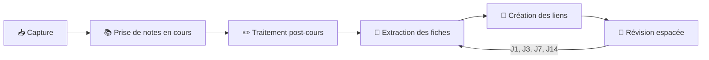
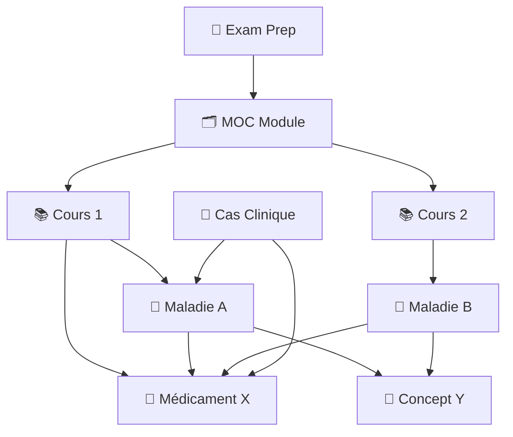

# resume.md — Système de Notes Médicales pour Obsidian

Un système complet de prise de notes pour les étudiants en médecine francophones, optimisé pour [Obsidian](https://obsidian.md). Ce dépôt contient **9 templates** couvrant l'ensemble du parcours d'études : cours, fiches maladies, pharmacologie, cas cliniques, révisions et organisation quotidienne.

---

## Démarrage rapide

1. **Cloner ou télécharger** ce dépôt (via GitHub Desktop ou `git clone`)
2. **Ouvrir le dossier** comme vault dans Obsidian (*Ouvrir un coffre > Ouvrir un dossier comme coffre*)
3. **Configurer les templates** : Paramètres > Modèles de base > Emplacement → `Templates`
4. **Créer la structure de dossiers** décrite ci-dessous dans votre vault
5. **Lire le [guide Markdown](guide-markdown.md)** pour maîtriser la syntaxe utilisée dans les templates

---

## Structure du vault

### Arborescence recommandée

```
MedVault/
├── 📥 Inbox/              ← captures rapides, notes non triées
├── 📚 Cours/              ← notes de cours et notes médicales détaillées
├── 🗂️ Modules/            ← une MOC (carte de contenu) par module
├── 🧠 Fiches/             ← notes atomiques de référence
│   ├── Maladies/          ← une fiche par pathologie
│   ├── Pharmacologie/     ← une fiche par médicament
│   └── Concepts/          ← un concept par note
├── 🏥 Cas Cliniques/      ← études de cas et dossiers cliniques
├── 📝 Journal/            ← notes quotidiennes
├── 🎯 Examens/            ← fiches de révision par examen
├── 📂 Ressources/         ← PDFs, transcriptions, images, audio
└── Templates/             ← les 9 modèles (ne pas modifier)
```

### Description des dossiers

#### 📥 Inbox

Votre boîte de capture. Toute idée, question ou note rapide prise à la volée atterrit ici. L'objectif est de vider cette boîte régulièrement en triant chaque note vers le bon dossier.

#### 📚 Cours

Toutes vos notes de cours. Utilisez `lecture.md` pour la prise de notes rapide pendant le cours, puis `Template_Note_Medicale.md` pour le traitement approfondi après le cours. Chaque note lie vers le MOC de son module.

#### 🗂️ Modules

Une note MOC (Map of Content) par module ou matière. C'est le **point d'entrée** de chaque module : elle regroupe les liens vers tous les cours, maladies, médicaments et concepts associés, avec un diagramme de vue d'ensemble et un suivi de progression.

#### 🧠 Fiches

Vos notes atomiques de référence, organisées en trois sous-dossiers :

- **Maladies/** — une fiche complète par pathologie (épidémiologie, clinique, diagnostic, traitement)
- **Pharmacologie/** — une fiche par médicament (mécanisme, pharmacocinétique, indications, effets indésirables)
- **Concepts/** — un concept fondamental par note (définition, explication, mnémotechnique, liens)

> Les wikilinks et les tags permettent de retrouver n'importe quelle fiche instantanément, quel que soit son sous-dossier.

#### 🏥 Cas Cliniques

Cas cliniques d'entraînement : énoncé, questions, correction, synthèse diagnostique et prise en charge. Chaque cas lie vers les maladies, médicaments et concepts impliqués.

#### 📝 Journal

Une note par jour pour organiser votre emploi du temps, lister les cours suivis, noter les tâches et faire le bilan de fin de journée.

#### 🎯 Examens

Une fiche de révision par examen. Elle centralise les cours à maîtriser, les maladies et médicaments clés, le planning de répétition espacée, et les fiches de dernière minute.

#### 📂 Ressources

Tout le matériel externe : PDFs de cours, transcriptions audio, images, schémas Excalidraw, articles de référence. Ce dossier sert de bibliothèque — les notes de cours y font référence via des liens.

#### Templates

Les 9 modèles de ce dépôt. Ne les modifiez pas directement — Obsidian les insère dans vos nouvelles notes via la commande *Insérer un modèle*.

---

## Templates inclus

| Template | Dossier cible | Description |
|----------|---------------|-------------|
| `lecture.md` | 📚 Cours | Prise de notes pendant le cours : capture rapide, points-clés, résumé |
| `Template_Note_Medicale.md` | 📚 Cours | Note de cours détaillée avec structure complète et zone de révision active |
| `moc.md` | 🗂️ Modules | Vue d'ensemble d'un module : cours, maladies, médicaments, progression |
| `disease.md` | 🧠 Fiches/Maladies | Fiche pathologie : épidémiologie, étiologie, clinique, diagnostic, traitement |
| `drug.md` | 🧠 Fiches/Pharmacologie | Fiche médicament : mécanisme, pharmacocinétique, indications, EI, interactions |
| `concept.md` | 🧠 Fiches/Concepts | Concept atomique : définition, explication, mnémo, liens hiérarchiques |
| `clinical-case.md` | 🏥 Cas Cliniques | Cas clinique : énoncé, questions-réponses, diagnostic, prise en charge |
| `daily.md` | 📝 Journal | Note quotidienne : emploi du temps, tâches, révisions, bilan |
| `exam-prep.md` | 🎯 Examens | Fiche de révision : objectifs, planning espacé, annales, fiches de dernière minute |

---

## Workflow recommandé

### Cycle quotidien



1. **Matin** — ouvrir la note quotidienne (`📝 Journal/`) pour planifier la journée
2. **En cours** — créer une note avec `lecture.md` dans `📚 Cours/` et capturer les idées-clés
3. **Après le cours** — traiter la note : restructurer, compléter avec `Template_Note_Medicale.md` si besoin
4. **Extraire** — créer des fiches atomiques dans `🧠 Fiches/` pour chaque nouvelle maladie, médicament ou concept
5. **Lier** — ajouter les wikilinks entre toutes les notes reliées (cours ↔ fiches ↔ MOC)
6. **Réviser** — suivre le planning de répétition espacée dans `🎯 Examens/` (J0, J1, J3, J7, J14)
7. **Soir** — compléter le bilan de fin de journée dans la note quotidienne

### Réseau de connaissances

Les liens entre notes créent un graphe de connaissances interconnecté :



Chaque nœud est une note. Plus vous créez de liens, plus le graphe devient riche et les connexions transversales apparaissent.

---

## Plugins Obsidian recommandés

| Plugin | Utilité |
|--------|---------|
| **Templater** | Variables de template avancées, insertion automatique |
| **Dataview** | Requêtes sur le frontmatter (lister les maladies par module, filtrer par statut) |
| **Calendar** | Navigation visuelle dans les notes quotidiennes |
| **Excalidraw** | Schémas et diagrammes intégrés aux notes |
| **Spaced Repetition** | Révision des flashcards `Q :: R` créées dans les cours |
| **Periodic Notes** | Automatisation des notes quotidiennes |

---

## Outils complémentaires

| Outil | Usage |
|-------|-------|
| **NotebookLM** | Importer vos notes pour réviser avec l'IA, générer des résumés |
| **Gemini CLI** | Traiter et améliorer vos notes en local |
| **Pages web en .md** | Sauvegarder des pages web au format `.md` pour les importer dans le vault |
| **GitHub Desktop** | Cloner le dépôt en local, synchroniser vos améliorations |

### Synchronisation et sauvegarde

- **Obsidian Sync** (payant) — synchronisation native entre appareils
- **Obsidian Git** (plugin gratuit) — sauvegarde automatique vers GitHub
- **GitHub Desktop** — gestion manuelle des versions

---

## Guide Markdown & Obsidian

Ce dépôt inclut un **[guide complet de la syntaxe Markdown et des fonctionnalités Obsidian](guide-markdown.md)** couvrant :

- Toute la syntaxe Markdown (titres, listes, tableaux, liens, images...)
- Les fonctionnalités Obsidian (wikilinks, callouts, frontmatter, Mermaid, LaTeX...)
- Les bonnes pratiques de prise de notes médicales
- Un aide-mémoire des raccourcis et syntaxes

Consultez-le pour tirer le maximum de vos templates.

---

*Dernière mise à jour : 2026-04-13*
