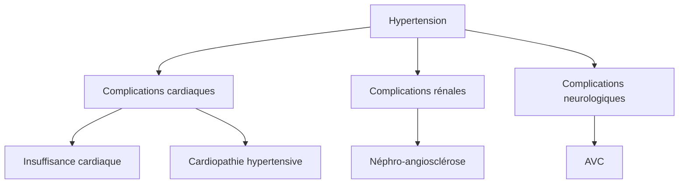
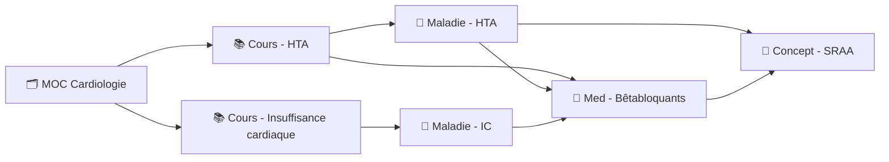

# Guide Markdown & Obsidian pour la Prise de Notes Médicales

> [!abstract] Objectif
> Ce guide couvre toute la syntaxe Markdown et les fonctionnalités Obsidian nécessaires pour utiliser efficacement les templates de ce dépôt. Il est conçu pour les étudiants en médecine qui découvrent Obsidian ou souhaitent approfondir leur maîtrise.

---

## Table des matières

- [1. Syntaxe Markdown de base](#1-syntaxe-markdown-de-base)
- [2. Fonctionnalités Obsidian](#2-fonctionnalités-obsidian)
- [3. Bonnes pratiques pour la prise de notes](#3-bonnes-pratiques-pour-la-prise-de-notes)
- [4. Aide-mémoire](#4-aide-mémoire)

---

## 1. Syntaxe Markdown de base

### 1.1 Titres et hiérarchie

Les titres structurent vos notes. Utilisez `#` pour définir le niveau :

```markdown
# Titre principal (H1)
## Section (H2)
### Sous-section (H3)
#### Sous-sous-section (H4)
```

> [!tip] Conseil
> Dans Obsidian, le panneau **Plan** (outline) à droite affiche automatiquement la hiérarchie de vos titres. Structurez bien vos notes pour naviguer rapidement.

**Convention dans nos templates** : H1 = titre de la note, H2 = sections principales (Épidémiologie, Clinique, Traitement...), H3 = sous-sections.

---

### 1.2 Mise en forme du texte

| Syntaxe | Résultat | Exemple médical |
|---------|----------|-----------------|
| `**texte**` | **gras** | **Diagnostic** : pneumonie |
| `*texte*` | *italique* | *Streptococcus pneumoniae* |
| `~~texte~~` | ~~barré~~ | ~~hypothèse éliminée~~ |
| `==texte==` | ==surligné== | ==point tombable à l'examen== |
| `` `texte` `` | `code` | Valeur normale : `Na+ 135-145 mmol/L` |

Vous pouvez combiner les formats : `***gras et italique***` donne ***gras et italique***.

---

### 1.3 Listes

**Liste à puces :**

```markdown
- Premier élément
- Deuxième élément
  - Sous-élément (2 espaces d'indentation)
  - Autre sous-élément
```

**Liste numérotée :**

```markdown
1. Étape 1 — Interrogatoire
2. Étape 2 — Examen clinique
3. Étape 3 — Examens complémentaires
```

**Cases à cocher (tâches) :**

```markdown
- [ ] Relire le cours de cardiologie
- [x] Compléter la fiche HTA
- [ ] Réviser la pharmacologie des bêtabloquants
```

Résultat :

- [ ] Relire le cours de cardiologie
- [x] Compléter la fiche HTA
- [ ] Réviser la pharmacologie des bêtabloquants

> [!tip] Conseil
> Les cases à cocher sont utilisées dans nos templates `daily.md` (tâches du jour) et `exam-prep.md` (objectifs de révision). Cliquez dessus dans Obsidian pour les cocher/décocher.

---

### 1.4 Liens et images

**Lien externe :**

```markdown
[Collège de Cardiologie](https://www.sfcardio.fr)
```

**Image :**

```markdown

```

> [!note] Note
> Pour les liens entre notes Obsidian, préférez les **wikilinks** `[[]]` (voir [section 2.2](#22-wikilinks)).

---

### 1.5 Citations

```markdown
> Le patient présente une douleur thoracique rétrosternale
> irradiant vers le bras gauche, évoluant depuis 2 heures.
```

Résultat :

> Le patient présente une douleur thoracique rétrosternale
> irradiant vers le bras gauche, évoluant depuis 2 heures.

Les citations sont utilisées dans nos templates pour les énoncés de cas cliniques et les histoires de la maladie.

---

### 1.6 Blocs de code

**Code inline** — entourez avec des backticks :

```markdown
La posologie est de `500 mg x 3/jour` pendant 7 jours.
```

**Bloc de code** — entourez avec trois backticks :

````markdown
```
Formule de clairance de la créatinine (Cockcroft-Gault) :
ClCr = [(140 - âge) × poids] / (72 × créatininémie)
Multiplier par 0.85 si femme
```
````

---

### 1.7 Tableaux

```markdown
| Paramètre | Valeur normale | Unité |
|-----------|----------------|-------|
| Na+       | 135-145        | mmol/L |
| K+        | 3.5-5.0        | mmol/L |
| Créatinine | 60-110        | µmol/L |
```

Résultat :

| Paramètre | Valeur normale | Unité |
|-----------|----------------|-------|
| Na+       | 135-145        | mmol/L |
| K+        | 3.5-5.0        | mmol/L |
| Créatinine | 60-110        | µmol/L |

**Alignement des colonnes :**

```markdown
| À gauche | Centré | À droite |
|:---------|:------:|----------:|
| texte    | texte  | texte     |
```

> [!tip] Conseil
> Les tableaux sont omniprésents dans nos templates : pharmacocinétique (`drug.md`), résultats d'examens (`clinical-case.md`), planning de révision (`exam-prep.md`). Dans Obsidian, utilisez `Tab` pour naviguer entre les cellules.

---

### 1.8 Lignes horizontales

```markdown
---
```

Trois tirets créent une ligne de séparation. Nos templates les utilisent entre chaque section pour une lecture claire.

---

## 2. Fonctionnalités Obsidian

### 2.1 Frontmatter YAML

Le frontmatter est un bloc de métadonnées au tout début du fichier, délimité par `---` :

```yaml
---
type: maladie
titre: "Hypertension artérielle"
module: "[[Cardiologie]]"
specialite: "[[Cardiologie]]"
tags:
  - maladie
  - medecine
  - cardiologie
aliases:
  - HTA
statut: révisé
created: "2026-04-13T10:30"
modified: "2026-04-13T10:30"
---
```

**Clés utilisées dans nos templates :**

| Clé | Rôle | Exemple |
|-----|------|---------|
| `type` | Catégorise la note | `cours`, `maladie`, `medicament`, `concept`, `cas-clinique`, `exam-prep`, `daily`, `moc` |
| `titre` | Titre de la note | `"Hypertension artérielle"` |
| `module` | Lien vers le module/MOC | `"[[Cardiologie]]"` |
| `tags` | Étiquettes pour le filtrage | `- maladie`, `- medecine` |
| `statut` | Avancement de la note | `brouillon`, `en-construction`, `révisé`, `maîtrisé` |
| `aliases` | Noms alternatifs | `- HTA`, `- hypertension` |
| `created` / `modified` | Dates de création/modification | `"2026-04-13T10:30"` |

> [!important] Important
> Le frontmatter doit être **tout en haut du fichier**, avant tout autre contenu. Les valeurs contenant des caractères spéciaux doivent être entre guillemets.

> [!tip] Astuce avancée
> Le plugin **Dataview** peut interroger vos notes par frontmatter. Par exemple, lister toutes les maladies du module Cardiologie dont le statut est « à revoir ».

---

### 2.2 Wikilinks

Les wikilinks sont la fonctionnalité centrale d'Obsidian. Ils créent des liens entre vos notes et construisent votre réseau de connaissances.

**Syntaxe :**

```markdown
[[Nom de la note]]                     → lien vers une note
[[Nom de la note|texte affiché]]       → lien avec alias
[[Nom de la note#Section]]             → lien vers une section précise
```

**Exemples médicaux :**

```markdown
Le traitement repose sur les [[Bêtabloquants]] et les [[IEC]].
Voir le cours [[Insuffisance cardiaque#Traitement]] pour les détails.
Cette pathologie est rattachée au module [[Cardiologie MOC|Cardiologie]].
```

> [!note] Rétroliens (backlinks)
> Quand vous créez un lien `[[HTA]]` dans une note de cours, Obsidian affiche automatiquement ce cours dans le panneau **rétroliens** de la fiche HTA. C'est ainsi que le réseau se construit naturellement.

> [!tip] Conseil
> Créez des liens même vers des notes qui n'existent pas encore. Obsidian les affichera en gris, et vous pourrez les créer plus tard en cliquant dessus. C'est la méthode utilisée dans nos templates avec les `[[]]` vides.

---

### 2.3 Embeds (intégrations)

Intégrez le contenu d'une autre note directement dans la note courante :

```markdown
![[Nom de la note]]              → intègre la note entière
![[Nom de la note#Section]]      → intègre une section
![[image.png]]                   → affiche une image
![[schema.excalidraw]]           → affiche un schéma Excalidraw
```

**Cas d'usage** : intégrer un schéma physiopathologique dans plusieurs fiches de maladies, ou afficher un tableau de valeurs normales dans différentes notes de cours.

---

### 2.4 Callouts (encadrés)

Les callouts sont des encadrés visuels colorés. Syntaxe :

```markdown
> [!type] Titre optionnel
> Contenu du callout.
> Peut s'étendre sur plusieurs lignes.
```

**Les 10 types utilisés dans nos templates :**

> [!info] Info
> Métadonnées, résumés, informations contextuelles.
> Utilisé dans : `disease.md`, `drug.md`, `lecture.md`

> [!tip] Astuce
> Conseils, mnémotechniques, méthodes recommandées.
> Utilisé dans : `concept.md`, `exam-prep.md`, `daily.md`

> [!warning] Attention
> Points tombables à l'examen, éléments à ne pas oublier.
> Utilisé dans : `disease.md`, `drug.md`, `lecture.md`

> [!danger] Danger
> Contre-indications absolues, urgences, pièges critiques.
> Utilisé dans : `drug.md`

> [!note] Note
> Mécanismes, remarques, compléments d'information.
> Utilisé dans : `disease.md`, `drug.md`, `moc.md`

> [!question] Question
> QCM, auto-évaluation, questions à éclaircir.
> Utilisé dans : `concept.md`, `Template_Note_Medicale.md`

> [!abstract] Résumé
> Synthèses, bilans, résumés condensés.
> Utilisé dans : `daily.md`, `lecture.md`, `clinical-case.md`

> [!example] Exemple
> Cas cliniques concrets, illustrations pratiques.
> Utilisé dans : `concept.md`, `Template_Note_Medicale.md`

> [!success] Réussite
> Corrections, réponses validées, suivi positif.
> Utilisé dans : `clinical-case.md`, `Template_Note_Medicale.md`

> [!important] Important
> Critères diagnostiques, éléments incontournables.
> Utilisé dans : `disease.md`

**Callouts repliables :**

```markdown
> [!tip]+ Titre (déplié par défaut)
> Contenu visible.

> [!tip]- Titre (replié par défaut)
> Contenu masqué, cliquer pour ouvrir.
```

---

### 2.5 Tags

Les tags permettent de catégoriser et retrouver vos notes.

**Dans le texte :**

```markdown
Ce concept est lié à la #cardiologie et à la #physiologie.
```

**Dans le frontmatter (méthode recommandée dans nos templates) :**

```yaml
tags:
  - maladie
  - medecine
  - cardiologie
```

**Tags imbriqués :**

```markdown
#medecine/cardiologie/valvulopathies
#medecine/pneumologie/asthme
```

> [!tip] Tags vs Dossiers vs Liens
> - **Dossiers** : organisation physique des fichiers (un fichier = un dossier)
> - **Tags** : catégorisation transversale (un fichier peut avoir plusieurs tags)
> - **Liens** : connexions sémantiques entre concepts
>
> Les trois sont complémentaires. Nos templates utilisent les tags dans le frontmatter pour le filtrage et les wikilinks pour les connexions.

---

### 2.6 Diagrammes Mermaid

Obsidian supporte les diagrammes Mermaid directement dans vos notes :

````markdown

````

Résultat :


**Types de diagrammes utiles en médecine :**

| Type | Syntaxe | Usage |
|------|---------|-------|
| Arborescence | `graph TD` | Cascades physiopathologiques, complications |
| Organigramme | `flowchart LR` | Arbres décisionnels, algorithmes diagnostiques |
| Séquence | `sequenceDiagram` | Chronologie d'une prise en charge |

Le template `moc.md` utilise un diagramme Mermaid pour visualiser la structure d'un module.

---

### 2.7 Variables de templates

Obsidian (et le plugin Templater) remplace automatiquement certaines variables quand vous insérez un template :

| Variable | Résultat | Exemple |
|----------|----------|---------|
| `{{date}}` | Date du jour | `2026-04-13` |
| `{{time}}` | Heure actuelle | `14:30` |
| `{{title}}` | Titre de la note | `Hypertension artérielle` |

Ces variables apparaissent dans tous nos templates. Quand vous créez une note à partir d'un template, elles sont remplacées automatiquement.

> [!warning] Attention
> Les variables ne sont remplacées qu'au moment de l'insertion du template. Si vous copiez-collez un template manuellement, les `{{variables}}` resteront telles quelles — utilisez toujours la commande **Insérer un modèle** (`Ctrl/Cmd + T` ou palette de commandes).

---

### 2.8 Formules mathématiques (LaTeX)

Obsidian supporte les formules LaTeX, très utiles en pharmacologie et physiologie :

**Formule inline :**

```markdown
La clairance rénale se calcule par $ClCr = \frac{(140 - âge) \times poids}{72 \times créat}$
```

**Bloc de formule :**

```markdown
$$
DFG = 175 \times (créat)^{-1.154} \times (âge)^{-0.203} \times 0.742 \text{ (si femme)}
$$
```

---

### 2.9 Flashcards inline

Le template `lecture.md` utilise la syntaxe `::` pour créer des flashcards compatibles avec le plugin **Spaced Repetition** :

```markdown
Q1 :: Quel est le traitement de première intention de l'HTA ?
Q2 :: Citez 3 complications de l'HTA non traitée.
Q3 :: Quelle est la valeur seuil définissant l'HTA ?
```

Ces flashcards peuvent être révisées directement dans Obsidian avec le plugin, en suivant un algorithme de répétition espacée.

---

### 2.10 Commentaires masqués

```markdown
%%Ce texte est invisible en mode lecture%%
%%TODO: compléter cette section après le cours de jeudi%%
```

Utile pour laisser des notes personnelles dans vos fichiers sans qu'elles apparaissent en mode lecture.

---

## 3. Bonnes pratiques pour la prise de notes

### 3.1 Nommage des notes

Adoptez une convention claire et cohérente :

| Type de note | Convention | Exemple |
|-------------|------------|---------|
| Cours | `Cours — Titre` | `Cours — Valvulopathies aortiques` |
| Maladie | `Maladie — Nom` | `Maladie — Hypertension artérielle` |
| Médicament | `Med — DCI` | `Med — Amoxicilline` |
| Concept | `Concept — Nom` | `Concept — Pression oncotique` |
| Cas clinique | `Cas — Description` | `Cas — Douleur thoracique chez homme 55 ans` |
| MOC | `MOC — Module` | `MOC — Cardiologie` |
| Exam prep | `Exam — Module` | `Exam — Cardiologie S1` |

> [!tip] Conseil
> Le préfixe permet d'identifier le type de note dans les résultats de recherche et les suggestions de wikilinks. Combinez avec le champ `type` du frontmatter pour un double repérage.

---

### 3.2 Stratégie de liens bidirectionnels

Le vrai pouvoir d'Obsidian réside dans les liens entre notes. Voici comment construire un réseau de connaissances efficace :



**Règles de liaison :**

1. **Chaque note de cours** lie vers le MOC du module et les fiches maladies/médicaments/concepts mentionnés
2. **Chaque fiche maladie** lie vers ses traitements (médicaments) et ses cours sources
3. **Chaque fiche médicament** lie vers les maladies qu'il traite
4. **Chaque concept** lie vers ses concepts parents et enfants
5. **Les cas cliniques** lient vers les maladies, médicaments et concepts impliqués

> [!note] Le graphe de connaissances
> Au fil du temps, ces liens créent un graphe visible dans Obsidian (vue graphe `Ctrl/Cmd + G`). Les nœuds les plus connectés sont vos concepts les plus transversaux — ce sont souvent les plus importants à maîtriser.

---

### 3.3 Workflow de révision

Nos templates intègrent un système de suivi de progression :

| Statut | Signification | Action |
|--------|---------------|--------|
| `brouillon` | Notes brutes, pendant le cours | Capturer rapidement |
| `en-construction` | En cours de traitement | Structurer, compléter, lier |
| `révisé` | Traité et relu une fois | Planifier la répétition espacée |
| `maîtrisé` | Bien assimilé | Réviser périodiquement |

**Cycle recommandé :**

1. **J0** — Prendre les notes brutes en cours (`brouillon`)
2. **J0 soir** — Traiter la note : restructurer, compléter, créer les liens (`en-construction`)
3. **J1** — Première relecture, extraire les concepts clés en fiches séparées (`révisé`)
4. **J3, J7, J14** — Répétitions espacées via le planning dans `exam-prep.md`
5. **Confiance 4-5/5** — Marquer comme `maîtrisé`

---

### 3.4 Organisation avec les MOC (Maps of Content)

Les MOC (Maps of Content) sont des notes d'index qui organisent un thème ou module :

- **Un MOC par module** (Cardiologie, Pneumologie, Neurologie...)
- Le MOC regroupe les liens vers tous les cours, maladies, médicaments et concepts du module
- Il contient un diagramme Mermaid pour visualiser la structure
- Il suit la progression (cours traités, maladies maîtrisées)

Le template `moc.md` est conçu pour cela. C'est le point d'entrée de chaque module.

---

## 4. Aide-mémoire

### Syntaxe Markdown

| Syntaxe | Résultat |
|---------|----------|
| `# Titre` | Titre H1 |
| `## Titre` | Titre H2 |
| `**gras**` | **gras** |
| `*italique*` | *italique* |
| `~~barré~~` | ~~barré~~ |
| `==surligné==` | ==surligné== |
| `` `code` `` | `code` |
| `- élément` | Liste à puces |
| `1. élément` | Liste numérotée |
| `- [ ] tâche` | Case à cocher |
| `[texte](url)` | Lien externe |
| `` | Image |
| `> citation` | Citation |
| `---` | Ligne horizontale |
| `\| col1 \| col2 \|` | Tableau |

### Syntaxe Obsidian

| Syntaxe | Résultat |
|---------|----------|
| `[[note]]` | Wikilink |
| `[[note\|alias]]` | Wikilink avec alias |
| `[[note#section]]` | Lien vers section |
| `![[note]]` | Embed (intégration) |
| `![[image.png]]` | Afficher image |
| `#tag` | Tag |
| `> [!info] Titre` | Callout info |
| `> [!tip] Titre` | Callout astuce |
| `> [!warning] Titre` | Callout attention |
| `> [!danger] Titre` | Callout danger |
| `$formule$` | LaTeX inline |
| `$$formule$$` | LaTeX bloc |
| `Q :: R` | Flashcard inline |
| `%%commentaire%%` | Commentaire masqué |

### Raccourcis clavier essentiels

| Action | Raccourci |
|--------|-----------|
| Ouvrir une note (switcher rapide) | `Ctrl/Cmd + O` |
| Palette de commandes | `Ctrl/Cmd + P` |
| Insérer un template | `Ctrl/Cmd + T` |
| Recherche globale | `Ctrl/Cmd + Shift + F` |
| Vue graphe | `Ctrl/Cmd + G` |
| Basculer mode édition/lecture | `Ctrl/Cmd + E` |
| Créer une nouvelle note | `Ctrl/Cmd + N` |
| Gras | `Ctrl/Cmd + B` |
| Italique | `Ctrl/Cmd + I` |
| Lien | `Ctrl/Cmd + K` |
| Liste à cocher | `Ctrl/Cmd + L` |

---

> [!abstract] Pour aller plus loin
> - Consultez le [README](README.md) pour la structure de vault recommandée et le workflow complet
> - Explorez les templates dans le dossier `Templates/` pour voir ces syntaxes en action
> - La documentation officielle d'Obsidian est disponible sur help.obsidian.md

---

*Dernière mise à jour : 2026-04-13*
