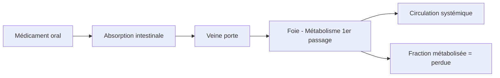
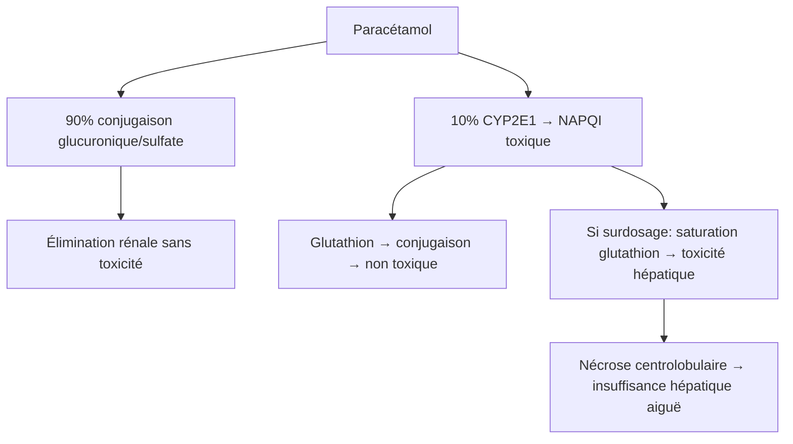

# Médicament et pathologies du foie

> [!info] Métadonnées
> **Module** : [[Pharmacologie]] · **Enseignant** : Pr. ZAOUI
> **Statut** : 🔴 Brouillon → 🟡 Révisé → 🟢 Maîtrisé

---

## I. Introduction

> [!abstract] Objectifs pédagogiques
> 1. Comprendre le rôle du foie dans le métabolisme des médicaments
> 2. Adapter les prescriptions en cas d'insuffisance hépatique
> 3. Reconnaître et prévenir l'hépatotoxicité médicamenteuse

- **Double problème** :
  1. L'insuffisance hépatique (IH) modifie la pharmacocinétique → risque de surdosage/sous-dosage
  2. Certains médicaments sont hépatotoxiques → risque de lésion hépatique

---

## II. Rôle du foie dans le métabolisme des médicaments

### A. Fonctions hépatiques impliquées

| Fonction | Impact pharmacologique |
|---|---|
| Métabolisme (biotransformation) | Phase I (CYP450) et Phase II (conjugaison) |
| Synthèse des protéines (albumine) | Distribution des médicaments liés aux protéines |
| Production de bile | Élimination biliaire de certains médicaments |
| Effet de premier passage hépatique | Biodisponibilité des médicaments oraux |

### B. Effet de premier passage hépatique

- En cas d'IH sévère → ↓ effet de premier passage → ↑ biodisponibilité → risque de **surdosage**
- Exemples : propranolol, vérapamil, morphine, lidocaïne

### C. Liaison aux protéines plasmatiques

- Albumine synthétisée par le foie
- IH → ↓ albumine → ↑ fraction libre des médicaments → ↑ effet et toxicité
- Médicaments très liés aux protéines : warfarine, phénytoïne, AINS, furosémide

---

## III. Évaluation de la fonction hépatique

### Score de Child-Pugh (cirrhose)

| Paramètre | 1 point | 2 points | 3 points |
|---|---|---|---|
| Bilirubine (µmol/L) | < 34 | 34–50 | > 50 |
| Albumine (g/L) | > 35 | 28–35 | < 28 |
| TP (%) | > 70 | 40–70 | < 40 |
| Encéphalopathie | Absente | Grade I–II | Grade III–IV |
| Ascite | Absente | Minime | Modérée-sévère |

| Score | Classe | Interprétation |
|---|---|---|
| 5–6 | A | IH légère |
| 7–9 | B | IH modérée |
| 10–15 | C | IH sévère |

> [!warning] Adaptation posologique
> - **Child A** : adaptation rare nécessaire
> - **Child B** : réduire les doses, surveiller
> - **Child C** : contre-indication formelle de nombreux médicaments

---

## IV. Adaptation des médicaments en cas d'IH

### A. Principes généraux

- Éviter les médicaments à **fort métabolisme hépatique** ou opter pour des formes à élimination rénale
- ↓ doses initiales, ↑ intervalles entre les prises
- Surveiller les signes de toxicité et d'efficacité
- Éviter les médicaments hépatotoxiques

### B. Médicaments à adapter ou éviter en IH

| Classe | Médicament | Recommandation |
|---|---|---|
| Analgésiques | Paracétamol | Dose ≤ 2 g/j en IH sévère ; CI si alcool |
| AINS | Ibuprofène | Éviter (risque HTP, insuffisance rénale) |
| Opioïdes | Morphine | ↓ dose + ↑ intervalle (accumulation) |
| Antibiotiques | Métronidazole | ↓ dose en IH sévère |
| Antifongiques | Kétoconazole | CI en IH |
| Anticoagulants | Warfarine | Risque hémorragique ↑ (TP abaissé) |
| Statines | Toutes | Prudence, surveiller transaminases |
| Benzodiazépines | Diazépam | Accumulation, risque encéphalopathie |
| Diurétiques | Spironolactone | 1ère intention dans ascite cirrhotique |

---

## V. Hépatotoxicité médicamenteuse (DILI)

### A. Définition

> [!important] DILI — Drug-Induced Liver Injury
> Atteinte hépatique causée par un médicament, documentée après exclusion des autres causes.

### B. Mécanismes

| Mécanisme | Type | Exemples |
|---|---|---|
| Dose-dépendant (prévisible) | Direct | Paracétamol (surdosage), Isoniazide |
| Idiosyncrasique (imprévisible) | Immunoallergique ou métabolique | Amoxicilline-clavulanate, Halothane |

### C. Tableau clinico-biologique

**Trois profils lésionnels :**

| Profil | Prédominance | ALAT/PAL | Exemples |
|---|---|---|---|
| Hépatocellulaire | Cytolyse (ALAT ↑↑) | R ≥ 5 | Paracétamol, INH |
| Cholestatique | PAL ↑↑ | R ≤ 2 | Amoxicilline-clavulanate, macrolides |
| Mixte | ALAT + PAL ↑ | 2 < R < 5 | Phénytoïne |

> **R = (ALAT/N) / (PAL/N)**

### D. Médicaments les plus hépatotoxiques

> [!danger] Principaux médicaments hépatotoxiques
> 1. **Paracétamol** (surdosage > 10 g/j → nécrose centrolobulaire)
> 2. **Isoniazide** (hépatite cytolytique dans 1%)
> 3. **Amoxicilline-clavulanate** (cholestase, la plus fréquente en France)
> 4. **AINS** (cytolytique ou cholestatique)
> 5. **Statines** (cytolyse, rare)
> 6. **Méthotrexate** (fibrose hépatique à long terme)
> 7. **Rifampicine** (hépatite)
> 8. **Tétracyclines** (stéatose microvésiculaire)
> 9. **Halothane** (hépatite fulminante idiosyncrasique)

### E. Paracétamol — focus

**Traitement du surdosage au paracétamol :**
- N-acétylcystéine (NAC) IV → restaure le glutathion
- Délai : efficace dans les **10-16h** suivant l'ingestion
- Nomogramme de Rumack-Matthew : décision de traitement selon taux sanguin / temps

---

## VI. Médicaments et cirrhose — points clés

- **Hémorragie digestive** : éviter AINS, anticoagulants si varices non traitées
- **Encéphalopathie hépatique** : BZD → accumulation → risque de déclenchement
- **Syndrome hépatorénal** : AINS, aminosides → néphrotoxicité accrue
- **Hypertension portale** : ISRS avec prudence (↑ risque saignement)

---

## VII. Surveillance hépatique sous traitement

| Traitement | Bilan à surveiller | Fréquence |
|---|---|---|
| Isoniazide | ALAT, ASAT | J0, M1, M3, M6 |
| Méthotrexate | ALAT, ASAT | Avant, puis tous les 1–3 mois |
| Statines | ALAT | Avant, puis si symptômes |
| Antiépileptiques | ALAT, ASAT, GGT | Régulièrement |

---

## Zone de révision active

> [!question] Questions de synthèse
> **Q1** : Quel est l'antidote du surdosage au paracétamol ? Quel est son mécanisme ?
> **R1** : N-acétylcystéine (NAC). Elle restaure le glutathion hépatique pour neutraliser le NAPQI toxique.
>
> **Q2** : Comment le score de Child-Pugh guide-t-il la prescription ?
> **R2** : Child A = adaptation rare ; Child B = réduire doses, surveiller ; Child C = contre-indication de nombreux médicaments.
>
> **Q3** : Quels sont les 3 profils lésionnels du DILI et comment les distinguer ?
> **R3** : Hépatocellulaire (R≥5), cholestatique (R≤2), mixte (2<R<5). R = (ALAT/N)/(PAL/N).

> [!success] Points tombables à l'examen ⭐
> - Score de Child-Pugh (paramètres + interprétation)
> - Paracétamol : mécanisme de toxicité + traitement (NAC)
> - Médicaments hépatotoxiques à connaître (INH, amox-clav, paracétamol)
> - Profils DILI (R ratio)
> - BZD : risque d'encéphalopathie en cas de cirrhose

---

## Liens

- **Cours précédent** : [[07-Regles_generales_prescription]]
- **Cours suivant** : [[09-Prescription_enfant_sujet_age]]
- **Référentiel** : [VIDAL](https://www.vidal.fr) · [AFEF](https://www.afef.asso.fr)

---

> [!success] Suivi de révision
> | Date | Score (/5) | Notes |
> |------|------------|-------|
> | {{date}} | | |

*Dernière révision : {{date}}*
