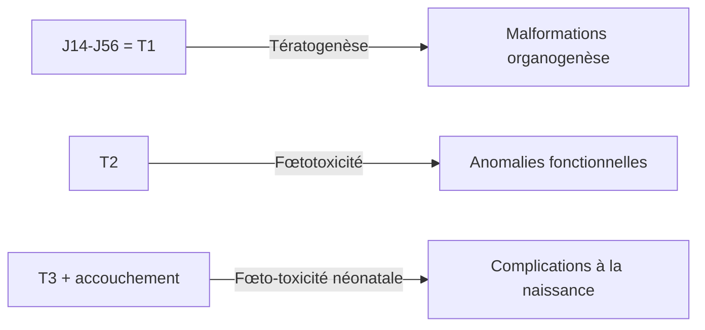

# Prescription médicamenteuse chez la femme enceinte et allaitante

> [!info] Métadonnées
> **Module** : [[Pharmacologie]] · **Enseignant** : Pr. ZAOUI
> **Statut** : 🔴 Brouillon → 🟡 Révisé → 🟢 Maîtrisé

---

## I. Introduction

> [!abstract] Objectifs pédagogiques
> 1. Connaître les risques médicamenteux spécifiques pendant la grossesse et l'allaitement
> 2. Identifier les médicaments tératogènes et fœtotoxiques
> 3. Prescrire de façon sécurisée pendant ces périodes

- **Principe fondamental** : Toute prescription pendant la grossesse et l'allaitement engage la responsabilité du médecin et peut affecter le fœtus/nourrisson.
- La règle est : n'utiliser un médicament que si le **bénéfice maternel > risque fœtal**.

---

## II. Modifications pharmacocinétiques pendant la grossesse

| Paramètre | Modification | Conséquence |
|---|---|---|
| Absorption orale | Nausées, vomissements T1 ; transit ralenti | Absorption variable |
| Volume de distribution | ↑ (eau corporelle ↑, 6-8 L) | ↓ concentrations plasmatiques |
| Liaison protéique | ↓ albumine → ↑ fraction libre | ↑ effets et toxicité |
| Métabolisme hépatique | ↑ CYP3A4 (progestérone) → ↑ métabolisme | Nécessite ↑ doses |
| Débit sanguin rénal | ↑ 50% | ↑ élimination rénale → ↓ concentrations |

---

## III. Passage placentaire des médicaments

### Facteurs favorisant le passage placentaire

- Faible poids moléculaire (< 500 Da)
- Non ionisé à pH physiologique
- Liposoluble
- Faible liaison aux protéines

### Notion de placenta = barrière relative

> [!warning] Le placenta n'est PAS une barrière efficace
> La quasi-totalité des médicaments passent le placenta à des degrés divers.

---

## IV. Périodes critiques de la grossesse

| Période | Risque principal | Exemples |
|---|---|---|
| J1-J14 (pré-implantatoire) | Loi du "tout ou rien" → fausse couche ou normal | — |
| J14-J56 = T1 (organogenèse) | **Tératogenèse** = malformations congénitales | Thalidomide, acide valproïque |
| T2 | Retard croissance, troubles fonctionnels | AINS |
| T3 | Fœtotoxicité, prématurité, complications néonatales | AINS (fermeture canal artériel), opioïdes |
| Accouchement | Syndrome de sevrage néonatal, dépression respiratoire | Opioïdes, BZD |

---

## V. Classification des médicaments pendant la grossesse

### Classification FDA (américaine, ancienne mais encore utilisée)

| Catégorie | Signification |
|---|---|
| A | Études contrôlées chez la femme → sans risque |
| B | Études animales sans risque, pas d'études humaines contrôlées |
| C | Études animales → effets indésirables, pas d'études humaines |
| D | Risque fœtal humain documenté, mais bénéfice peut l'emporter |
| X | Risque fœtal prouvé → **CI absolue** |

---

## VI. Médicaments contre-indiqués pendant la grossesse

### A. Tératogènes avérés (CI absolue)

> [!danger] Médicaments tératogènes MAJEURS (CI absolue)
> | Médicament | Anomalies induites | Moment critique |
> |---|---|---|
> | **Acide valproïque** | Spina bifida, défaut de fermeture tube neural, autisme | T1 |
> | **Thalidomide** | Phocomélie (membres raccourcis/absents) | T1 |
> | **Isotrétinoïne** | Malformations craniofaciales, cardiaques, SNC | T1 |
> | **Méthotrexate** | Avortement, malformations squelettiques | T1 |
> | **Cyclophosphamide** | Malformations multiples | T1 |
> | **Warfarine** | Syndrome warfarine fœtale (hypoplasie nez, hémorragies) | T1, T3 |
> | **Lithium** | Malformation cardiaque (Ebstein) | T1 |
> | **Misoprostol** | Syndrome de Möbius, avortement | Tout terme |
> | **Antagonistes SRAA (IEC, ARA2)** | Dysplasie rénale, oligohydramnios | T2, T3 |

### B. Médicaments à éviter en T3

| Médicament | Risque |
|---|---|
| AINS | Fermeture prématurée du canal artériel, oligohydramnios |
| Aspirine forte dose | Hémorragies, fermeture canal artériel |
| Benzodiazépines | Syndrome de sevrage néonatal, hypotonie |
| Opioïdes | Syndrome de sevrage, dépression respiratoire néonatale |
| Fluoroquinolones | Arthropathie |
| Aminosides | Ototoxicité fœtale |

---

## VII. Médicaments autorisés pendant la grossesse

> [!tip] Médicaments considérés comme sûrs (liste non exhaustive)
> | Indication | Médicament(s) autorisé(s) |
> |---|---|
> | Douleur légère/fièvre | **Paracétamol** (1er choix à tout terme) |
> | HTA | **Méthyldopa**, labetalol, nifédipine |
> | Asthme | **Bêta2-mimétiques inhalés**, corticoïdes inhalés |
> | Diabète | **Insuline** (métformine à discuter) |
> | Infections urinaires | **Amoxicilline**, nitrofurantoïne (T1-T2 seulement) |
> | Anticoagulation | **HBPM** (héparine de bas poids moléculaire) |
> | Nausées | **Doxylamine + pyridoxine**, métoclopramide |
> | Épilepsie si nécessaire | **Lamotrigine**, lévétiracétam (moins risqués) |
> | Hypothyroïdie | **Lévothyroxine** (indispensable) |

---

## VIII. Supplémentation pendant la grossesse

| Supplémentation | Dose | Indication |
|---|---|---|
| **Acide folique** | 0,4 mg/j (5 mg/j si ATCD spina bifida) | 1 mois avant conception + T1 → prévention tube neural |
| **Fer** | 30-60 mg/j si anémie | Anémie ferriprive de la grossesse |
| **Iode** | 150 µg/j | Prévention hypothyroïdie fœtale |
| **Vitamine D** | 100 000 UI en 1 dose au T3 (ou 1000 UI/j) | Prévention carence |

---

## IX. Médicaments pendant l'allaitement

### Principes

- La majorité des médicaments passent dans le lait maternel (faiblement)
- La dose reçue par le nourrisson dépend du **rapport lait/plasma (M/P)**
- Si M/P < 1 → médicament compatible avec allaitement en général

### Médicaments à éviter pendant l'allaitement

| Médicament | Raison |
|---|---|
| Ergotamine | Vasospasme, vomissements, convulsions |
| Tétracyclines | Coloration dentaire |
| Chloramphénicol | Syndrome gris |
| Amiodarone | Riche en iode, effets thyroïdiens |
| Lithium | Index thérapeutique étroit, toxicité rénale |
| Indinavir / antirétroviraux | Transmission VIH (allaitement contre-indiqué) |
| BZD longue demi-vie | Sédation |

### Médicaments compatibles avec l'allaitement

- **Paracétamol** ✓, ibuprofène (en curatif court) ✓
- **Amoxicilline, céphalosporines** ✓
- **Métronidazole** (dose unique acceptable)
- **Bromocriptine** → inhibe la lactation (si non souhaitée)

> [!tip] Ressource utile
> Base de données **LactMed** (NIH) ou **CRAT** (Centre de Référence sur les Agents Tératogènes) : www.lecrat.fr

---

## Zone de révision active

> [!question] Questions de synthèse
> **Q1** : Quel est le seul antalgique recommandé à tout terme de la grossesse ?
> **R1** : Paracétamol.
>
> **Q2** : Quels sont les risques des AINS au 3e trimestre ?
> **R2** : Fermeture prématurée du canal artériel + oligohydramnios (CI absolue > 24 SA).
>
> **Q3** : Quelle supplémentation prescrit-on avant la conception pour prévenir les défauts du tube neural ?
> **R3** : Acide folique 0,4 mg/j (5 mg/j si ATCD), 1 mois avant et pendant T1.
>
> **Q4** : Pourquoi la warfarine est-elle contre-indiquée pendant la grossesse ?
> **R4** : Tératogène (T1 = syndrome warfarine fœtale) et hémorragique (T3). Remplacée par HBPM.

> [!success] Points tombables à l'examen ⭐
> - Médicaments tératogènes (acide valproïque, isotrétinoïne, thalidomide, warfarine, IEC/ARA2)
> - CI AINS après 24 SA
> - Supplémentation : acide folique (dose, timing)
> - Antihypertenseurs autorisés (méthyldopa, labetalol, nifédipine)
> - CRAT comme ressource de référence
> - Anticoagulation → HBPM, pas warfarine

---

## Liens

- **Cours précédent** : [[09-Prescription_enfant_sujet_age]]
- **Cours suivant** : [[11-Antiepileptiques]]
- **Référentiel** : [CRAT](https://www.lecrat.fr) · [VIDAL](https://www.vidal.fr)

---

> [!success] Suivi de révision
> | Date | Score (/5) | Notes |
> |------|------------|-------|
> | {{date}} | | |

*Dernière révision : {{date}}*
