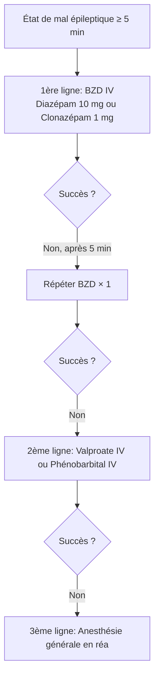

# Antiépileptiques

> [!info] Métadonnées
> **Module** : [[Pharmacologie]] · **Enseignant** : Pr. ZAOUI
> **Statut** : 🔴 Brouillon → 🟡 Révisé → 🟢 Maîtrisé

---

## I. Introduction

> [!abstract] Objectifs pédagogiques
> 1. Classer les antiépileptiques selon leur mécanisme d'action
> 2. Choisir le bon antiépileptique selon le type de crise
> 3. Connaître les interactions médicamenteuses majeures et les CI

- **Épilepsie** : affection neurologique chronique caractérisée par des crises épileptiques récurrentes, non provoquées.
- Environ 50 millions de personnes épileptiques dans le monde (OMS)
- Les antiépileptiques (AE) sont des médicaments à **index thérapeutique étroit** → surveillance et dosages plasmatiques indispensables

---

## II. Rappels physiologiques

- Crise épileptique = décharge neuronale anormale, excessive, synchrone
- Rôle des canaux ioniques (Na⁺, Ca²⁺, K⁺) et des neurotransmetteurs (GABA inhibiteur ↔ glutamate excitateur)
- La plupart des AE agissent en **↓ excitabilité neuronale** et/ou **↑ inhibition GABAergique**

---

## III. Classification des antiépileptiques

### A. Par mécanisme d'action

| Mécanisme | Médicaments |
|---|---|
| Blocage canaux Na⁺ voltage-dépendants | Phénytoïne, Carbamazépine, Oxcarbazépine, Lamotrigine, Lacosamide |
| Potentialisation GABA (GABA-A) | Phénobarbital, Benzodiazépines (diazépam, clonazépam) |
| Inhibition canaux Ca²⁺ (type T) | Éthosuximide (absences) |
| Réduction libération glutamate | Lamotrigine, Topiramate |
| Liaison à SV2A (vésicules synaptiques) | Lévétiracétam (Keppra®) |
| Inhibition anhydrase carbonique | Topiramate, Acétazolamide |
| Mécanisme multiple | Valproate (Na⁺, GABA, Ca²⁺) |

### B. Par génération

| Génération | Médicaments |
|---|---|
| 1ère génération | Phénobarbital, Phénytoïne, Éthosuximide, Carbamazépine, Valproate |
| 2ème génération | Lamotrigine, Gabapentine, Prégabaline, Lévétiracétam, Topiramate, Oxcarbazépine |
| 3ème génération | Lacosamide, Perampanel, Brévariceptam |

---

## IV. Principaux antiépileptiques — fiches détaillées

### A. Valproate de sodium (Dépakine®)

| Paramètre | Détail |
|---|---|
| Mécanisme | Blocage Na⁺, ↑ GABA, blocage Ca²⁺ |
| Spectre | Large (toutes crises : tonico-cloniques, absences, myoclonies) |
| Posologie | 20-30 mg/kg/j en 2-3 prises |
| Surveillance | Taux plasmatique (50-100 mg/L), NFS, bilan hépatique |
| EI majeurs | **Tératogène +++** (spina bifida, autisme), hépatotoxicité, pancréatite, tremblements, prise de poids, alopécie |
| CI | **Grossesse** (sauf nécessité absolue), IH, maladie mitochondriale |
| Interactions | Inducteurs enzymatiques (↓ concentration valproate) |

> [!danger] VALPROATE ET GROSSESSE
> CI absolue en 1ère intention. Si indispensable → contraception + programme de prévention grossesse (PPP) obligatoire.

### B. Carbamazépine (Tégrétol®)

| Paramètre | Détail |
|---|---|
| Mécanisme | Blocage canaux Na⁺ |
| Spectre | Crises partielles + généralisées tonico-cloniques |
| Posologie | 400-1200 mg/j |
| Surveillance | Taux plasmatique (4-12 mg/L), NFS, Na+ (hyponatrémie) |
| EI | Somnolence, ataxie, diplopie, **hyponatrémie**, aplasie médullaire rare |
| CI | Grossesse relative, bloc AV, porphyrie |
| Interactions | **Inducteur enzymatique puissant** → ↓ pilule, warfarine, autres AE |

### C. Phénobarbital (Gardénal®)

| Paramètre | Détail |
|---|---|
| Mécanisme | ↑ GABA-A (allongement ouverture Cl⁻) |
| Spectre | Crises tonico-cloniques, partielles |
| Posologie | 50-200 mg/j (adulte) |
| Surveillance | Taux plasmatique (10-40 mg/L) |
| EI | Sédation, dépendance, **inducteur enzymatique** |
| Particularité | Le plus ancien AE. 1ère intention en état de mal épileptique (IV) |

### D. Lamotrigine (Lamictal®)

| Paramètre | Détail |
|---|---|
| Mécanisme | Blocage Na⁺, ↓ libération glutamate |
| Spectre | Large (absences, myoclonies, partielles, TC) |
| Posologie | Titration lente (↑ risque d'éruption cutanée si titration rapide) |
| EI majeurs | **Syndrome de Stevens-Johnson** (si titration rapide), éruption cutanée, céphalées |
| CI | Contre-indiqué si prise de valproate sans adaptation de dose |
| Grossesse | AE relativement sûr |

### E. Lévétiracétam (Keppra®)

| Paramètre | Détail |
|---|---|
| Mécanisme | Liaison protéine SV2A des vésicules présynaptiques |
| Spectre | Large (tonico-cloniques, myoclonies, partielles) |
| Posologie | 1000-3000 mg/j |
| EI | Irritabilité, troubles comportementaux, céphalées |
| Avantages | Peu d'interactions, élimination rénale sans métabolisme hépatique |
| Adapatation | Si insuffisance rénale |

### F. Phénytoïne (Dilantin®)

| Paramètre | Détail |
|---|---|
| Mécanisme | Blocage canaux Na⁺ |
| EI spécifiques | Hypertrophie gingivale, hirsutisme, ataxie, nystagmus, ostéoporose |
| Pharmacocinétique | Cinétique d'ordre 0 (saturable) → accumulation imprévisible |
| Interactions | Inducteur enzymatique |

### G. Éthosuximide (Zarontin®)

- **Seule indication** : absences typiques (petit mal)
- Blocage canaux Ca²⁺ de type T thalamiques

---

## V. Choix du traitement selon le type d'épilepsie

| Type de crise/épilepsie | 1ère intention | 2ème intention |
|---|---|---|
| Crises partielles | Carbamazépine, Oxcarbazépine, Lamotrigine | Lévétiracétam, Valproate |
| Tonico-cloniques généralisées | Valproate (éviter femme en âge de procréer) | Lamotrigine, Lévétiracétam |
| Absences | **Éthosuximide**, Valproate | Lamotrigine |
| Myoclonies juvéniles | Valproate (éviter FAP), Lévétiracétam | Lamotrigine, Topiramate |
| **État de mal épileptique** | **Diazépam IV / Clonazépam IV** | Phénobarbital IV, Valproate IV, Phénytoïne IV |

### État de mal épileptique — algorithme thérapeutique

---

## VI. Interactions médicamenteuses majeures

| AE inducteur | Médicament affecté | Conséquence |
|---|---|---|
| Carbamazépine, Phénobarbital, Phénytoïne | Contraceptifs oraux | Inefficacité → grossesse non planifiée |
| Carbamazépine | Warfarine | ↓ anticoagulation |
| Valproate | Lamotrigine | ↑ lamotrigine → toxicité (↓ dose lamotrigine) |

---

## VII. Surveillance du traitement

- Dosages plasmatiques réguliers (phénobarbital, phénytoïne, valproate, carbamazépine)
- Bilan hépatique (valproate, carbamazépine)
- NFS (carbamazépine : aplasie médullaire)
- Ionogramme (carbamazépine : hyponatrémie)
- EEG et IRM selon évolution
- Bilan osseux si traitement chronique (inducteurs enzymatiques → métabolisme vit D → ostéoporose)

---

## Zone de révision active

> [!question] Questions de synthèse
> **Q1** : Quel antiépileptique est indiqué en 1ère intention dans les absences ?
> **R1** : Éthosuximide (blocage canaux Ca²⁺ de type T).
>
> **Q2** : Quel est le traitement de 1ère ligne de l'état de mal épileptique ?
> **R2** : Benzodiazépines IV (diazépam 10 mg ou clonazépam 1 mg).
>
> **Q3** : Pourquoi le valproate est-il contre-indiqué (sauf nécessité) chez la femme enceinte ?
> **R3** : Tératogène : spina bifida, malformations craniofaciales, troubles neurodéveloppementaux (autisme, TDAH).

> [!success] Points tombables à l'examen ⭐
> - Mécanismes d'action des grandes classes
> - Valproate : CI grossesse, EI, tératogénicité
> - Carbamazépine : inducteur enzymatique, hyponatrémie
> - Lamotrigine : Stevens-Johnson si titration rapide
> - Éthosuximide = absences uniquement
> - État de mal épileptique : algorithme BZD → phénobarbital → anesthésie générale

---

## Liens

- **Cours précédent** : [[10-Prescription_femme_enceinte_allaitante]]
- **Cours suivant** : [[12-Antidepresseurs]]
- **Référentiel** : [VIDAL](https://www.vidal.fr) · [ebmfrance](https://www.ebmfrance.net)

---

> [!success] Suivi de révision
> | Date | Score (/5) | Notes |
> |------|------------|-------|
> | {{date}} | | |

*Dernière révision : {{date}}*
