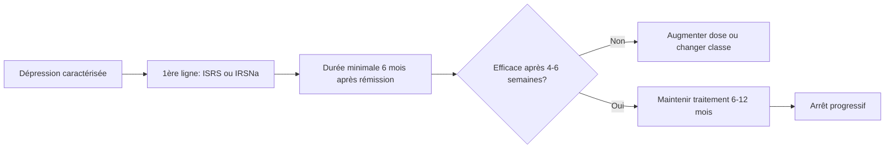

# Antidépresseurs

> [!info] Métadonnées
> **Module** : [[Pharmacologie]] · **Enseignant** : Pr. ZAOUI
> **Statut** : 🔴 Brouillon → 🟡 Révisé → 🟢 Maîtrisé

---

## I. Introduction

> [!abstract] Objectifs pédagogiques
> 1. Classer les antidépresseurs et connaître leurs mécanismes
> 2. Choisir le bon antidépresseur selon le profil clinique
> 3. Gérer les effets indésirables et interactions

- Dépression majeure : prévalence ~10%, 2ème cause de handicap mondial (OMS)
- Les antidépresseurs agissent sur la neurotransmission monoaminergique (sérotonine, noradrénaline, dopamine)
- **Délai d'action** : 2-4 semaines → informer le patient !

---

## II. Classifications

### A. Par mécanisme d'action

| Classe | Médicaments | Mécanisme |
|---|---|---|
| **ISRS** (1ère intention) | Fluoxétine, Sertraline, Paroxétine, Escitalopram, Citalopram | Inhibition recapture 5-HT |
| **IRSNa** | Venlafaxine, Duloxétine | Inhibition recapture 5-HT + NA |
| **Tricycliques (ATC)** | Amitriptyline, Imipramine, Clomipramine | ↑ 5-HT + NA + effets anticholinergiques |
| **IMAO** | Phénelzine, Moclobémide (IMAO-A réversible) | Inhibition MAO → ↑ monoamines |
| **NaSSA** | Mirtazapine | Blocage α2 présynaptique → ↑ NA + 5-HT |
| **IRDA** | Bupropion | Inhibition recapture DA + NA |

---

## III. ISRS — 1ère ligne de traitement

### A. Médicaments

| DCI | Nom commercial | Particularité |
|---|---|---|
| Fluoxétine | Prozac® | Demi-vie très longue (1-6 sem.), inhibiteur CYP2D6 |
| Sertraline | Zoloft® | Bon profil, grossesse |
| Paroxétine | Deroxat® | Anxiolytique, mais anticholinergique, dépendance, CI grossesse |
| Escitalopram | Seroplex® | Bonne tolérance, peu d'interactions |
| Citalopram | Seropram® | Risque allongement QT à forte dose |

### B. Effets indésirables ISRS

| EI | Fréquence | Timing |
|---|---|---|
| Nausées, diarrhée | Fréquent | Début traitement |
| Insomnie, agitation | Fréquent | Début traitement |
| Dysfonction sexuelle | Fréquent | Tout au long |
| Syndrome sérotoninergique | Rare mais grave | Interaction |
| Syndrome de sevrage | Fréquent | Arrêt brutal |
| Hyponatrémie | Peu fréquent | Sujet âgé |
| Allongement QT | Dose-dépendant | Citalopram ++ |

### C. Syndrome sérotoninergique

> [!danger] Syndrome sérotoninergique — URGENCE
> **Triade** :
> 1. Troubles neurovégétatifs (hyperthermie, sueurs, tachycardie, HTA)
> 2. Troubles neuromusculaires (myoclonies, hyperréflexie, tremblements)
> 3. Troubles cognitifs (confusion, agitation)
>
> **Causes** : association ISRS + IMAO, tramadol, triptans, linézolide, millepertuis
>
> **Traitement** : arrêt immédiat, soins de support, cyproheptadine (antagoniste 5-HT)

### D. Syndrome de sevrage

> [!warning] Arrêt progressif obligatoire !
> Symptômes à l'arrêt brutal : vertiges, nausées, paresthésies électriques ("brain zaps"), irritabilité
> → Réduire la dose progressivement sur plusieurs semaines

---

## IV. Antidépresseurs tricycliques (ATC)

### A. Mécanismes

- Inhibition recapture 5-HT et NA
- Blocage récepteurs muscariniques → effets anticholinergiques
- Blocage α1-adrénergiques → hypotension orthostatique
- Blocage H1 → sédation, prise de poids

### B. Effets indésirables ATC

| Type | Effets |
|---|---|
| Anticholinergiques | Sécheresse buccale, constipation, rétention urinaire, tachycardie, glaucome angle fermé |
| Cardiovasculaires | Hypotension orthostatique, **tachycardie, allongement QT, blocs de conduction** |
| Neurologiques | Sédation, confusion (sujet âgé), abaissement seuil épileptique |
| Surdosage | **CARDIOTOXICITÉ** → tachycardie ventriculaire → DC (bicarbonate de sodium IV en urgence) |

### C. Indications spécifiques

- Amitriptyline : douleurs neuropathiques (hors AMM), migraine (prophylaxie), dépression mélancolique
- Clomipramine : TOC

### D. Contre-indications ATC

- Glaucome par fermeture de l'angle
- Adénome de prostate avec RAU
- Infarctus du myocarde récent
- Bloc auriculo-ventriculaire
- Sujet âgé : risque anticholinergique majoré

---

## V. IMAO

### A. Types

| Type | Médicament | Particularité |
|---|---|---|
| IMAO non sélectifs irréversibles | Phénelzine | Interactions alimentaires graves |
| IMAO-A réversibles (RIMAs) | Moclobémide | Moins d'interactions, 2ème intention |

### B. Interactions majeures IMAO

> [!danger] Interactions IMAO — GRAVES
> - **IMAO + aliments riches en tyramine** (fromages affinés, charcuteries) → **crise hypertensive** (tyramine non dégradée → libération massive NA)
> - **IMAO + ISRS** → syndrome sérotoninergique
> - **IMAO + sympathomimétiques** → HTA maligne
> - Délai de wash-out : 14 jours entre IMAO irréversible et ISRS (5 semaines pour fluoxétine)

---

## VI. Mirtazapine (NaSSA)

- Bonne tolérance sexuelle (avantage vs ISRS)
- Sédatif → utile si dépression avec insomnie
- Orexigène → utile si dépression avec anorexie/amaigrissement
- EI : prise de poids, somnolence

---

## VII. Règles de prescription des antidépresseurs

### Durées de traitement

- **Episode inaugural** : 6-12 mois après rémission complète
- **2e épisode** : 2 ans
- **3e épisode ou + / récurrences** : traitement au long cours envisagé

---

## VIII. Cas particuliers

| Situation | Choix préférentiel |
|---|---|
| Grossesse | Sertraline (le plus étudié) |
| Sujet âgé | ISRS (éviter ATC), escitalopram |
| Douleur neuropathique | Duloxétine, amitriptyline |
| TOC | Clomipramine, ISRS à forte dose |
| Dépression avec mélancolie | ATC ou venlafaxine haute dose |
| Dépression avec insomnie | Mirtazapine |

---

## Zone de révision active

> [!question] Questions de synthèse
> **Q1** : Quel est le délai d'action des antidépresseurs ? Comment informer le patient ?
> **R1** : 2-4 semaines. Informer qu'il ne faut pas arrêter par manque d'effet rapide.
>
> **Q2** : Décrivez la triade du syndrome sérotoninergique.
> **R2** : Troubles neurovégétatifs + troubles neuromusculaires + troubles cognitifs.
>
> **Q3** : Pourquoi les tricycliques sont-ils dangereux en cas de surdosage ?
> **R3** : Cardiotoxicité : allongement QT, blocs de conduction, tachycardie ventriculaire → traitement : bicarbonate de sodium IV.

> [!success] Points tombables à l'examen ⭐
> - Classification ISRS, IRSNa, ATC, IMAO
> - Syndrome sérotoninergique (triade, causes, traitement)
> - ATC : CI (glaucome, adénome, IDM) + surdosage cardiotoxique
> - IMAO + tyramine = crise hypertensive
> - Arrêt progressif obligatoire
> - Durées de traitement selon le nombre d'épisodes

---

## Liens

- **Cours précédent** : [[11-Antiepileptiques]]
- **Cours suivant** : [[13-Anxiolytiques]]
- **Référentiel** : [VIDAL](https://www.vidal.fr) · [HAS](https://www.has-sante.fr)

---

> [!success] Suivi de révision
> | Date | Score (/5) | Notes |
> |------|------------|-------|
> | {{date}} | | |

*Dernière révision : {{date}}*
