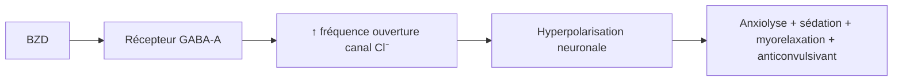
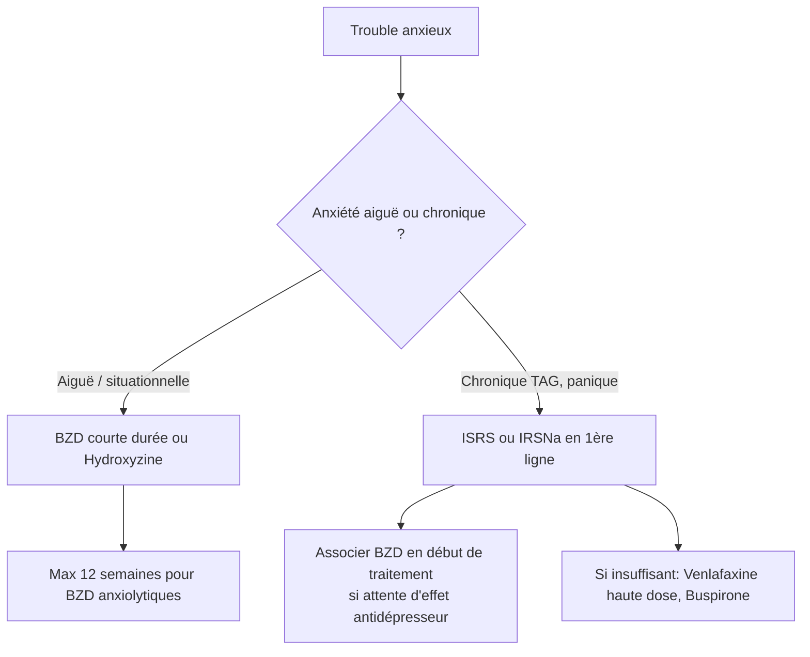

# Anxiolytiques

> [!info] Métadonnées
> **Module** : [[Pharmacologie]] · **Enseignant** : Pr. ZAOUI
> **Statut** : 🔴 Brouillon → 🟡 Révisé → 🟢 Maîtrisé

---

## I. Introduction

> [!abstract] Objectifs pédagogiques
> 1. Classer les anxiolytiques selon leur mécanisme
> 2. Connaître les règles de prescription des benzodiazépines
> 3. Gérer le sevrage aux benzodiazépines

- Les troubles anxieux sont les troubles psychiatriques les plus fréquents (15-20% de la population)
- Les BZD sont les anxiolytiques les plus prescrits mais comportent des risques de dépendance et de mésusage

---

## II. Classification des anxiolytiques

| Classe | Médicaments | Mécanisme |
|---|---|---|
| **Benzodiazépines** | Diazépam, Lorazépam, Alprazolam, Clorazépate, Bromazépam | Potentialisation GABA-A |
| **Buspirone** | Buspirone | Agoniste partiel 5-HT1A |
| **Hydroxyzine** | Atarax® | Antihistaminique H1, anticholinergique |
| **Bêtabloquants** | Propranolol | Blocage β-adrénergique (symptômes somatiques) |
| **Prégabaline** | Lyrica® | Liaison sous-unité α2δ canaux Ca²⁺ |
| **Antidépresseurs** | ISRS, IRSNa, ATC | Anxiolyse à long terme |

---

## III. Benzodiazépines (BZD)

### A. Mécanisme d'action

> [!tip] Mnémo — 4 effets des BZD
> **A-S-M-A** : Anxiolytique, Sédatif/hypnotique, Myorelaxant, Anticonvulsivant

### B. Classification selon la demi-vie

| Durée de vie | Médicament | T½ | Usage |
|---|---|---|---|
| Longue demi-vie | Diazépam (Valium®) | 20-70h | Anxiété, sevrage alcool, EME |
| Longue demi-vie | Clorazépate (Tranxène®) | 30-150h | Anxiété généralisée |
| Demi-vie intermédiaire | Bromazépam (Lexomil®) | 10-20h | Anxiété |
| Courte demi-vie | Lorazépam (Temesta®) | 10-20h | Anxiété, prémédication |
| Courte demi-vie | Alprazolam (Xanax®) | 11-15h | Anxiété, attaques de panique |
| Très courte | Midazolam | 1.5-2.5h | Sédation procédurale |

> [!warning] BZD longue demi-vie chez le sujet âgé → risque accumulati→ STOPP criteria !

### C. Effets indésirables des BZD

| EI | Mécanisme | Manifestation |
|---|---|---|
| Sédation excessive | Dépression SNC | Somnolence, troubles de la concentration |
| Amnésie antérograde | ↓ formation mémoire | Oubli d'événements récents |
| Myorelaxation | Effet direct | Chutes (sujet âgé ++) |
| Dépression respiratoire | Dépression SNC | Surtout IV ou associé à l'alcool/opioïdes |
| **Dépendance physique et psychologique** | Adaptation neuronale | Risque même à doses thérapeutiques |
| **Tolérance** | Désensibilisation GABA-A | ↓ efficacité → escalade des doses |
| Effet rebond | Syndrome de sevrage | Anxiété, insomnie en fin d'effet |

### D. Contre-indications des BZD

- **Absolues** : Myasthénie, insuffisance respiratoire sévère, apnée du sommeil sévère, alcool (association)
- **Relatives** : IH sévère, grossesse (T3), allaitement, sujet âgé (risque chutes)

### E. Règles légales de prescription des BZD

> [!important] Règles de prescription
> - **Anxiolytiques BZD** : durée maximale **12 semaines** (84 jours) — ordonnance simple
> - **Hypnotiques BZD** : durée maximale **4 semaines** (28 jours)
> - Prescription en toutes lettres pour la quantité (ordonnance sécurisée non obligatoire sauf stupéfiants)
> - Réévaluation régulière de la nécessité du traitement

### F. Syndrome de sevrage aux BZD

> [!danger] Arrêt brutal = DANGEREUX
> Surtout après traitement prolongé ou forte dose.
> **Symptômes** : anxiété rebond, insomnie, tremblements, sueurs, crises convulsives (dans les 24-72h)
>
> **Règle d'or** : diminution progressive sur plusieurs semaines/mois (10% de la dose tous les 1-2 mois)
>
> **Stratégie** : substitution par BZD à longue demi-vie (diazépam) puis décroissance lente

### G. Antidote des BZD

> [!tip] Flumazénil (Anexate®)
> - Antagoniste compétitif des récepteurs BZD
> - Indication : intoxication/surdosage aux BZD, réveil post-sédation
> - Demi-vie courte (1h) → risque de re-sédation → surveillance prolongée
> - **CI** : épileptique traité par BZD (risque de déclencher crise)

---

## IV. Buspirone

- **Mécanisme** : agoniste partiel 5-HT1A → réduction anxiété sans sédation ni dépendance
- **Avantages** : pas de dépendance, pas de potentialisation alcool, pas d'effet myorelaxant
- **Inconvénients** : délai d'action 2-4 semaines, moins efficace en anxiété aiguë
- **Indication** : anxiété généralisée chronique (alternative aux BZD au long cours)

---

## V. Hydroxyzine (Atarax®)

- **Mécanisme** : antihistaminique H1 + anticholinergique
- **Effets** : anxiolytique, antihistaminique, anti-émétique
- **Avantages** : pas de dépendance, utilisable en courte durée, prémédication anesthésique
- **EI** : somnolence, sécheresse buccale, constipation (effets anticholinergiques)
- **CI** : glaucome, adénome prostate, QT long

---

## VI. Prégabaline (Lyrica®)

- **AMM** : trouble anxieux généralisé (en Europe, mais non remboursé pour cette indication en France)
- **Mécanisme** : liaison sous-unité α2δ des canaux Ca²⁺ voltage-dépendants → ↓ libération de neurotransmetteurs excitateurs
- **Avantage** : efficacité rapide (quelques jours)
- **EI** : somnolence, vertiges, prise de poids, œdèmes
- **Risque** : potentiel d'abus, mésusage documenté

---

## VII. Stratégie thérapeutique

---

## VIII. Alcool et BZD — synergie dépressive du SNC

> [!danger] Alcool + BZD = Potentialisation mortelle
> Dépression respiratoire, coma, décès possible
> Interaction pharmacodynamique synergique sur les récepteurs GABA-A

---

## Zone de révision active

> [!question] Questions de synthèse
> **Q1** : Quels sont les 4 effets pharmacologiques des BZD ?
> **R1** : Anxiolytique, sédatif-hypnotique, myorelaxant, anticonvulsivant.
>
> **Q2** : Quelle est la durée maximale de prescription d'un anxiolytique benzodiazépinique ?
> **R2** : 12 semaines (84 jours).
>
> **Q3** : Quel est l'antidote des BZD ? Quelle est sa limite ?
> **R3** : Flumazénil. Limite : demi-vie courte → risque de re-sédation ; CI chez l'épileptique sous BZD.

> [!success] Points tombables à l'examen ⭐
> - Mécanisme BZD (GABA-A → Cl⁻)
> - 4 effets BZD (ASMA)
> - Durées de prescription (anxiolytique : 12 sem., hypnotique : 4 sem.)
> - Antidote : flumazénil + ses limites
> - Sevrage BZD : manifestations + décroissance lente
> - Contre-indications (myasthénie, IRC sévère, apnée du sommeil)
> - Buspirone = alternative non addictive

---

## Liens

- **Cours précédent** : [[12-Antidepresseurs]]
- **Cours suivant** : [[14-Antibiotherapie_generalites]]
- **Référentiel** : [VIDAL](https://www.vidal.fr) · [HAS](https://www.has-sante.fr)

---

> [!success] Suivi de révision
> | Date | Score (/5) | Notes |
> |------|------------|-------|
> | {{date}} | | |

*Dernière révision : {{date}}*
