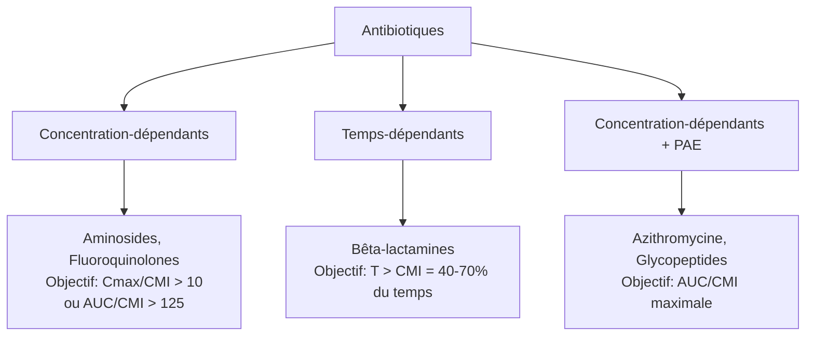

# Antibiothérapie : Généralités

> [!info] Métadonnées
> **Module** : [[Pharmacologie]] · **Enseignant** : Pr. TASSI
> **Statut** : 🔴 Brouillon → 🟡 Révisé → 🟢 Maîtrisé

---

## I. Introduction

> [!abstract] Objectifs pédagogiques
> 1. Définir les paramètres PK/PD des antibiotiques
> 2. Distinguer les mécanismes de résistance bactérienne
> 3. Appliquer les règles d'une antibiothérapie rationnelle

- **Antibiotique** : substance naturelle ou synthétique capable d'inhiber ou de détruire les bactéries à des concentrations tolérées par l'organisme.
- Enjeu majeur : **antibiorésistance** — problème de santé mondiale (OMS : alerte rouge)

---

## II. Classification des antibiotiques

### A. Par mécanisme d'action

| Mécanisme | Classe |
|---|---|
| Inhibition synthèse paroi (bactéricide) | Bêta-lactamines, Glycopeptides |
| Inhibition synthèse protéique (30S) | Aminosides, Cyclines |
| Inhibition synthèse protéique (50S) | Macrolides, Chloramphénicol, Lincosamides |
| Inhibition ADN-gyrase/topoisomérase IV | Fluoroquinolones |
| Inhibition ARN polymérase | Rifampicine |
| Inhibition synthèse folates | Sulfamides, Triméthoprime |
| Perturbation membrane | Polymyxines (Colistine) |
| Inhibition ADN anaérobies | Imidazolés (Métronidazole) |

### B. Effet bactéricide vs bactériostatique

| Type | Définition | Exemples |
|---|---|---|
| **Bactéricide** | Tue la bactérie (CMB/CMI ≤ 4) | Bêta-lactamines, Aminosides, Fluoroquinolones, Glycopeptides |
| **Bactériostatique** | Inhibe la croissance (besoin immunité du patient) | Macrolides, Cyclines, Chloramphénicol, Sulfamides |

> [!important] En pratique : on préfère les bactéricides chez l'immunodéprimé, l'endocardite, les infections graves.

---

## III. Paramètres pharmacocinétiques / pharmacodynamiques (PK/PD)

### A. Paramètres de base

- **CMI** (Concentration Minimale Inhibitrice) : concentration minimale qui inhibe la croissance visible
- **CMB** (Concentration Minimale Bactéricide) : concentration qui tue 99,9% des bactéries

### B. Profils PK/PD — trois types d'activité

- **Concentration-dépendant** : l'efficacité dépend du pic (Cmax). Dose unique élevée préférable. Exemples : aminosides → 1 injection/jour
- **Temps-dépendant** : l'efficacité dépend du temps au-dessus de la CMI. Perfusion continue ou multidoses préférable. Exemples : bêta-lactamines
- **PAE** (Post-Antibiotic Effect) : effet inhibiteur persistant après suppression de l'antibiotique. Aminosides +++

---

## IV. Spectre antibactérien

| Spectre | Bactéries cibles | Exemples |
|---|---|---|
| Étroit | Gram+ ou Gram- ou anaérobies | Pénicilline G (Gram+), Métronidazole (anaérobies) |
| Large | Gram+ et Gram- | Amoxicilline-acide clavulanique, Céphalosporines C3 |
| Très large | Gram+, Gram-, anaérobies, intracellulaires | Carbapénèmes, Fluoroquinolones |

---

## V. Résistances bactériennes

### A. Mécanismes de résistance

| Mécanisme | Exemple |
|---|---|
| Production d'enzymes inactivatrices | Bêta-lactamases → pénicillines ; aminoglycosides acétyltransférases |
| Modification de la cible | PLP altérée (MRSA), mutations gyrase (FQ résistance) |
| Diminution de la perméabilité | Perte de porines (Gram-) |
| Efflux actif | Pompes d'efflux (Pseudomonas, entérobactéries) |
| Protection de la cible | qnr (résistance quinolones) |

### B. Types de résistance

- **Résistance naturelle** (intrinsèque) : constitutive, prévisible (ex : Pseudomonas résistant à l'amoxicilline)
- **Résistance acquise** : par mutation ou acquisition de gènes (plasmides) : IMPRÉVISIBLE → antibiogramme indispensable
- **BLSE** (Bêta-Lactamases à Spectre Étendu) : résistance à la plupart des bêta-lactamines → traitement : carbapénèmes

> [!danger] BMR = Bactéries Multirésistantes
> SARM (S. aureus résistant à la méticilline), BLSE, EPC (Entérobactéries productrices de carbapénémases)
> → précautions complémentaires contact + isolement

---

## VI. Règles de l'antibiothérapie rationnelle

### A. Les 5 étapes

1. **Identifier** le(s) foyer(s) infectieux (clinique + imagerie)
2. **Documenter** : prélèvements bactériologiques **AVANT** antibiotiques (hémocultures, ECBU, PL, etc.)
3. **Choisir** l'antibiotique (spectre, site, terrain, pharmacocinétique)
4. **Adapter** après antibiogramme (désescalade thérapeutique ++)
5. **Surveiller** efficacité, tolérance, durée optimale

> [!important] Prélèvements AVANT antibiothérapie (sauf urgence absolue = sepsis/choc septique)

### B. Critères de choix d'un antibiotique

| Critère | Points clés |
|---|---|
| Spectre | Adapté au(x) germe(s) probables (documentation) |
| Site de l'infection | Diffusion tissulaire (LCR, os, poumon, prostate) |
| Terrain | IR (adaptation dose), IH, grossesse, allergies |
| Voie d'administration | IV si sepsis grave ; oral si infection modérée, bonne biodisponibilité |
| Durée | La plus courte possible efficace (↓ résistances, ↓ EI) |
| Coût et disponibilité | Préférer les génériques disponibles |

### C. Associations antibiotiques

**Indications :**
- Infections sévères (sepsis grave, choc septique)
- Risque de résistances (tuberculose → trithérapie/quadrithérapie obligatoire)
- Élargissement du spectre en attendant documentation
- Synergie (ex : bêta-lactamine + aminoside dans endocardite)

**Éviter :**
- Association de deux bactériostatiques de même classe sans bénéfice documenté
- Antagonisme (bactériostatique + bactéricide sur même cible)

### D. Désescalade thérapeutique

> [!tip] Principe de désescalade
> Dès l'obtention de l'antibiogramme → passer au spectre le plus étroit efficace.
> Réduire les résistances, coûts, effets indésirables.

---

## VII. Durées de traitement recommandées

| Infection | Durée recommandée |
|---|---|
| Cystite non compliquée | 3-7 jours |
| Pneumonie communautaire | 5-7 jours |
| Pyélonéphrite | 7-14 jours |
| Endocardite | 4-6 semaines |
| Ostéomyélite | 6 semaines |
| Tuberculose | 6 mois (2RHZE + 4RH) |
| Méningite bactérienne | 10-14 jours |

---

## VIII. Prophylaxie antibiotique

- **Indication** : chirurgie à risque d'infection, immunodépression sévère, prévention endocardite
- **Principe** : dose unique en pré-opératoire (30-60 min avant incision) ; ne pas prolonger inutilement
- Exemples : amoxicilline (prophylaxie endocardite), céfazoline (chirurgie propre)

---

## Zone de révision active

> [!question] Questions de synthèse
> **Q1** : Quelle est la différence entre CMI et CMB ?
> **R1** : CMI = concentration inhibant la croissance visible. CMB = concentration tuant 99,9% des bactéries (≤4×CMI pour un bactéricide).
>
> **Q2** : Qu'est-ce que la désescalade thérapeutique ? Pourquoi est-elle importante ?
> **R2** : Réduire le spectre antibiotique dès obtention de l'antibiogramme → réduit résistances, coûts et EI.
>
> **Q3** : Citez 4 mécanismes de résistance bactérienne.
> **R3** : Production enzymes (bêta-lactamases), modification cible (PLP), diminution perméabilité (perte porines), efflux actif.

> [!success] Points tombables à l'examen ⭐
> - PK/PD : concentration-dépendant (aminosides) vs temps-dépendant (bêta-lactamines)
> - BLSE → traitement : carbapénèmes
> - Prélèvements AVANT antibiothérapie
> - Désescalade thérapeutique
> - Mécanismes de résistance (4 principaux)
> - Règles de l'antibiothérapie (5 étapes)

---

## Liens

- **Cours précédent** : [[13-Anxiolytiques]]
- **Cours suivant** : [[15-Beta_lactamines]]
- **Référentiel** : [VIDAL](https://www.vidal.fr) · [Antibioclic](https://antibioclic.com) · [SPILF](https://www.infectiologie.com)

---

> [!success] Suivi de révision
> | Date | Score (/5) | Notes |
> |------|------------|-------|
> | {{date}} | | |

*Dernière révision : {{date}}*
