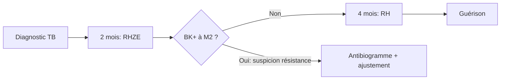

# Les Antibacillaires (Antituberculeux)

> [!info] Enseignant : Pr. BENJELLOUN | Statut : 🔴 Brouillon → 🟢 Maîtrisé

## I. Introduction

- La tuberculose (TB) reste l'une des maladies infectieuses les plus meurtrières (1,5 million de décès/an, OMS)
- Agent : *Mycobacterium tuberculosis* (bacille de Koch)
- Traitement toujours **en association** (prévention résistances) et **prolongé** (6 mois minimum)

## II. Principaux antituberculeux (1ère ligne)

### A. Isoniazide (INH, H)

| Paramètre | Détail |
|---|---|
| Mécanisme | Inhibition synthèse acides mycoliques de la paroi mycobactérienne (prodrug activée par catalase-peroxydase KatG) |
| Effet | Bactéricide (intracellulaire et extracellulaire) |
| EI majeurs | **Hépatotoxicité** (surveillance ALAT), **Neuropathie périphérique** (carence B6 → supplémenter en B6 systématiquement), Lupus médicamenteux, convulsions (surdosage) |
| Métabolisme | Acétylation (acétyleurs lents vs rapides → toxicité variable) |

### B. Rifampicine (R)

| Paramètre | Détail |
|---|---|
| Mécanisme | Inhibition ARN polymérase bactérienne ADN-dépendante |
| Effet | Bactéricide puissant (intracellulaire ++) |
| EI majeurs | **Coloration rouge-orangé** des urines, larmes, sueurs (bénin, informer), **hépatotoxicité**, **inducteur enzymatique puissant** (CYP3A4, 2C9 → nombreuses interactions) |
| Interactions | ↓ contraceptifs oraux, warfarine, antiviraux (IP), ciclosporine, glucocorticoïdes, méthadone |

### C. Pyrazinamide (Z)

| Paramètre | Détail |
|---|---|
| Mécanisme | Actif uniquement en milieu acide (intracellulaire, foyer caséeux) → bactéricide en phase initiale |
| EI majeurs | **Hépatotoxicité**, **hyperuricémie** (inhibe excrétion acide urique) → risque crise de goutte, arthralgies |

### D. Éthambutol (E)

| Paramètre | Détail |
|---|---|
| Mécanisme | Inhibition biosynthèse arabinogalactane (paroi) |
| Effet | Bactériostatique → rôle protecteur anti-résistances |
| EI majeurs | **Névrite optique rétrobulbaire** (troubles visuels, dyschromatopsie rouge-vert) → surveillance ophtalmologique régulière |
| CI | Insuffisance rénale sévère (accumulation → névrite), enfant < 6 ans (difficile à surveiller) |

### E. Streptomycine (S) — 2ème ligne

- Aminoside, injectable uniquement
- Ototoxicité, néphrotoxicité (voir cours aminosides)
- Utilisé en cas de résistance à d'autres agents

## III. Schéma thérapeutique standard (OMS)

> [!important] TB pulmonaire sensible : **2RHZE + 4RH**
> - **Phase initiale (2 mois)** : Rifampicine + Isoniazide + Pyrazinamide + Éthambutol
> - **Phase de continuation (4 mois)** : Rifampicine + Isoniazide
> - Total : **6 mois**

## IV. Tuberculose multirésistante (TB-MDR et TB-XDR)

| Type | Définition | Traitement |
|---|---|---|
| TB-MDR | Résistance à INH + Rifampicine | Fluoroquinolones + aminosides + autres (≥ 18 mois) |
| TB-XDR | MDR + résistance FQ + aminosides | Bédaquiline, Linézolide, Délamanide (schémas individualisés) |

## V. Surveillance du traitement

| Paramètre | Fréquence | Raison |
|---|---|---|
| Transaminases (ALAT, ASAT) | M0, M1, M3, M6 | INH + Rifampicine hépatotoxiques |
| Acide urique | M0, puis si arthralgies | Pyrazinamide |
| Vision (acuité + couleurs) | M0 puis mensuel | Éthambutol → névrite optique |
| Bactériologie (BK crachat) | M0, M2, M5 ou M6 | Évaluation efficacité |
| Ionogramme, créatinine | M0 | Si streptomycine |

## VI. Règles importantes

- **Prise unique quotidienne** (à jeun pour rifampicine) → meilleure observance et Cmax élevée
- **DOT** (Directly Observed Therapy) recommandé
- Contraception hormonale inefficace sous rifampicine → contraception mécanique

---

## Zone de révision active

> [!question] Questions
> **Q1** : Quel est le schéma standard du traitement de la tuberculose pulmonaire sensible ?
> **R1** : 2RHZE (phase initiale 2 mois) + 4RH (phase continuation 4 mois) = 6 mois total.
>
> **Q2** : Quels sont les effets secondaires spécifiques de l'éthambutol ?
> **R2** : Névrite optique rétrobulbaire (troubles visuels, dyschromatopsie) → surveillance ophtalmologique obligatoire.

> [!success] Points tombables ⭐
> - Schéma 2RHZE + 4RH
> - INH → hépatite + neuropathie périphérique → supplémenter B6
> - Rifampicine → inducteur CYP3A4 ↓ contraceptifs, warfarine, antiviraux
> - Éthambutol → névrite optique (surveillance vision)
> - Pyrazinamide → hyperuricémie (pas TB-MDR)
> - Streptomycine → injectable, 2ème ligne

*Dernière révision : {{date}}*
