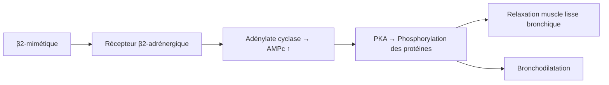

# Les Bronchodilatateurs

> [!info] Enseignant : Pr. BENJELLOUN | Statut : 🔴 Brouillon → 🟢 Maîtrisé

## I. Introduction

- **Bronchodilatateur** : médicament relaxant le muscle lisse bronchique → ↑ calibre des voies aériennes → ↓ résistances et ↑ débit expiratoire
- Indications principales : **asthme** et **BPCO**
- Voie préférentielle : **inhalée** (action locale, effets systémiques réduits)

## II. Bêta-2 agonistes (β2-mimétiques)

### A. Mécanisme

### B. Classification

| Durée d'action | Médicaments | Usage |
|---|---|---|
| **Courte durée (SABA)** | Salbutamol (Ventoline®), Terbutaline (Bricanyl®) | Bronchodilatation de secours (4-6h) |
| **Longue durée (LABA)** | Formotérol (Foradil®), Salmétérol (Serevent®) | Traitement de fond (12h), jamais en monothérapie |
| **Ultra-longue durée** | Indacatérol, Olodatérol | BPCO (24h, 1 fois/j) |

> [!danger] SABA = traitement de crise UNIQUEMENT. LABA = jamais seul en traitement de fond de l'asthme (toujours associé à CSI)

### C. Effets indésirables

| EI | Mécanisme |
|---|---|
| **Tachycardie, palpitations** | Stimulation β1 résiduelle |
| **Tremblements** musculaires | Stimulation β2 musculaire |
| **Hypokaliémie** | Activation pompe Na-K → entrée K+ dans cellules |
| Céphalées, nervosité | Effets systémiques |

### D. Voies d'administration

- **Inhalée** : aérosol doseur, inhalateur poudre sèche, nébulisation → action locale, EI systémiques minimaux
- **Nébulisation** : crise sévère (urgence)
- **IV / SC** : crise très sévère (hospitalisation)
- **Oral** : peu utilisé (EI systémiques ++)

## III. Anticholinergiques (antagonistes muscariniques)

### A. Mécanisme

- Blocage des récepteurs M3 muscariniques bronchiques → ↓ bronchoconstriction cholinergique (tonus vagal)
- Effet : bronchodilatation + ↓ sécrétion bronchique

### B. Médicaments

| Durée | Médicament | Usage |
|---|---|---|
| **Court (SAMA)** | Ipratropium (Atrovent®) | Crise de BPCO (+ salbutamol), asthme sévère |
| **Long (LAMA)** | Tiotropium (Spiriva®), Uméclidinium, Glycopyrronium | BPCO : traitement de fond 1×/j |

### C. Effets indésirables

- **Bouche sèche**, constipation, rétention urinaire, tachycardie (faible)
- Glaucome par fermeture de l'angle (risque si mauvais aérosol dans les yeux)
- **CI** : glaucome angle fermé, adénome prostate avec RAU

## IV. Méthylxanthines (Théophylline)

### A. Mécanisme

- Inhibition des phosphodiestérases → ↑ AMPc et GMPc → bronchodilatation
- Blocage des récepteurs adénosine → effet central (stimulation respiratoire)
- Effets anti-inflammatoires à faibles doses

### B. Particularités

- **Index thérapeutique étroit** : taux sanguin thérapeutique = 10-20 mg/L (monitoring obligatoire)
- **Nombreuses interactions** : inducteurs/inhibiteurs CYP1A2 (tabac, ciprofloxacine, érythromycine)
- Rôle limité actuellement (remplacé par LABA/LAMA)

### C. Effets indésirables (dose-dépendants)

> [!danger] Surdosage théophylline = urgence
> Nausées, vomissements, tachycardie, **arythmies** (fibrillation ventriculaire), **convulsions**

---

## V. Stratégie thérapeutique

### Asthme (escalier thérapeutique)

| Palier | Traitement |
|---|---|
| 1 | SABA si besoin (crise légère, rare) |
| 2 | CSI faible dose + SABA si besoin |
| 3 | CSI dose modérée ± LABA ou LAMA |
| 4 | CSI forte dose + LABA ± tiotropium |
| 5 | +/- Anti-IgE (omalizumab), Anti-IL5 |

### BPCO (GOLD)

| GOLD | Symptômes/exacerbations | Traitement |
|---|---|---|
| A | Peu | SABA ou SAMA |
| B | Plus | LAMA ou LABA |
| C | Exacerbations | LAMA |
| D | Exacerbations + symptômes | LAMA + LABA ± CSI |

---

## Zone de révision active

> [!question] Questions
> **Q1** : Quelle est la principale complication électrolytique des β2-mimétiques ?
> **R1** : Hypokaliémie (entrée K+ dans les cellules par activation pompe Na-K-ATPase).
>
> **Q2** : Pourquoi ne faut-il jamais utiliser un LABA seul dans l'asthme ?
> **R2** : Risque d'asthme fatal si utilisé sans corticostéroïde inhalé (masque l'inflammation, sans traitement de fond).

> [!success] Points tombables ⭐
> - β2-mimétiques : mécanisme AMPc, tachycardie, tremblements, hypokaliémie
> - SABA = urgence/crise ; LABA = fond (jamais seul dans l'asthme)
> - Anticholinergiques : LAMA (tiotropium) = BPCO de référence
> - Théophylline : index thérapeutique étroit, monitoring
> - Salbutamol = Ventoline = β2 de référence de la crise

*Dernière révision : {{date}}*
