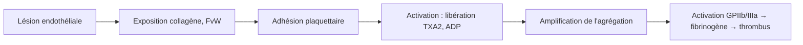

# Antithrombotiques — Antiagrégants Plaquettaires

> [!info] Enseignant : Pr. BENDRISS | Statut : 🔴 Brouillon → 🟢 Maîtrisé

## I. Introduction

- La thrombose artérielle est initiée par l'**agrégation plaquettaire** (rôle central)
- Les antiagrégants plaquettaires (AAP) inhibent cette agrégation → prévention des accidents thrombotiques artériels (SCA, AVC ischémique, AOMI)

## II. Rappel : Activation plaquettaire

## III. Classes d'antiagrégants plaquettaires

### A. Aspirine (Acide acétylsalicylique) — anti-COX

| Paramètre | Détail |
|---|---|
| Mécanisme | **Inhibition irréversible** de la cyclo-oxygénase (COX-1 et COX-2) → ↓ TXA2 (vasoconstricteur, proagrégant) → inhibition définitive pendant la vie de la plaquette (7-10 jours) |
| Dose antiagrégante | **75-160 mg/j** (faible dose) — effet antiagrégant |
| Dose anti-inflammatoire | > 1g/j |
| Délai d'action | Immédiat |
| EI | Hémorragie digestive (ulcère gastrique → IPP si risque), allergie (asthme à l'aspirine), syndrome de Reye (< 16 ans + virale) |
| Arrêt avant chirurgie | 5-7 jours (si thrombopénie élevée) mais souvent non nécessaire pour gestes mineurs |

### B. Thiénopyridines — antagonistes ADP (P2Y12)

| DCI | Nom | Particularité |
|---|---|---|
| **Clopidogrel** (Plavix®) | Prodrug (CYP2C19) → métabolite actif bloque P2Y12 irréversiblement | Standard post-SCA, pose de stent |
| **Prasugrel** (Efient®) | Prodrug plus efficace, plus rapide, moins de non-répondeurs | Post-SCA avec stent, CI si ATCD AVC/AIT, > 75 ans avec risque hémorragique |
| **Ticagrélor** (Brilique®) | Inhibiteur direct réversible P2Y12 (non prodrug) | Post-SCA, plus efficace que clopidogrel, EI : dyspnée, bradycardie |

> [!important] Pharmacogénomique : Clopidogrel → "non répondeurs" CYP2C19 lent (3-14% population) → préférer prasugrel ou ticagrélor

### C. Inhibiteurs GPIIb/IIIa — usage IV hospitalier

| DCI | Usage |
|---|---|
| Abciximab (ReoPro®) | Angioplastie coronaire à haut risque |
| Eptifibatide | SCA sans sus-ST (NSTEMI) |
| Tirofiban | SCA non-ST |

### D. Dipyridamole

- Inhibition de la phosphodiestérase → ↑ AMPc plaquettaire → ↓ agrégation
- Inhibition du recaptage de l'adénosine
- **Association avec aspirine** (Asasantin®) : prévention secondaire AVC non cardio-embolique

## IV. Indications

| Indication | Traitement |
|---|---|
| **SCA (IDM, angor instable)** | Double antiagrégation (DAPT) : Aspirine 75-160 mg + Ticagrélor ou Prasugrel ou Clopidogrel (12 mois minimum) |
| Post-angioplastie avec stent (SMK) | DAPT 1-6 mois selon type de stent |
| Post-angioplastie avec stent pharmaco-actif | DAPT 6-12 mois |
| Prévention secondaire AVC ischémique | Aspirine 75-100 mg OU Clopidogrel |
| AOMI | Aspirine ou Clopidogrel |
| Prévention 1ère coronaropathie (HRS > 10%) | Aspirine (discuté) |

## V. Effets indésirables

| EI | Mécanisme | Fréquence |
|---|---|---|
| **Hémorragie** (digestive, cérébrale, cutanée) | Inhibition hémostase | Le + fréquent |
| **Ulcère gastrique** (aspirine) | Inhibition PGE2 (protection muqueuse) | Fréquent |
| Résistance au traitement (clopidogrel) | Polymorphisme CYP2C19 | |
| Dyspnée, bradycardie | Ticagrélor (spécifique) | |
| TTP (thrombopénie thrombotique) | Anti-GPIIb/IIIa | Rare |

## VI. Gestion péri-opératoire

> [!warning] Arrêt avant chirurgie
> - **Aspirine** : souvent maintenu pour chirurgie mineure, arrêt 5-7j si chirurgie hémorragique
> - **Clopidogrel / Prasugrel** : arrêt 5-7 jours avant chirurgie
> - **Ticagrélor** : arrêt 5 jours avant chirurgie
> - En cas de stent récent (< 1-3 mois) → discuter avec cardiologue (risque thrombose de stent)

---

## Zone de révision active

> [!question] Questions
> **Q1** : Quelle est la différence entre clopidogrel et ticagrélor ?
> **R1** : Clopidogrel = prodrug (CYP2C19, non répondeurs possibles), blocage irréversible P2Y12. Ticagrélor = actif directement, blocage réversible, plus efficace, EI : dyspnée.
>
> **Q2** : Quel est le mécanisme antiagrégant de l'aspirine ?
> **R2** : Inhibition irréversible COX → ↓ TXA2 → inhibition définitive (durée de vie plaquette = 7-10j).

> [!success] Points tombables ⭐
> - Aspirine : COX, irréversible, 75-160 mg/j, CI < 16 ans (Reye)
> - Clopidogrel : prodrug (CYP2C19), non-répondeurs
> - DAPT post-SCA : aspirine + ticagrélor/prasugrel (12 mois)
> - Ticagrélor : dyspnée, bradycardie (spécifiques)
> - Arrêt péri-opératoire : 5-7 jours (clopidogrel), 5 jours (ticagrélor)

*Dernière révision : {{date}}*
