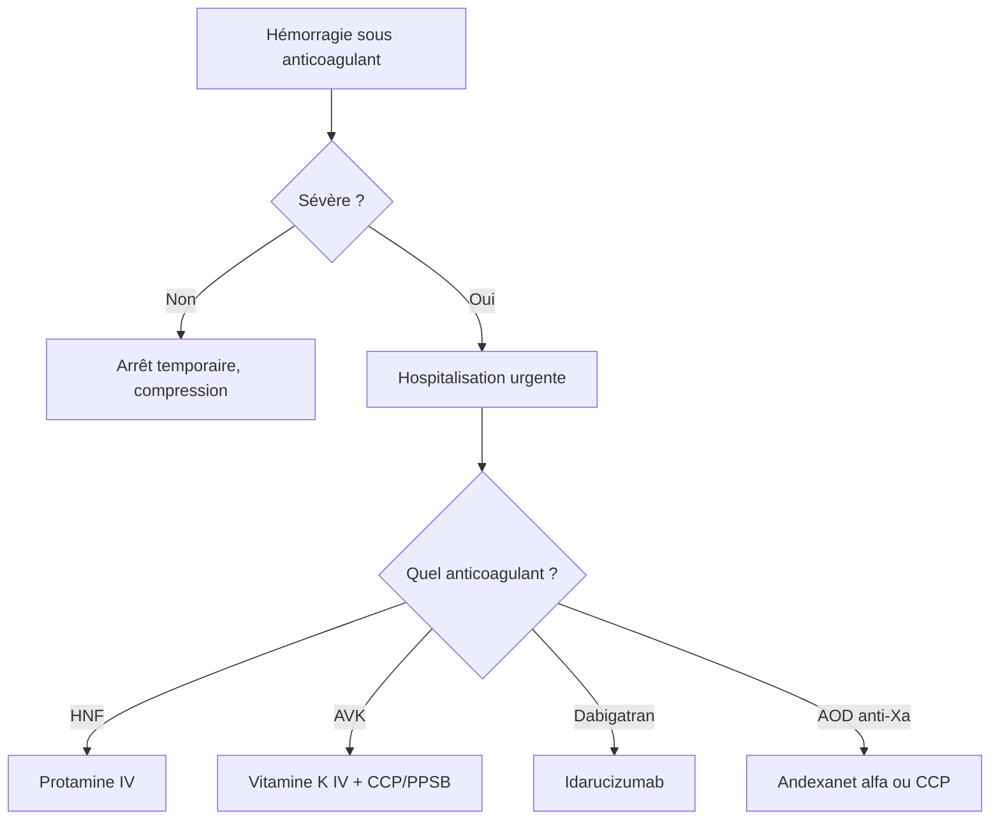

# Antithrombotiques — Anticoagulants

> [!info] Enseignant : Pr. BENDRISS | Statut : 🔴 Brouillon → 🟢 Maîtrisé

## I. Introduction

- Les anticoagulants préviennent la thrombose **veineuse** (TVP, EP) et la thrombose liée à la fibrillation auriculaire
- Mécanismes : inhibition de la cascade de la coagulation (facteurs de coagulation)

## II. Héparine et dérivés

### A. Héparine non fractionnée (HNF)

| Paramètre | Détail |
|---|---|
| Mécanisme | Potentialise l'antithrombine III (ATIII) → inhibition facteurs Xa et IIa (thrombine) |
| Voie | IV continue ou SC |
| Surveillance | **TCA** (temps de céphaline activée) : objectif 2-3× normal |
| Antidote | **Protamine sulfate** |
| EI | Hémorragie, **TIH** (thrombopénie induite par héparine type II), ostéoporose (long cours) |

> [!danger] TIH Type II : thrombocytopénie + thrombose paradoxale → arrêt immédiat de toute héparine → substitution par Argatroban ou Danaparoïde

### B. Héparines de bas poids moléculaire (HBPM)

| Paramètre | Détail |
|---|---|
| Mécanisme | Potentialise ATIII → inhibition prédominante Xa (anti-Xa > anti-IIa) |
| Médicaments | Enoxaparine (Lovenox®), Nadroparine (Fraxiparine®), Tinzaparine |
| Voie | SC uniquement |
| Surveillance | Dosage anti-Xa (si IR, obésité, grossesse) ; PAS de TCA |
| Antidote | Protamine (neutralisation partielle) |
| Avantages | Dose fixe selon poids, 1-2 injections/j, moins de TIH que HNF |

**Doses ENOXAPARINE :**
- Curatif TVP/EP : 1 mg/kg × 2/j ou 1,5 mg/kg × 1/j
- Préventif (chirurgie) : 0,4 ml = 4000 UI × 1/j

### C. Fondaparinux (Arixtra®)

- Pentasaccharide synthétique → inhibiteur sélectif anti-Xa (via ATIII)
- SC, 1 fois/j
- Pas de TIH, pas d'antidote disponible (protamine inefficace)
- Indication : TVP, EP, SCA, chirurgie orthopédique

## III. Antivitamines K (AVK)

### A. Mécanisme

- Inhibition de la **γ-carboxylation des facteurs II, VII, IX, X** (vitamine K-dépendants) et protéines C et S
- Délai d'action : **2-5 jours** (selon demi-vie des facteurs existants)

### B. Médicaments

| DCI | Nom | Demi-vie | Particularité |
|---|---|---|---|
| Warfarine | Coumadine® | 35-45h | Référence mondiale |
| Fluindione | Previscan® | 31h | + fréquente en France |
| Acénocoumarol | Sintrom® | 8h | Ajustements plus fréquents |

### C. Surveillance : INR

> [!important] INR (International Normalized Ratio)
> - **INR thérapeutique usuel** : 2-3 (FA, TVP/EP)
> - **INR thérapeutique si valve mécanique** : 2,5-3,5
> - **INR > 4** : risque hémorragique élevé
> - Contrôle régulier (tous les 1-3 mois si stable)

### D. Interactions AVK (nombreuses ++)

| Médicament | Effet sur INR | Raison |
|---|---|---|
| Antibiotiques (ciprofloxacine, métronidazole) | ↑ | Destruction flore intestinale productrice de vit K |
| AINS, aspirine | ↑ risque hémorragique | Antiplatelet + gastrotoxicité |
| Inducteurs (rifampicine, phénobarbital) | ↓ | ↑ métabolisme CYP2C9 |
| Amiodarone | ↑ | Inhibition CYP2C9 |
| Jus de pamplemousse | ↑ | Inhibition CYP3A4 |
| Aliments riches en vit K (brocolis, épinards) | ↓ | Compétition avec AVK |

### E. Antidote des AVK

> [!tip] Antidote : Vitamine K1 (phytoménadione)
> - **Hémorragie grave** : Vitamine K IV + **CCP** (Concentré de Complexe Prothrombinique = PPSB) → correction rapide INR
> - **INR > 4-5 sans hémorragie** : Vitamine K orale faible dose

## IV. Anticoagulants oraux directs (AOD / NACO)

### A. Mécanismes

| Classe | Médicament | Cible |
|---|---|---|
| Anti-Xa direct | Rivaroxaban (Xarelto®), Apixaban (Eliquis®), Edoxaban | Facteur Xa |
| Anti-IIa direct | Dabigatran (Pradaxa®) | Thrombine (facteur IIa) |

### B. Avantages vs AVK

- **Pas de monitoring** en routine
- Moins d'interactions médicamenteuses et alimentaires
- Dose fixe
- Délai d'action rapide (2-4h)

### C. Inconvénients

- Pas d'antidote universellement disponible (sauf :
  - Dabigatran : **Idarucizumab** (Praxbind®)
  - Rivaroxaban/Apixaban : **Andexanet alfa** (accès limité))
- Adaptation obligatoire si IR (Cockroft ++)
- Coût plus élevé que AVK

### D. Contre-indications

- IR sévère (DFG < 15-30 mL/min selon molécule)
- Valves mécaniques (CONTRE-INDIQUÉS → AVK obligatoires)
- Grossesse, allaitement

## V. Gestion des hémorragies sous anticoagulants

---

## Zone de révision active

> [!question] Questions
> **Q1** : Quel est l'antidote des AVK en cas d'hémorragie grave ?
> **R1** : Vitamine K IV + CCP (Concentré de Complexe Prothrombinique = PPSB) pour corriger rapidement l'INR.
>
> **Q2** : Pourquoi les AOD sont-ils contre-indiqués avec une valve mécanique ?
> **R2** : Risque de thrombose de la valve non couvert → AVK obligatoires (INR cible 2,5-3,5).

> [!success] Points tombables ⭐
> - HNF : TCA, antidote protamine, TIH type II (thrombose paradoxale)
> - AVK : INR 2-3, nombreuses interactions (rifampicine ↓, amiodarone ↑)
> - AOD : pas de monitoring, CI valves mécaniques, antidotes (idarucizumab pour dabigatran)
> - HBPM : anti-Xa, pas TCA, surveillance anti-Xa si IR/obésité

*Dernière révision : {{date}}*
