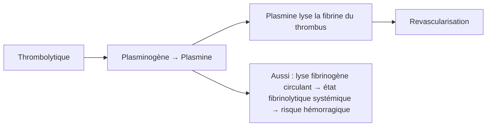

# Thrombolytiques (Fibrinolytiques)

> [!info] Enseignant : Pr. BENDRISS | Statut : 🔴 Brouillon → 🟢 Maîtrisé

## I. Généralités

- **Thrombolyse** : dissolution active d'un thrombus déjà constitué par activation du plasminogène → plasmine → lyse de la fibrine
- Indication dans les urgences thrombotiques où la revascularisation est critique : IDM STEMI, EP massive, AVC ischémique, thrombose de valve

## II. Mécanisme d'action

## III. Médicaments

| DCI | Génération | Sélectivité | Voie | Particularité |
|---|---|---|---|---|
| **Streptokinase** | 1ère | Non sélective | IV | Protéine bactérienne → risque allergique, peut être neutralisée par Ac |
| **Altéplase** (rt-PA) | 2ème | **Sélective** (fibrine) | IV | Référence, demi-vie courte (5 min) → perfusion continue |
| **Ténectéplase** (TNK) | 3ème | Très sélective | IV bolus | Dose unique selon poids, STEMI préhospitalier |
| Rétéplase | 3ème | Sélective | IV × 2 bolus | Facilité d'administration |
| Urokinase | 2ème | Peu sélective | IV | Dérivé humain (rein), pas d'anticorps |

## IV. Pharmacocinétique

- Altéplase : demi-vie très courte (5 min) → perfusion continue sur 60-90 min
- Ténectéplase : demi-vie plus longue → bolus unique → avantage préhospitalier

## V. Indications

| Indication | Thrombolytique | Conditions |
|---|---|---|
| **STEMI** (IDM sus-ST) | Altéplase ou Ténectéplase | Si angioplastie impossible dans 120 min (délai porte-ballon), idéalement < 12h |
| **Embolie pulmonaire massive** | Altéplase | Choc cardiogénique ou arrêt cardiaque |
| **AVC ischémique** | Altéplase (Actilyse®) | Dans les **4,5h** du début des symptômes, après exclusion hémorragie par TDM |
| Thrombose de valve mécanique | Altéplase | Si chirurgie contre-indiquée |
| Occlusion artérielle périphérique | Urokinase, Altéplase | Thrombolyse locale par cathéter |

## VI. Contre-indications

### CI absolues (hémorragies catastrophiques)

> [!danger] Contre-indications absolues
> - ATCD AVC hémorragique ou AVC ischémique < 3 mois (< 6 mois pour thrombolyse EP/IDM)
> - Traumatisme crânien ou chirurgie crânienne récente (< 3 mois)
> - Néoplasme intracrânien, malformation vasculaire
> - Hémorragie interne active (sauf menstruation)
> - Suspicion de dissection aortique
> - Chirurgie majeure < 3 semaines (ou < 10 jours selon indication)

### CI relatives

- HTA non contrôlée (>180/110 mmHg)
- Ponction récente de vaisseau non compressible
- RCP traumatique récente
- Grossesse
- Coagulopathie préexistante

## VII. Effets indésirables

| EI | Fréquence | Mécanisme |
|---|---|---|
| **Hémorragie intracrânienne** | 0,5-1% | Lyse des thrombus cérébraux normaux |
| **Hémorragie systémique** | Fréquent | État fibrinolytique généralisé |
| **Reperfusion** : arythmies | Fréquent post-IDM | Arythmies de reperfusion (bénignes souvent) |
| Allergie (streptokinase) | < 5% | Origine bactérienne |
| Hypotension | Streptokinase | Libération kinines |

## VIII. Gestion d'une hémorragie sous thrombolytiques

- **Arrêt immédiat** du thrombolytique
- Comprimer si site accessible
- Transfusion si nécessaire
- **Antifibrinolytiques** : **Acide tranexamique** (Exacyl®) ou Acide aminocaproïque → inhibent la plasmine
- Plasma frais congelé si coagulopathie associée

---

## Zone de révision active

> [!question] Questions
> **Q1** : Quelle est la fenêtre thérapeutique de la thrombolyse dans l'AVC ischémique ?
> **R1** : 4,5 heures après le début des symptômes (altéplase IV) après exclusion de l'hémorragie par scanner.
>
> **Q2** : Quelle est la principale complication des thrombolytiques ?
> **R2** : Hémorragie intracrânienne (0,5-1%), pouvant être mortelle.

> [!success] Points tombables ⭐
> - Mécanisme : plasminogène → plasmine → lyse fibrine
> - Altéplase = référence (sélectif fibrine)
> - AVC ischémique : fenêtre 4,5h, CI si hémorragie (TDM obligatoire)
> - STEMI : si délai angioplastie > 120 min
> - CI absolues : ATCD AVC hémorragique, chirurgie crânienne récente
> - Antidote hémorragie : acide tranexamique

*Dernière révision : {{date}}*
