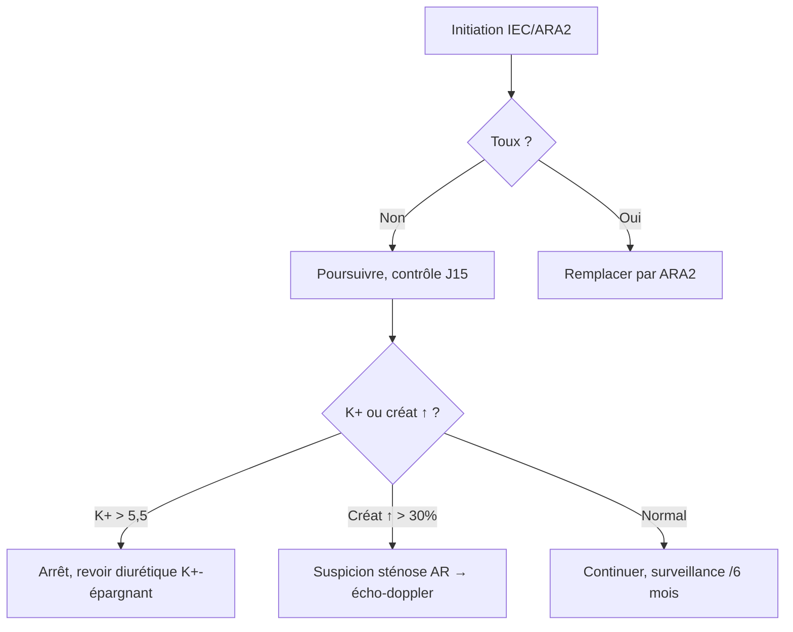

# Bloqueurs du SRAA

> [!info] Métadonnées
> **Module** : [[Pharmacologie]] · **Spécialité** : [[Cardiologie]]
> **Enseignant** : Pr. BENDRISS · **Statut** : 🔴 Brouillon → 🟡 Révisé → 🟢 Maîtrisé

---

## I. Introduction

> [!abstract] Objectifs pédagogiques
> 1. Connaître les étapes du SRAA et les cibles thérapeutiques
> 2. Distinguer IEC et ARA2 : mécanismes, effets, indications
> 3. Maîtriser les contre-indications absolues (grossesse, sténose bilatérale)

- **Intérêt** : les bloqueurs du SRAA sont parmi les **médicaments les plus prescrits au monde** (HTA, IC, néphroprotection)
- Deux grandes classes : **IEC** (inhibiteurs de l'enzyme de conversion) et **ARA2** (antagonistes des récepteurs à l'angiotensine II = sartans)

---

## II. Rappels physiologiques — Le SRAA

```mermaid
graph TD
    A[Angiotensinogène\n(foie)] -->|Rénine (rein ischémié)| B[Angiotensine I]
    B -->|ECA (poumon, endothélium)| C[Angiotensine II]
    C -->|AT1| D[Vasoconstriction\nRétention Na+/eau\nFibrose\nInflammation]
    C -->|AT2| E[Vasodilatation\nEffets protecteurs]
    B -->|ECA| F[Bradykinine\n→ vasodilatation]
    F -->|ECA| G[Peptides inactifs]
    style C fill:#ff6b6b,color:#fff
    style D fill:#ff6b6b,color:#fff
```

- **Rénine** : enzyme clé sécrétée par l'appareil juxta-glomérulaire (en réponse à : ↓PA, ↓NaCl macula densa, SN sympathique)
- **ECA** : convertit Ang I → Ang II **ET** dégrade la bradykinine (vasodilatateur)
- **Angiotensine II** : via récepteurs AT1 → vasoconstriction + aldostérone + réabsorption Na+ + prolifération cellulaire

---

## III. IEC — Inhibiteurs de l'Enzyme de Conversion

### A. Mécanisme d'action

> [!important] Mécanisme
> Inhibition de l'ECA → **↓ Angiotensine II** + **↑ Bradykinine**
> Les deux mécanismes contribuent aux effets thérapeutiques ET aux effets indésirables

### B. Principaux IEC

| DCI | Prodrug ? | Demi-vie | Particularités |
|-----|-----------|----------|----------------|
| **Captopril** | Non | 2h | Courte durée, 2-3 prises/j, contient soufre |
| **Énalapril** | Oui (énalaprilate) | 11h | 1-2 prises/j |
| **Ramipril** | Oui | 13-17h | Cardioprotection post-IDM (étude HOPE) |
| **Perindopril** | Oui | 17h | 1 prise/j, très utilisé en HTA |
| **Lisinopril** | Non | 12h | Non métabolisé, élimination rénale pure |

### C. Effets pharmacologiques

- **Hémodynamique** : ↓ RVP (vasodilatation artérielle + veineuse) → ↓ PA, ↓ post-charge
- **Rénal** : dilatation artériole efférente → ↓ pression de filtration → néphroprotection (DFG peut baisser modérément)
- **Cardiaque** : ↓ remodelage ventriculaire (↓ fibrose, ↓ hypertrophie)
- **Métabolique** : neutre sur glycémie et lipides (avantage vs bêtabloquants)

### D. Effets indésirables

> [!warning] Effets indésirables IEC
> - **Toux sèche chronique** ★ : 10-15% (↑ bradykinine dans les poumons) → remplacer par ARA2
> - **Hyperkaliémie** : ↓ aldostérone → ↓ excrétion K+ → risque si IRC, K+-épargnants associés
> - **↑ Créatinine modéré** : acceptable (↑ < 30% du départ) sauf sténose bilatérale
> - **Hypotension de 1ère dose** : surtout si déplété en sel (diurétiques, IC sévère) → commencer à dose faible
> - **Angio-œdème** : rare mais grave (0,1-0,5%), bradykinine → CI à vie à toute la classe IEC

### E. Contre-indications IEC

> [!danger] CI absolues
> 1. **Grossesse** (T2, T3) : fœtotoxique ++ (oligoamnios, IR néonatale, mort fœtale)
> 2. **Antécédent d'angio-œdème** sous IEC
> 3. **Sténose bilatérale des artères rénales** (ou sténose sur rein unique)
> 4. **Hyperkaliémie sévère** > 5,5 mmol/L
> 5. **Association avec aliskiren** si diabète ou IRC (risque hyperK+ et IR)

---

## IV. ARA2 — Antagonistes des Récepteurs AT1

### A. Mécanisme

> [!important] Mécanisme
> Blocage sélectif des récepteurs **AT1** de l'angiotensine II
> L'ECA n'est PAS inhibée → **pas d'accumulation de bradykinine** → **pas de toux**

### B. Principaux ARA2 (sartans)

| DCI | Demi-vie | Particularités |
|-----|----------|----------------|
| **Losartan** | 6-9h (métab actif 14h) | Premier sartan, uricosurique (↓ uricémie) |
| **Valsartan** | 9h | IC post-IDM (étude Val-HeFT) |
| **Irbesartan** | 11-15h | Néphroprotection dans néphropathie diabétique |
| **Olmésartan** | 13h | Puissance antihypertensive ++ |
| **Telmisartan** | 24h | Plus longue demi-vie, 1 prise/j |
| **Candesartan** | 9h | IC (étude CHARM) |

### C. Comparaison IEC vs ARA2

| Critère | IEC | ARA2 |
|---------|-----|------|
| Bradykinine | ↑↑ | Inchangée |
| Toux | Fréquente (10-15%) | **Rare** (<2%) |
| Angio-œdème | 0,1-0,5% | Très rare (0,01%) |
| Efficacité antihypertensive | ≈ équivalente | ≈ équivalente |
| Néphroprotection | Oui | Oui |
| CI grossesse | Oui | **Oui identique** |

> [!tip] En pratique
> Les ARA2 sont souvent utilisés en **remplacement des IEC** en cas de toux. Les deux classes sont CI en grossesse.

---

## V. Indications communes IEC / ARA2

| Indication | Classe recommandée |
|------------|-------------------|
| **HTA** | IEC ou ARA2 (1ère ligne) |
| **Insuffisance cardiaque** (FE réduite) | IEC **en 1ère intention** ; ARA2 si intolérance |
| **Post-IDM** (↓ remodelage) | IEC (ramipril, lisinopril) |
| **Néphropathie diabétique** | IEC ou ARA2 (irbesartan, losartan) |
| **Néphropathie chronique** protéinurie | IEC ou ARA2 |

> [!danger] Association IEC + ARA2
> **Déconseillée** : ne réduit pas la mortalité, augmente les EI (IR, hyperK+)

---

## VI. Inhibiteurs de la Rénine — Aliskiren

- **Mécanisme** : inhibition directe de la rénine (1ère étape du SRAA)
- **DCI** : aliskiren (Rasilez®)
- **Place** : limitée, ne pas associer aux IEC/ARA2 si diabète ou IRC
- **Avantage** : ↓↓ rénine active → blocage plus complet du SRAA en théorie

---

## VII. Surveillance sous IEC/ARA2

| Paramètre | Moment | Valeur d'alerte |
|-----------|--------|-----------------|
| Créatinine + ionogramme | Avant, J7-J15, puis /3-6 mois | ↑ créat > 30% ou K+ > 5,5 → arrêt |
| PA | Chaque consultation | |
| Protéinurie | /an si néphropathie | |

---

## VIII. Conduite à tenir — HTA sous IEC/ARA2



---

## Zone de révision active

> [!question] Questions de synthèse
> **Q1** : Pourquoi les IEC provoquent-ils une toux ?
> **R1** : L'ECA dégrade normalement la bradykinine. L'inhibition de l'ECA → accumulation de bradykinine dans les poumons → irritation locale → toux sèche réflexe.
>
> **Q2** : Quelle est la CI absolue commune aux IEC et ARA2 ?
> **R2** : La grossesse (T2-T3) : fœtotoxicité grave (oligoamnios, dysplasie rénale, mort fœtale).
>
> **Q3** : Pourquoi la créatinine peut-elle légèrement augmenter sous IEC ?
> **R3** : L'Ang II dilate préférentiellement l'artériole efférente. Sous IEC, perte de cette vasoconstriction efférente → ↓ pression de filtration → ↓ DFG → ↑ créatinine modérée. Acceptable si < 30% du départ.
>
> **Q4** : Quel sartan est uricosurique ? Intérêt ?
> **R4** : Losartan. Intérêt chez patient HTA + hyperuricémie / goutte.

> [!note] Mnémotechnique
> **IEC = I.E.C.** : **I**ntolérance = toux, **E**xclure grossesse, **C**réatinine à surveiller

---

> [!success] Points tombables à l'examen ⭐
> - Toux sous IEC = bradykinine → remplacer par ARA2
> - CI absolue IEC ET ARA2 = **grossesse** (T2-T3)
> - Sténose bilatérale artères rénales = CI IEC/ARA2 (IR fonctionnelle aiguë)
> - Surveillance : ionogramme + créatinine à J15 puis /6 mois
> - IEC 1ère intention dans l'IC à FE réduite (pas ARA2 seul)
> - Angio-œdème sous IEC = CI à vie à TOUTE la classe + à l'ARA2 (risque moindre mais possible)
> - Association IEC + ARA2 = **déconseillée**

---

## Liens

- **Voir aussi** : [[34-Beta_bloquants]] · [[33-Inhibiteurs_calciques]] · [[29-Anticoagulants]]
- **Pathologies** : [[HTA]] · [[Insuffisance cardiaque]] · [[Néphropathie diabétique]]
- **Référentiel** : [[VIDAL]] · [[ESC Guidelines HTA 2023]]

---

*Dernière révision : 2026-04-14*
