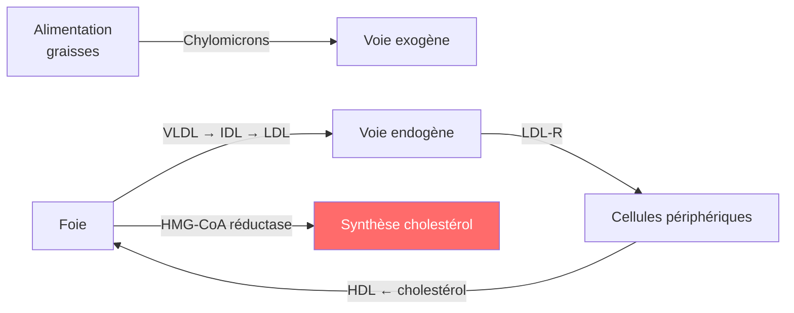

# Les Hypolipémiants

> [!info] Métadonnées
> **Module** : [[Pharmacologie]] · **Spécialité** : [[Cardiologie]]
> **Enseignant** : Pr. BENDRISS · **Statut** : 🔴 Brouillon → 🟡 Révisé → 🟢 Maîtrisé

---

## I. Introduction

> [!abstract] Objectifs pédagogiques
> 1. Connaître les classes d'hypolipémiants et leurs mécanismes
> 2. Savoir choisir et surveiller un traitement selon le profil lipidique
> 3. Reconnaître les effets indésirables graves (myopathie aux statines)

- **Dyslipidémie** = facteur de risque cardiovasculaire majeur modifiable
- **Objectif LDL** selon risque CV : très haut risque < 0,55 g/L ; haut risque < 0,7 g/L ; modéré < 1,0 g/L (ESC 2021)

---

## II. Rappels — Métabolisme des lipides



- **LDL** : athérogène (oxydation, dépôt plaques) → cible principale
- **HDL** : cardioprotecteur (transport retour vers foie)
- **TG** : associés aux VLDL, risque pancréatite si > 10 g/L

---

## III. Statines (Inhibiteurs de l'HMG-CoA réductase) ★★★

### A. Mécanisme d'action

> [!important] Mécanisme
> Inhibition compétitive de **l'HMG-CoA réductase** (enzyme limitante de la synthèse hépatique du cholestérol)
> → ↓ cholestérol intracellulaire → ↑ expression des récepteurs LDL → ↑ captation LDL circulant → **↓ LDL-c**

**Effets pléiotropes** (indépendants du LDL) : anti-inflammatoires, stabilisation de la plaque, amélioration de l'endothélium → bénéfice CV précoce

### B. Principales statines

| DCI | Puissance ↓LDL | Demi-vie | Liposolubilité | Particularités |
|-----|---------------|----------|----------------|----------------|
| **Simvastatine** | Modérée (35-45%) | 2-3h | Élevée | Prodrug, interactions CYP3A4 |
| **Atorvastatine** | Forte (50-60%) | 14h | Élevée | 1ère intention en prévention secondaire |
| **Rosuvastatine** | Très forte (50-65%) | 19h | Faible | Moins d'interactions, elimation rénale ++ |
| **Pravastatine** | Modérée (30-40%) | 2h | Faible | Peu d'interactions, safe en IRC, grossesse |
| **Fluvastatine** | Modérée | 3h | Élevée | |

> [!tip] Règle de prise
> Les statines liposolubles (simvastatine) se prennent **le soir** (synthèse hépatique nocturne ++)
> Les statines hydrosolubles (atorvastatine, rosuvastatine) peuvent se prendre à tout moment

### C. Effets indésirables

> [!warning] Myopathie aux statines ★
> - **Myalgies** (5-10%) : douleurs musculaires sans ↑ CPK → souvent dose-dépendant
> - **Myosite** (0,1%) : myalgies + ↑ CPK > 10N → arrêt obligatoire
> - **Rhabdomyolyse** (rare, <0,01%) : destruction musculaire massive, myoglobinurie, IRA → urgence
> - **Facteurs de risque** : hypothyroïdie, IRC, interactions médicamenteuses (fibrates, ciclosporine, macrolides), fortes doses
> - **Surveillance** : CPK si symptômes ; bilan hépatique à l'initiation

- **Hépatotoxicité** : ↑ transaminases (1-3%), grave < 0,1% → bilan hépatique avant traitement
- **Diabète** : légère augmentation risque DT2 (surtout fortes doses) — bénéfice CV > risque
- **CI grossesse** (tératogènes : cholestérol = précurseur stéroïdes fœtaux)

### D. Interactions médicamenteuses

| Association | Risque | Conduite |
|-------------|--------|---------|
| Fibrates (gemfibrozil) | Myopathie ++ | Éviter gemfibrozil ; fénofibrate acceptable |
| Inhibiteurs CYP3A4 (macrolides, azolés) | ↑ concentration statines | Adapter dose ou suspendre |
| Ciclosporine | Rhabdomyolyse | CI simvastatine/lovastatine |
| Acide nicotinique | Myopathie | Prudence |

---

## IV. Ézétimibe

- **Mécanisme** : inhibition du transporteur **NPC1L1** au niveau de l'entérocyte → ↓ absorption intestinale du cholestérol
- **Effet** : ↓ LDL de 15-20%
- **Association statine + ézétimibe** : effet additif (↓ LDL +15% supplémentaire) — étude IMPROVE-IT : ↓ événements CV
- **EI** : bien toléré, rares myalgies
- **Indication** : en association si objectif LDL non atteint sous statine seule, ou intolérance aux statines

---

## V. Inhibiteurs de PCSK9 ★ (Nouveauté)

- **PCSK9** : protéine hépatique qui dégrade les récepteurs LDL → ↑ LDL circulant
- **Mécanisme** : Ac monoclonaux anti-PCSK9 → ↑ durée de vie des LDL-R → ↓↓ LDL (50-60% supplémentaires)
- **DCI** : évolocumab (Repatha®), alirocumab (Praluent®)
- **Administration** : injection SC toutes les 2 ou 4 semaines
- **Indications** : hypercholestérolémie familiale homozygote, prévention secondaire CV si objectif non atteint
- **EI** : réactions au site d'injection, bien toléré

---

## VI. Fibrates

- **Mécanisme** : agonistes des récepteurs **PPAR-α** → ↑ lipoprotéine lipase → ↓↓ TG (40-60%), ↑ HDL (10-20%), faible ↓ LDL
- **Indication principale** : **hypertriglycéridémie** (surtout si TG > 5 g/L pour prévenir pancréatite)
- **DCI** : fénofibrate (Lipanthyl®), gemfibrozil, bézafibrate
- **EI** : myopathie (seul ou + statines), hépatotoxicité, ↑ créatinine, lithiase biliaire (cholestérol dans bile)
- **CI** : IR sévère, hépatopathie, grossesse

---

## VII. Autres hypolipémiants

| Classe | Mécanisme | Indication | Remarque |
|--------|-----------|------------|---------|
| **Résines échangeuses d'ions** (cholestyramine) | ↓ réabsorption sels biliaires → ↑ conversion hépatique cholestérol → ↑ LDL-R | Hypercholestérolémie | EI : constipation, malabsorption liposolubles |
| **Acides oméga-3** | ↓ synthèse VLDL | HTG sévère | Complémentaire |
| **Acide nicotinique** | ↓ lipolyse tissulaire | HTG + ↑ HDL | Flushing, mal toléré |
| **Acide bempédoïque** | Inhibition ATP-citrate lyase (voie ↑ HMG-CoA) | Intolérance statines | Oral, moins de myopathies |
| **Inclisiran** | ARNsi anti-PCSK9 | Hypercholest. familiale | 2 inj/an |

---

## VIII. Stratégie thérapeutique

```mermaid
flowchart TD
    A[Dyslipidémie identifiée] --> B{LDL élevé ?}
    B -->|Oui| C[Statine haute intensité\nAtorvastatine 40-80 mg\nou Rosuvastatine 20-40 mg]
    C --> D{Objectif LDL atteint à 4-12 sem ?}
    D -->|Non| E[Ajouter Ézétimibe 10 mg]
    E --> F{Objectif atteint ?}
    F -->|Non| G[Ajouter inhibiteur PCSK9\n(évolocumab / alirocumab)]
    F -->|Oui| H[Surveiller /6 mois]
    D -->|Oui| H
    B -->|Non - TG élevés| I[Fibrate ou Oméga-3]
```

---

## Zone de révision active

> [!question] Questions de synthèse
> **Q1** : Quel est le mécanisme des statines ?
> **R1** : Inhibition de l'HMG-CoA réductase → ↓ synthèse hépatique du cholestérol → ↑ LDL-R → ↑ captation LDL circulant → ↓ LDL plasmatique.
>
> **Q2** : Quel est l'effet indésirable musculaire grave des statines et comment le surveiller ?
> **R2** : Rhabdomyolyse (myalgies + ↑↑ CPK + myoglobinurie + IRA). Surveiller CPK si symptômes ; arrêt si CPK > 10N.
>
> **Q3** : Quelle classe est indiquée en cas d'hypertriglycéridémie isolée ?
> **R3** : Fibrates (ou oméga-3 à fortes doses).
>
> **Q4** : Pourquoi associer ézétimibe à une statine ?
> **R4** : Action complémentaire : statine ↓ synthèse hépatique, ézétimibe ↓ absorption intestinale → ↓ LDL additionnelle de 15-20%.

> [!note] Mnémotechnique
> **PCSK9** = **P**roducteur **C**onstant qui **S**acrifie les **K**epteurs du LDL (**9** lettres)

---

> [!success] Points tombables à l'examen ⭐
> - Statines : mécanisme = HMG-CoA réductase → ↑ LDL-R hépatiques
> - EI majeur = myopathie (myalgies → myosite → rhabdomyolyse) → doser CPK si symptômes
> - CI grossesse (toute la classe)
> - Ézétimibe = ↓ absorption intestinale NPC1L1
> - Fibrates = hypertriglycéridémie + risque myopathie si associés aux statines
> - PCSK9i = biothérapie SC, ↓ LDL 50-60% supplémentaires, indication HF homozygote et prévention secondaire
> - Objectif LDL très haut risque CV (ATCD IDM, AOMI) : < 0,55 g/L (ESC 2021)

---

## Liens

- **Voir aussi** : [[31-Bloqueurs_SRAA]] · [[28-Antiagregants_plaquettaires]] · [[34-Beta_bloquants]]
- **Pathologies** : [[Dyslipidémie]] · [[Athérosclérose]] · [[Syndrome coronarien]]
- **Référentiel** : [[ESC Dyslipidaemias 2021]] · [[VIDAL]]

---

*Dernière révision : 2026-04-14*
