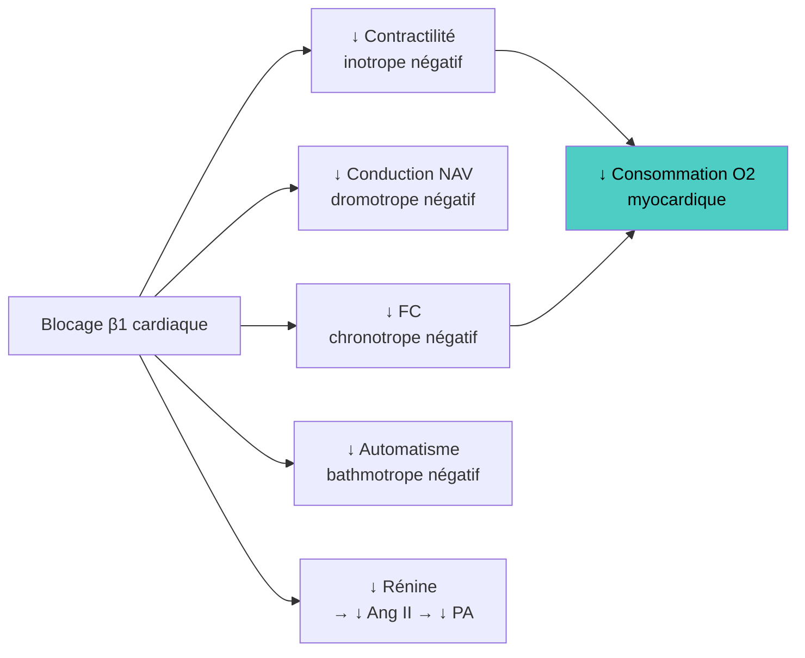

# Les Bêta-Bloquants

> [!info] Métadonnées
> **Module** : [[Pharmacologie]] · **Spécialité** : [[Cardiologie]]
> **Enseignant** : Pr. BENDRISS · **Statut** : 🔴 Brouillon → 🟡 Révisé → 🟢 Maîtrisé

---

## I. Introduction

> [!abstract] Objectifs pédagogiques
> 1. Comprendre la classification des bêtabloquants (cardiosélectivité, ASI, liposolubilité)
> 2. Maîtriser les indications cardiovasculaires majeures (IC, post-IDM, HTA, arythmies, angor)
> 3. Connaître les contre-indications absolues et relatives

- Les bêtabloquants sont des **antagonistes compétitifs des récepteurs bêta-adrénergiques**
- Classe médicamenteuse à **mortalité prouvée** dans l'IC à FE réduite et le post-IDM
- Antiarythmique **classe II** (classification de Vaughan-Williams)

---

## II. Rappels physiologiques — Récepteurs bêta

| Récepteur | Localisation | Effet de la stimulation |
|-----------|-------------|------------------------|
| **β1** | Cœur (nœud SA, NAV, myocarde) | ↑ FC, ↑ conduction NAV, ↑ contractilité, ↑ automatisme |
| **β1** | Rein (JGA) | ↑ sécrétion rénine |
| **β2** | Muscle lisse bronchique | Bronchodilatation |
| **β2** | Muscle lisse vasculaire | Vasodilatation périphérique |
| **β2** | Pancréas (cellules β) | ↑ insulinosécrétion |
| **β2** | Muscle squelettique | ↑ lipolyse, ↑ glycogénolyse |
| **β3** | Tissu adipeux | Lipolyse |

---

## III. Classification des bêtabloquants

### A. Selon la cardiosélectivité (β1 vs β2)

| Type | Exemple | Intérêt |
|------|---------|---------|
| **Non sélectifs** (β1 + β2) | Propranolol, Carvédilol, Labétalol | Bloquent aussi β2 → risque bronchospasme |
| **Cardiosélectifs** (β1 >> β2) | Métoprolol, Aténolol, Bisoprolol, Nebivolol | ↓ Risque bronchospasme (mais CI asthme maintenue!) |

> [!warning] Cardiosélectivité relative
> La cardiosélectivité est **dose-dépendante** et **relative** : à fortes doses, les β1-sélectifs bloquent aussi β2 → asthme reste une CI absolue à toute la classe

### B. Selon l'ASI (Activité Sympathomimétique Intrinsèque)

- **ASI+** (agoniste partiel) : Pindolol, Acébutolol
  - Activité bêta résiduelle → moins de bradycardie au repos
  - **Pas d'indication dans l'IC ou le post-IDM** (perte du bénéfice sur la mortalité)

### C. Selon la liposolubilité

| Propriété | Lipophile | Hydrophile |
|-----------|-----------|-----------|
| Exemples | Propranolol, Métoprolol | Aténolol, Bisoprolol |
| Passage BHE | Oui | Non |
| EI neuropsychiatriques | Oui (cauchemars, dépression) | Rares |
| Élimination | Hépatique | Rénale |

### D. Bêtabloquants avec propriétés supplémentaires

| DCI | Propriété particulière |
|-----|----------------------|
| **Carvédilol** | β1+β2+α1 bloquant → vasodilatation (IC) |
| **Labétalol** | β1+β2+α1 → urgences hypertensives de la grossesse |
| **Nebivolol** | β1 sélectif + libération NO → vasodilatation, bien toléré sujet âgé |
| **Esmolol** | Très courte demi-vie (9 min), IV uniquement, arythmies péri-opératoires |
| **Sotalol** | β1+β2 + propriétés antiarythmiques classe III (↑ QT) |

---

## IV. Effets pharmacologiques

---

## V. Indications

| Indication | BB recommandés | Niveau de preuve |
|-----------|---------------|-----------------|
| **IC à FE réduite** | Bisoprolol, Carvédilol, Métoprolol LP | **A** (↓ mortalité 34%) |
| **Post-IDM** | Métoprolol, Bisoprolol, Carvédilol | **A** (↓ mortalité, récidive) |
| **HTA** | Bisoprolol, Métoprolol, Aténolol | B (moins en 1ère ligne) |
| **Angor stable** | Tout BB | A |
| **Tachyarythmies SV** (FA, Flutter) | Métoprolol IV, Esmolol IV | A |
| **Prévention mort subite** (canalopathies) | Propranolol, Nadolol | A |
| **Tremblements essentiels** | Propranolol | A |
| **Migraine (prophylaxie)** | Propranolol, Métoprolol | B |
| **Thyrotoxicose** (symptômes) | Propranolol | A |
| **Glaucome** (topique) | Timolol, Bétaxolol | A |
| **Hypertension portale** (↓ saignement varices) | Propranolol, Carvédilol | A |

---

## VI. Contre-indications

> [!danger] CI absolues
> 1. **Asthme** (bronchospasme fatal, même les β1-sélectifs à fortes doses)
> 2. **BAV de haut degré** (2e et 3e degré non appareillé)
> 3. **Bradycardie sévère** (FC < 50 bpm)
> 4. **Choc cardiogénique**
> 5. **Syndrome de Raynaud sévère** (vasoconstriction périphérique ↑↑)

> [!warning] CI relatives / précautions
> - **BPCO** : utiliser BB cardiosélectifs avec prudence (bénéfice > risque si IC+BPCO)
> - **Diabète insulinodépendant** : masque les signes d'hypoglycémie (tachycardie) sauf sueurs
> - **Dépression** : BB lipophiles → EI neuropsychiatriques
> - **Artériopathie périphérique** sévère
> - **Grossesse** : possible (atenolol → RCIU), labétalol préféré si HTA gravidique

---

## VII. Effets indésirables

| EI | Mécanisme | Conduite |
|----|-----------|---------|
| **Bradycardie, BAV** | Effet chronotrope/dromotrope négatif | Réduire dose ou arrêt |
| **Bronchospasme** | Blocage β2 bronchique | Contre-indiqué si asthme |
| **Fatigue, asthénie** | ↓ débit cardiaque | Souvent transitoire |
| **Extrémités froides** | ↑ tonus α vasoconstriction | Utiliser BB vasodilatateurs (carvédilol) |
| **Cauchemars, dépression** | Passage BHE (lipophiles) | Utiliser BB hydrophiles |
| **Masquage hypoglycémie** | Blocage β2 → ↓ glycogénolyse et tachycardie | Surveiller glycémie, utiliser β1-sélectif |
| **Impuissance** | Mécanisme central + vasculaire | EI fréquent |
| **Dyslipidémie** | ↑ TG, ↓ HDL (non-sélectifs) | Surveillance bilan lipidique |

---

## VIII. Arrêt des bêtabloquants — RÈGLE FONDAMENTALE

> [!danger] Jamais d'arrêt brutal !
> L'arrêt brutal d'un BB peut provoquer un **phénomène de rebond** :
> - Hypersensibilité des récepteurs β (up-régulation)
> - **Tachycardie, HTA de rebond, angor instable, IDM**
> - **Toujours diminuer progressivement sur 2-4 semaines**

---

## Zone de révision active

> [!question] Questions de synthèse
> **Q1** : Pourquoi les bêtabloquants avec ASI ne sont-ils pas indiqués dans l'IC ?
> **R1** : L'ASI maintient une stimulation bêta résiduelle. Dans l'IC, l'objectif est de bloquer complètement l'hyperactivité sympathique néfaste. Les BB sans ASI (bisoprolol, métoprolol, carvédilol) ont démontré une réduction de mortalité dans l'IC ; ceux avec ASI n'ont pas ce bénéfice prouvé.
>
> **Q2** : Quel bêtabloquant choisir pour une urgence hypertensive chez la femme enceinte ?
> **R2** : Labétalol (IV) : α+β bloquant, vasodilatateur, efficace et bien toléré en grossesse.
>
> **Q3** : Quelle est la règle d'or à l'arrêt d'un bêtabloquant ?
> **R3** : Jamais d'arrêt brutal → diminution progressive sur 2-4 semaines (risque de rebond avec IDM).
>
> **Q4** : Pourquoi le diabète est-il une précaution et non une CI absolue aux BB ?
> **R4** : Les BB masquent la tachycardie (mais pas les sueurs) lors d'hypoglycémie. Ce risque est gérable avec surveillance glycémique et BB cardiosélectifs. Le bénéfice dans l'IC ou post-IDM reste supérieur au risque.

> [!note] Mnémotechnique
> **CI absolues BB** = **A**sthme, **B**AV haut degré, **B**radycardie sévère, **C**hoc cardiogénique, **R**aynaud sévère = **ABCR**

---

> [!success] Points tombables à l'examen ⭐
> - IC à FE réduite : bisoprolol, carvédilol, métoprolol LP → ↓ mortalité 34% (preuves classe A)
> - Asthme = CI absolue (même les β1-sélectifs à fortes doses bloquent β2)
> - Arrêt brutal = risque IDM → toujours diminution progressive
> - Masquage hypoglycémie = bloquer la tachycardie (signe d'alerte), les sueurs persistent
> - Esmolol IV = demi-vie 9 min → arythmies peropératoires et urgences cardiologiques
> - Sotalol = BB + antiarythmique classe III (↑ QT → risque torsades de pointes)
> - BB non sélectifs (propranolol) ↑ TG et ↓ HDL (effet métabolique défavorable)
> - CI association BB + vérapamil ou diltiazem (BAV complet)

---

## Liens

- **Voir aussi** : [[33-Inhibiteurs_calciques]] · [[31-Bloqueurs_SRAA]] · [[35-Anti_angoreux]]
- **Pathologies** : [[Insuffisance cardiaque]] · [[HTA]] · [[Angor]] · [[Fibrillation auriculaire]]
- **Référentiel** : [[ESC Heart Failure 2021]] · [[VIDAL]]

---

*Dernière révision : 2026-04-14*
