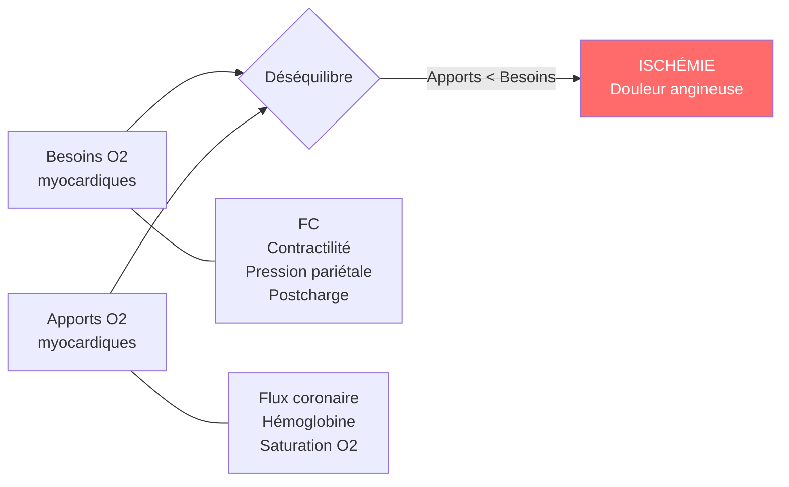
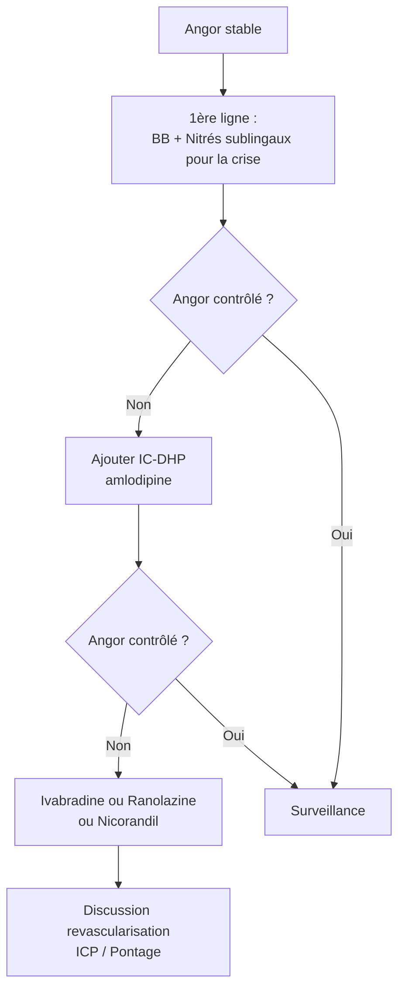

# Les Anti-Angoreux

> [!info] Métadonnées
> **Module** : [[Pharmacologie]] · **Spécialité** : [[Cardiologie]]
> **Enseignant** : Pr. BENDRISS · **Statut** : 🔴 Brouillon → 🟡 Révisé → 🟢 Maîtrisé

---

## I. Introduction

> [!abstract] Objectifs pédagogiques
> 1. Comprendre la physiopathologie de l'angor (balance apports/besoins en O2)
> 2. Maîtriser les mécanismes et utilisations des nitrés, BB, IC, et nouveaux antiangoreux
> 3. Connaître la gestion d'une crise angineuse et la prévention au long cours

> [!example] Vignette clinique
> *Homme de 62 ans, HTA, tabagique, consulte pour douleurs thoraciques constrictives à l'effort, irradiant dans le bras gauche, cédant en 3-5 min au repos. ECG d'effort positif.*
> **Diagnostic : Angor stable. Traitement ?**

- **Angor** = inadéquation entre apports et besoins myocardiques en O2
- **Objectifs thérapeutiques** : soulager la crise (curatif) + prévenir les récidives (préventif) + prévenir l'IDM (prognostique)

---

## II. Physiopathologie de l'angor

**Stratégies thérapeutiques** :
1. **↓ besoins** en O2 : BB (↓ FC, ↓ contractilité), IC, nitrés (↓ précharge)
2. **↑ apports** : vasodilatation coronaire (nitrés, IC), revascularisation

---

## III. Dérivés Nitrés ★★★

### A. Mécanisme d'action

> [!important] Mécanisme
> **Donneurs de NO** (monoxyde d'azote) → activation guanylyl cyclase → ↑ GMPc → phosphorylation myosine kinase → **relaxation musculaire lisse**
> - **Veines** (en premier, à doses thérapeutiques) → ↓ précharge → ↓ volume ventriculaire → ↓ pression pariétale → ↓ besoins O2
> - **Artères** (à doses plus élevées) → ↓ postcharge
> - **Coronaires** → vasodilatation (même les artères spastiques)

### B. Classification

| Forme | DCI | Délai d'action | Durée | Utilisation |
|-------|-----|---------------|-------|-------------|
| **Action courte** (crise) | Trinitrine SL (Natispray®) | 1-3 min | 20-30 min | Crise angineuse |
| **Action courte IV** | Trinitrine IV | Immédiat | Perf continue | OAP, SCA |
| **Action prolongée** | Isosorbide dinitrate (Risordan LP®) | 30 min | 8-12h | Prévention |
| **Action prolongée** | Isosorbide mononitrate (Monicor LP®) | 30-60 min | 12-24h | Prévention |

### C. Effets indésirables

> [!warning] EI nitrés
> - **Céphalées pulsatiles** ★ : vasodilatation cérébrale — très fréquentes, dose-dépendante, diminuent avec le temps
> - **Hypotension orthostatique** : surtout si debout, associés aux antihypertenseurs
> - **Flush, vertiges**
> - **Tachycardie réflexe** : corriger avec BB
> - **Méthémoglobinémie** : à fortes doses IV prolongées

### D. Tolérance (tachyphylaxie)

> [!warning] Tolérance aux nitrés
> En cas d'utilisation **continue** (24h/24) : réduction d'efficacité par down-régulation du NO endogène → imposer une **fenêtre thérapeutique de 8-10h/j** (généralement la nuit si angor d'effort diurne)

### E. Contre-indications

> [!danger] CI absolues
> - **Inhibiteurs de la PDE5** (sildénafil/Viagra®, tadalafil) : potentialisation majeure → hypotension sévère, choc → **CI absolue, délai 24-48h**
> - **Hypertrophie obstructive du ventricule gauche** (HTVO) : ↓ précharge → ↓ débit dans la HTVO
> - **Hypotension** (PA systolique < 90 mmHg)

---

## IV. Bêtabloquants — anti-angoreux

- Voir [[34-Beta_bloquants]] pour le détail
- **Mécanisme antiangoreux** : ↓ FC + ↓ contractilité + ↓ PA → **↓↓ consommation O2 myocardique**
- **Traitement de fond de l'angor stable** (1ère ligne)
- **Bénéfice pronostique post-IDM** : ↓ mortalité et récidive ischémique
- **Précautions** : angor vasospastique (Prinzmetal) → CI relative (risque de vasospasme paradoxal par blocage β2 vasculaire)

---

## V. Inhibiteurs Calciques — anti-angoreux

- Voir [[33-Inhibiteurs_calciques]] pour le détail
- **DHP (amlodipine, nifédipine LP)** : vasodilatation coronaire + ↓ postcharge
- **Non-DHP (vérapamil, diltiazem)** : vasodilatation + ↓ FC + ↓ contractilité
- **Indication de choix** : **angor vasospastique** (Prinzmetal) — vasodilatateurs directs
- **Combinaison DHP + BB** : possible et souvent bénéfique
- **Non-DHP + BB** : CI (bradycardie et BAV)

---

## VI. Nouveaux Anti-Angoreux

### A. Ivabradine (Procoralan®)

- **Mécanisme** : inhibition des canaux If (courant "funny" pacemaker) du nœud sinusal → **bradycardie pure** sans effet inotrope ni hypotenseur
- **Indication** : angor stable + FC ≥ 70 bpm malgré BB, ou intolérance aux BB (CI asthme)
- **Avantage** : ne déprime pas la contractilité (peut être utilisé dans l'IC)
- **EI** : phosphènes (flashs visuels lumineux — dus aux canaux If rétiniens), bradycardie, vertiges
- **CI** : FA (ne contrôle pas la FC si FA), BAV

### B. Nicorandil

- **Mécanisme** : ouverture des canaux K+ATP + effet nitré → vasodilatation coronaire
- **Indication** : angor réfractaire (3ème ligne)
- **EI** : céphalées, ulcères cutanéo-muqueux (spécifique)

### C. Ranolazine

- **Mécanisme** : inhibition du courant Na+ tardif → ↓ Ca²⁺ intracellulaire → ↓ ischémie
- **Intérêt** : n'affecte pas la FC ni la PA → utile si bradycardie ou hypotension préexistante
- **EI** : allongement QT, constipation, vertiges

### D. Trimétazidine

- **Mécanisme** : inhibition de la β-oxydation des acides gras → favorise métabolisme glucosique (plus efficace en ischémie)
- **Indication** : traitement complémentaire de l'angor
- **EI** : syndrome parkinsonien (troubles extrapyramidaux) ★ → arrêt obligatoire

---

## VII. Stratégie thérapeutique de l'angor stable

---

## VIII. Traitement de la crise angineuse

> [!danger] Urgence — Crise angineuse
> 1. **Arrêter l'effort** → s'asseoir ou s'allonger
> 2. **Trinitrine sublinguale** (Natispray® 0,3 mg) → délai d'action 1-3 min
> 3. Si douleur persiste à 5 min → renouveler (max 3 doses)
> 4. Si douleur persiste > 15 min ou intense → **appeler SAMU → suspicion SCA**
> 5. Aspirine 250 mg à croquer si non contre-indiqué

---

## Zone de révision active

> [!question] Questions de synthèse
> **Q1** : Par quel mécanisme les nitrés soulagent-ils l'angor ?
> **R1** : Libération de NO → ↑ GMPc → relaxation musculaire lisse → vasodilatation veineuse (↓ précharge, ↓ pression pariétale → ↓ besoins O2) et coronaire (↑ apport).
>
> **Q2** : Quelle association médicamenteuse est absolument contre-indiquée avec la trinitrine ?
> **R2** : Inhibiteurs de la PDE5 (sildénafil, tadalafil) : potentialisation de la vasodilatation → hypotension sévère/choc. Délai à respecter : 24h (sildénafil) à 48h (tadalafil).
>
> **Q3** : Quel anti-angoreux peut provoquer un syndrome parkinsonien ?
> **R3** : Trimétazidine (troubles extrapyramidaux, imposant l'arrêt du traitement).
>
> **Q4** : Quel médicament est indiqué dans l'angor de Prinzmetal (vasospastique) ?
> **R4** : Inhibiteurs calciques (vasodilatateurs directs). Les bêtabloquants sont à éviter (risque de vasospasme paradoxal).

> [!note] Mnémotechnique
> **Nitrés** = NO → GMPc → Vasodilatation : **"Le NO ouvre les vannes"**
> **CI nitrés** = IPDE5 + Hypotension + HTVO = **"IPas d'Hypotension dans les Valves Obstruées"**

---

> [!success] Points tombables à l'examen ⭐
> - Trinitrine SL = traitement curatif de la crise angineuse (délai 1-3 min)
> - CI absolue trinitrine + IPDE5 (sildénafil) → hypotension fatale
> - Tolérance aux nitrés : fenêtre thérapeutique de 8-10h/j obligatoire
> - Ivabradine = bradycardie pure (canaux If) → pas d'effet sur la PA ni la contractilité
> - Trimétazidine = syndrome parkinsonien (EI à connaître ++)
> - Angor de Prinzmetal = IC (pas de BB)
> - Crise angineuse > 15 min = SCA jusqu'à preuve du contraire → SAMU

---

## Liens

- **Voir aussi** : [[34-Beta_bloquants]] · [[33-Inhibiteurs_calciques]] · [[29-Anticoagulants]]
- **Pathologies** : [[Angor stable]] · [[SCA]] · [[Insuffisance cardiaque]]
- **Référentiel** : [[ESC Chronic Coronary Syndromes 2019]] · [[VIDAL]]

---

*Dernière révision : 2026-04-14*
