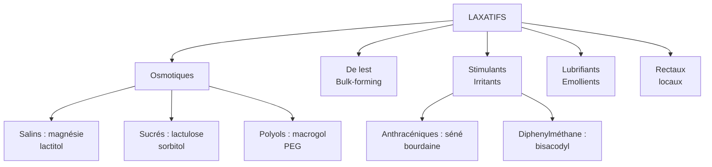

# Les Laxatifs

> [!info] Métadonnées
> **Module** : [[Pharmacologie]] · **Spécialité** : [[Gastro-entérologie]]
> **Enseignant** : Pr. SAMLANI · **Statut** : 🔴 Brouillon → 🟡 Révisé → 🟢 Maîtrisé

---

## I. Introduction

> [!abstract] Objectifs pédagogiques
> 1. Définir la constipation et ses critères diagnostiques (Rome IV)
> 2. Classer les laxatifs selon leur mécanisme d'action
> 3. Connaître les indications préférentielles et les effets indésirables de chaque classe

- **Constipation** : ≤ 3 selles/semaine, avec efforts de poussée, selles dures, sensation d'évacuation incomplète (critères de Rome IV)
- **Prévalence** : 15-30% de la population, prédominance féminine
- **Avant tout traitement médicamenteux** : mesures hygiéno-diététiques obligatoires

---

## II. Mesures Hygiéno-Diététiques (MHD) — 1ère intention

> [!important] MHD avant tout laxatif
> - **Hydratation** : ≥ 1,5 L/j d'eau
> - **Fibres alimentaires** : 25-30 g/j (légumes verts, légumineuses, céréales complètes, fruits)
> - **Activité physique** : marche ≥ 30 min/j (stimule le transit)
> - **Habitudes défécatoires** : même horaire, position adaptée (tabouret sous les pieds)
> - **Éliminer une cause médicamenteuse** : opioïdes, anticholinergiques, antidépresseurs, antihypertenseurs, fer

---

## III. Classification des Laxatifs



---

## IV. Laxatifs Osmotiques ★★★

### A. Mécanisme général

> [!important] Mécanisme
> Molécules non absorbables → maintien d'eau dans la lumière colique par **effet osmotique** → ramollissement des selles + ↑ volume → stimulation du péristaltisme

### B. Polyols (macrogol / PEG)

- **DCI** : macrogol 4000 (Forlax®), macrogol 3350 (Movicol®)
- **Mécanisme** : polyéthylène glycol → non absorbé → rétention d'eau isotonique
- **Délai d'action** : 24-48h
- **Tolérance** : excellente, utilisable **grossesse, enfant, sujet âgé**
- **Indication** : 1ère ligne en France
- **EI** : nausées, ballonnements, crampes
- **Usage** : prép coloscopie à fortes doses

### C. Sucres non absorbables (lactulose, lactitol)

- **DCI** : lactulose (Duphalac®), lactitol (Importal®)
- **Mécanisme** : disaccharides de synthèse non hydrolysables → fermentation colique → acides gras courts → ↑ acidité → ↑ péristaltisme + rétention osmotique
- **Délai d'action** : 24-48h
- **EI** : fermentation → **flatulences ++++**, ballonnements (principal inconvénient)
- **Indication spéciale** : lactulose utilisé dans **l'encéphalopathie hépatique** (↓ absorption NH3 par acidification colique)

### D. Laxatifs salins (hydroxyde de magnésium, sulfate de magnésium)

- **Mécanisme** : ions Mg²⁺ non absorbés → rétention osmotique + stimulation de la motilité
- **Délai d'action** : 2-6h (rapide)
- **EI** : hyperMagnésémie si IRC (**CI en IRC**), diarrhée hydrique, crampes
- **Usage** : préparation coloscopie, constipation occasionnelle

---

## V. Laxatifs de Lest (Mucilages)

- **DCI** : ispaghul (Psyllium, Psyllium Blonde®), méthylcellulose, son de blé
- **Mécanisme** : fibres végétales hydrophiles → ↑ volume des selles + ramollissement → ↑ péristaltisme
- **Délai** : 2-3 jours
- **Conditions d'emploi** : **hydratation suffisante obligatoire** (sinon constipation aggravée !)
- **EI** : ballonnements initiaux, risque d'occlusion si hydratation insuffisante
- **CI** : sténose colique, fécalome
- **Avantage** : physiologique, sûr, utilisable grossesse

---

## VI. Laxatifs Stimulants (Irritants)

### A. Anthracéniques

- **DCI** : séné (Senokot®), bourdaine, cascara
- **Mécanisme** : hétérosides anthracéniques → hydrolysés en aglycones par flore colique → stimulation directe des cellules muqueuses → ↑ motilité + ↓ réabsorption eau
- **Délai** : 6-12h (prise le soir → effet le matin)
- **EI** :
  - Crampes abdominales
  - **Mélanose colique** ★ (pigmentation brun-noir de la muqueuse : signe d'usage prolongé, réversible à l'arrêt)
  - **Syndrome du côlon paresseux** : usage prolongé → hyposensibilité colique
  - Coloration des urines en rouge-brun

### B. Bisacodyl et Picosulfate de sodium

- **DCI** : bisacodyl (Dulcolax®), picosulfate (Picolax®)
- **Mécanisme** : activation de la sécrétion d'eau et d'électrolytes + stimulation des plexus nerveux locaux
- **Délai** : 6-12h PO ; 15-60 min suppositoire
- **EI** : crampes abdominales, diarrhée

> [!warning] Usage chronique des laxatifs stimulants
> - Dépendance (côlon paresseux)
> - Mélanose colique
> - Troubles hydro-électrolytiques (hypokaliémie)
> - **À réserver aux constipations ponctuelles ou en cure courte**

---

## VII. Laxatifs Lubrifiants / Émollients

- **DCI** : huile de paraffine (Laxamalt®), docusate de sodium
- **Mécanisme** : ramollissement et lubrification des selles (interfaces huile-selles)
- **EI** :
  - **Pneumonie lipoïde** (si inhalation — risque ++ sujet âgé alité → CI chez le sujet âgé allongé)
  - **Malabsorption des vitamines liposolubles** (A, D, E, K) à l'usage prolongé
  - Fuites anales graisseuses (inconfort)
- **Usage** : limité, ponctuel

---

## VIII. Laxatifs Rectaux

| Forme | DCI | Mécanisme | Délai |
|-------|-----|-----------|-------|
| Suppositoire glycérol | Glycérol | Irritation rectale + lubrifiant | 15-30 min |
| Suppositoire bisacodyl | Bisacodyl | Stimulant + lubrifiant | 15-60 min |
| Lavement | Phosphate de sodium | Osmotique + stimulant | 5-20 min |
| Microlavement | Laurylsulfate + triglycérides | Ramollissement local | 5-15 min |

---

## IX. Nouveaux médicaments (sécrétagogues)

| DCI | Mécanisme | Indication |
|-----|-----------|------------|
| **Linaclotide** (Constella®) | Agoniste guanylate cyclase C → ↑ sécrétion Cl- et eau | SII-C (syndrome côlon irritable avec constipation) |
| **Prucalopride** (Resolor®) | Agoniste 5-HT4 → ↑ motilité colique | Constipation chronique réfractaire (femme ++) |
| **Naloxégol** (Moventig®) | Antagoniste μ-opioïde périphérique | Constipation induite par les opioïdes |

---

## X. Stratégie de prescription

```mermaid
flowchart TD
    A[Constipation] --> B[MHD d'abord\n(fibres, eau, activité physique)]
    B --> C{Persistance ?}
    C -->|Non| D[Surveillance]
    C -->|Oui - 1ère ligne| E[Laxatif osmotique\nMacrogol PEG]
    E --> F{Persistance ?}
    F -->|Non| D
    F -->|Oui - 2ème ligne| G[Laxatif de lest\n+ stimulant court terme]
    G --> H{Persistance - bilan étiologique}
    H --> I[Consultation spécialisée\nColoscopie, manométrie]
```

---

## Zone de révision active

> [!question] Questions de synthèse
> **Q1** : Quel laxatif est utilisé dans l'encéphalopathie hépatique et pourquoi ?
> **R1** : Lactulose (Duphalac®) : acidification du côlon → conversion NH4+ non absorbable → ↓ absorption d'ammoniaque → ↓ NH3 sanguin.
>
> **Q2** : Quel EI spécifique des laxatifs anthracéniques signe un usage prolongé ?
> **R2** : Mélanose colique (pigmentation brun-noir réversible de la muqueuse colique).
>
> **Q3** : Pourquoi éviter l'huile de paraffine chez le sujet âgé alité ?
> **R3** : Risque de pneumonie lipoïde par inhalation, et malabsorption des vitamines liposolubles.
>
> **Q4** : Quel est le laxatif de 1ère intention recommandé en France ?
> **R4** : Macrogol (PEG) — laxatif osmotique, bien toléré, efficace, utilisable chez la femme enceinte et l'enfant.

> [!note] Mnémotechnique
> **Laxatifs** = **OSLE** : **O**smotiques (1ère ligne) → **S**timulants (court terme) → **L**ubrifiant (limité) → **E**xtra (rectaux si urgence)

---

> [!success] Points tombables à l'examen ⭐
> - Lactulose = encéphalopathie hépatique (↓ NH3) en plus de la constipation
> - Macrogol = laxatif osmotique de référence (grossesse, enfant, sujet âgé)
> - Laxatifs stimulants chroniques → mélanose colique + côlon paresseux
> - Huile de paraffine : CI sujet âgé alité (pneumonie lipoïde) + malabsorption vitamines ADEK
> - MHD toujours en 1ère intention : fibres 25-30 g/j + hydratation 1,5 L/j
> - Lactulose EI principal = flatulences +++
> - Prucalopride = constipation réfractaire chronique (agoniste 5-HT4)
> - Naloxégol = constipation aux opioïdes (antagoniste μ périphérique)

---

## Liens

- **Voir aussi** : [[37-Traitement_ulcere_gastroduodenal]] · [[27-Antitussifs]]
- **Pathologies** : [[Constipation]] · [[SII]] · [[Encéphalopathie hépatique]]
- **Référentiel** : [[Rome IV]] · [[SNFGE]] · [[VIDAL]]

---

*Dernière révision : 2026-04-14*
