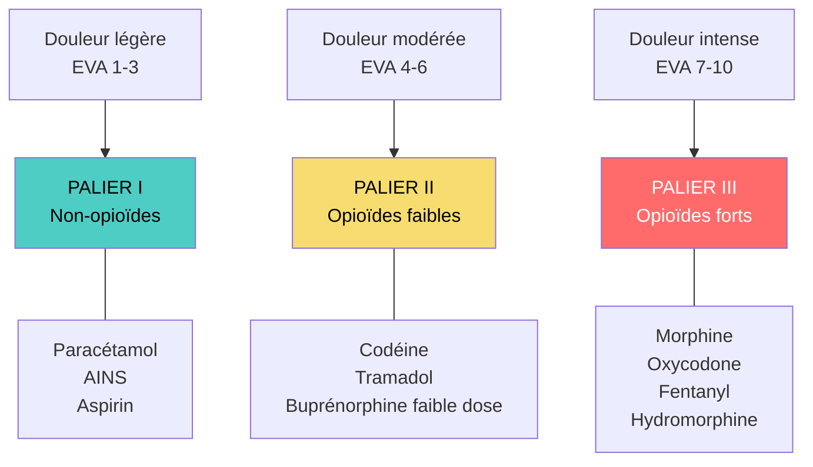
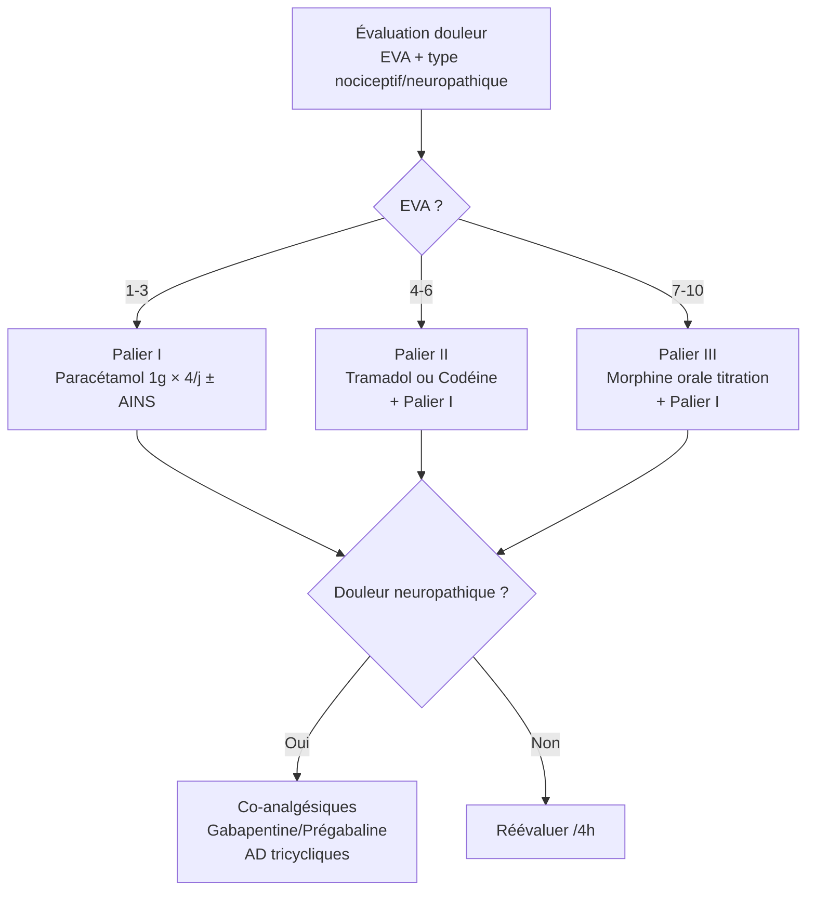

# Les Antalgiques

> [!info] Métadonnées
> **Module** : [[Pharmacologie]] · **Spécialité** : [[Algologie]]
> **Enseignant** : Pr. BOUCHTI · **Statut** : 🔴 Brouillon → 🟡 Révisé → 🟢 Maîtrisé

---

## I. Introduction

> [!abstract] Objectifs pédagogiques
> 1. Connaître la classification OMS des antalgiques en paliers
> 2. Maîtriser les mécanismes, EI et CI de chaque classe
> 3. Gérer une intoxication au paracétamol et un surdosage en opioïdes

> [!example] Vignette clinique
> *Femme 70 ans, cancer du sein métastatique osseux, EVA douleur = 7/10 malgré palier 1-2. Morphine orale envisagée.*
> **Initiation, titration, prévention des EI ?**

- La douleur = **5ème signe vital** (OMS)
- **Échelles** : EVA (0-10), EN (0-10), ÉÉPA (pédiatrique), DOLOPLUS (sujet âgé non verbal)
- **Règle de base** : traiter selon **l'intensité** (paliers OMS) et la **nature** de la douleur (nociceptive, neuropathique, mixte)

---

## II. Classification OMS — Paliers Antalgiques

---

## III. Palier I — Non-Opioïdes

### A. Paracétamol ★★★

> [!important] Mécanisme du paracétamol
> - Inhibition centrale des cyclooxygénases (COX) dans le SNC
> - Mécanisme sérotoninergique descendant inhibiteur de la douleur
> - **Pas d'effet anti-inflammatoire périphérique** (contrairement aux AINS)

- **Dose adulte** : 1 g/prise × 4/j = **4 g/j maximum**
- **Avantages** : très bonne tolérance, pas d'effet gastrique, pas d'effet plaquettaire
- **EI** : quasi nuls aux doses thérapeutiques
- **Hépatotoxicité** (surdosage) :

> [!danger] Intoxication au paracétamol ★★★
> - Dose toxique : > **7,5 g** en dose unique (variable selon terrain : alcoolisme, dénutrition, inducteurs enzymatiques → toxique dès 3-4 g)
> - **Mécanisme** : saturation des voies de conjugaison → accumulation de NAPQI (métabolite réactif) → nécrose hépatocellulaire centro-lobulaire
> - **Nomogramme de Rumack-Matthew** : décision de traiter selon heure ingestion + paracétamolémie
> - **ANTIDOTE : N-acétylcystéine (NAC)** IV : reconstitue le glutathion (piège le NAPQI)
>   - Efficace si administrée dans les **8-10h** (peut être donnée jusqu'à 24h)
>   - Protocole IV : dose de charge 150 mg/kg en 15 min, puis 50 mg/kg en 4h, puis 100 mg/kg en 16h
> - **Critères de transplantation hépatique** (King's College) si nécrose massive

### B. AINS — Anti-Inflammatoires Non Stéroïdiens

> [!important] Mécanisme des AINS
> Inhibition des **cyclooxygénases** COX-1 et COX-2 → ↓ synthèse des **prostaglandines** (PGE2, PGI2, TXA2)
> - **COX-1** : constitutive → protection gastrique (mucus, bicarbonates), agrégation plaquettaire (TXA2), perfusion rénale
> - **COX-2** : inductible → inflammation, douleur, fièvre

**Classification :**

| Classe | Sélectivité | Exemples |
|--------|-------------|---------|
| Non sélectifs | COX-1 + COX-2 | Ibuprofène, Diclofénac, Kétoprofène, Naproxène, Indométacine |
| Anti-COX-2 sélectifs (coxibs) | COX-2 >> COX-1 | Célécoxib, Étoricoxib |

**Effets indésirables AINS :**

> [!warning] EI des AINS ★
> 1. **Gastro-intestinaux** ★ : ulcère gastrique (inhibition COX-1 → ↓ mucus + ↑ acidité), hémorragie digestive
>    → **Prévention : IPP systématique si risque élevé** (âge > 65 ans, ATCD ulcère, corticoïdes, anticoagulants)
> 2. **Rénaux** : ↓ perfusion rénale (PGE2 vasodilatatrices ↓) → IRA fonctionnelle (surtout si déshydratation, IC, IRC)
> 3. **Cardiovasculaires** (surtout coxibs) : ↑ risque thrombose (↓ PGI2 sans ↓ TXA2) → infarctus, AVC
> 4. **Plaquettaires** (AINS non sélectifs) : ↓ TXA2 → ↓ agrégation (moins que l'aspirine, réversible)
> 5. **Hypersensibilité** : réactions pseudo-allergiques (triade de Fernand Widal : asthme, polypes nasaux, AINS)
> 6. **Grossesse** : CI T3 (fermeture prématurée du canal artériel)

**Contre-indications AINS :**

> [!danger] CI absolues AINS
> - **Ulcère gastroduodénal** évolutif
> - **IRC sévère** (DFG < 30 mL/min)
> - **IC sévère**
> - **Grossesse** (T3 absolue, T1-T2 à éviter)
> - **Aspirine chez l'enfant < 15 ans** (syndrome de Reye)
> - **Hypersensibilité** connue aux AINS

### C. Néfopam (Acupan®)

- **Mécanisme** : non-opioïde, non-AINS → inhibition de la recapture de monoamines (sérotonine, noradrénaline, dopamine) + inhibition des canaux Na+ → analgésie centrale
- **Avantage** : pas d'effet gastrique, pas d'effet plaquettaire
- **EI** : tachycardie, rétention urinaire, sueurs, nausées, hallucinations
- **CI** : convulsions, glaucome à angle fermé, adénome prostatique, IC

---

## IV. Palier II — Opioïdes Faibles

### A. Codéine

- **Mécanisme** : **prodrogue** → métabolisée par le **CYP2D6** en **morphine** (10% de la dose) → effet analgésique
- **Problème** : polymorphisme génétique du CYP2D6 :
  - Métaboliseurs rapides/ultrarapides : morphine ↑↑ → surdosage (cas de décès pédiatriques)
  - Métaboliseurs lents : pas d'effet (prodrogue non convertie)
- **CI** : < 12 ans (strict depuis 2013, ANSM), allaitement, postamygdalectomie

### B. Tramadol

- **Double mécanisme** :
  1. Opioïde faible (agoniste μ partiel)
  2. Inhibition recapture sérotonine et noradrénaline (mécanisme central)
- **Avantage** : moins d'effets opioïdes purs (moins de constipation et dépression respiratoire)
- **EI** : nausées +++ (50%), vertiges, **convulsions** (↓ seuil épileptogène), **syndrome sérotoninergique** si associé aux ISRS/IMAO
- **CI** : épilepsie non contrôlée, IMAO, association aux sérotoninergiques

### C. Buprénorphine faible dose (Temgésic®)

- **Mécanisme** : agoniste partiel μ + antagoniste κ
- **Particularité** : **effet plafond** (augmenter la dose n'augmente pas l'analgésie)
- **Disponible** en sublingual

---

## V. Palier III — Opioïdes Forts ★★★

### A. Mécanisme commun

> [!important] Mécanisme des opioïdes
> Agonistes des **récepteurs opioïdes** (μ, κ, δ, ε) → inhibition de l'adényl-cyclase → ↓ AMPc → **inhibition de la transmission nociceptive** (présynaptique + postsynaptique)
> - Récepteurs **μ** : analgésie, euphorie, dépression respiratoire, constipation, myosis
> - Récepteurs **κ** : analgésie spinale, sédation, dysphorie
> - Récepteurs **δ** : analgésie, effets humeurs

### B. Morphine — référence de la classe

| Paramètre | Valeur |
|-----------|--------|
| Voie orale LP | Skenan LP®, Moscontin LP® (8h / 12h) |
| Voie orale LI | Actiskenan® (4h), Oramorph® |
| Voie IV | Perfusion continue ou PCA |
| Voie SC | |
| Biodisponibilité orale | ~30-40% (fort premier passage hépatique) |
| Métabolite actif | Morphine-6-glucuronide (M6G) → accumulation si IRC |

**Titration morphine** (douleur oncologique) :
1. Commencer par morphine LI (libération immédiate) toutes les 4h
2. Dose de secours : 1/10 à 1/6 de la dose totale journalière, toutes les 1h si besoin
3. Après 24-48h : convertir en LP (libération prolongée = dose totale/2 × 2/j)

### C. Autres opioïdes forts

| DCI | Particularités |
|-----|----------------|
| **Oxycodone** | Plus biodisponible (60-80% oral), moins d'effets hallucinatoires |
| **Fentanyl** | Patch transdermique (72h), IV peropératoire, très liposoluble → rapide |
| **Hydromorphone** | Très puissant (5×morphine), IV SC |
| **Méthadone** | Demi-vie très longue, NMDA antagoniste (douleur neuropathique), substitution opioïdes |
| **Nalbuphine** | Agoniste-antagoniste (κ+, μ-) → pas de surdosage en théorie, IV uniquement |

### D. Effets indésirables opioïdes

> [!warning] EI des opioïdes — à prévenir systématiquement
> | EI | Fréquence | Conduite |
> |----|-----------|---------|
> | **Constipation** ★ | 100% | **Toujours** laxatifs d'emblée (macrogol, méthylnaltrexone) ; ne se tolère pas |
> | **Nausées/vomissements** | 30-50% | Antiémétiques (métoclopramide, ondansétron) pendant les 1ères semaines |
> | **Sédation/somnolence** | 20-30% | Réduire la dose, fractionner |
> | **Dépression respiratoire** ★★ | Rare aux doses thérapeutiques | ANTIDOTE = **NALOXONE** (Narcan®) 0,4 mg IV/IM/SC, renouvelable |
> | **Myosis** | Constant (signe diagnostique) | |
> | **Prurit** (IV/rachidien) | 30% | Faibles doses de naloxone |
> | **Rétention urinaire** | 5-10% | Sondage si besoin |

> [!danger] Overdose opioïdes = URGENCE
> **TRIADE** : **Coma + Myosis + Bradypnée** (< 12/min)
> **ANTIDOTE** : **Naloxone** (Narcan®) IV 0,4 mg, renouvelable toutes les 2-3 min, demi-vie 30-90 min (< morphine → risque récurrence → surveiller 6h)

### E. Naloxone

- **Antagoniste compétitif pur** des récepteurs opioïdes (μ, κ, δ)
- **Indications** : surdosage opioïdes (IV), réduction EI (prurit, constipation)
- **EI** : syndrome de sevrage brutal si dépendance (agitation, douleurs, sueurs, tachycardie)
- **Demi-vie** : 30-90 min → **courte par rapport aux opioïdes** → risque re-sédation → surveillance prolongée

---

## VI. Antalgiques Co-analgésiques (Douleur neuropathique)

| Classe | DCI | Indication |
|--------|-----|-----------|
| Antiépileptiques | Gabapentine, Prégabaline | Neuropathies, douleurs postopératoires |
| Antidépresseurs tricycliques | Amitriptyline, Imipramine | Neuropathies douloureuses |
| IRSNa | Duloxétine | Douleur neuropathique diabétique, fibromyalgie |
| Anesthésiques locaux | Lidocaïne patch, crème EMLA | Neuropathie locale, procédures |
| Capsaïcine | Patch forte dose (8%) | Neuropathies périphériques |

---

## VII. Stratégie analgésique

---

## Zone de révision active

> [!question] Questions de synthèse
> **Q1** : Quelle est la triade clinique de l'intoxication aux opioïdes et son traitement ?
> **R1** : Coma + myosis serré + bradypnée < 12/min → Naloxone 0,4 mg IV renouvelable toutes les 2-3 min. Surveiller 6h (demi-vie naloxone < morphine).
>
> **Q2** : Pourquoi la codéine est-elle CI chez l'enfant < 12 ans ?
> **R2** : La codéine est une prodrogue activée par CYP2D6. Les enfants métaboliseurs ultrarapides convertissent massivement la codéine en morphine → surdosage fatal. Cas décrits post-amygdalectomie.
>
> **Q3** : Quel effet indésirable des opioïdes NE se tolère jamais ?
> **R3** : La constipation (100% des patients) — ne disparaît pas avec le temps contrairement aux nausées. Toujours prescrire un laxatif prophylactique dès l'initiation.
>
> **Q4** : Pourquoi éviter les AINS au 3ème trimestre de grossesse ?
> **R4** : ↓ prostaglandines → fermeture prématurée du canal artériel (hypertension pulmonaire néonatale) + oligurie fœtale (↓ liquide amniotique).

> [!note] Mnémotechnique
> **Effets récepteurs μ opioïdes** = **MACE** : **M**yosis, **A**nalgésie, **C**onstipation, **E**uphorie + dépression **R**espiratoire

---

> [!success] Points tombables à l'examen ⭐
> - Paracétamol surdosage → NAPQI → nécrose hépatique → ANTIDOTE = NAC (efficace dans les 8-10h)
> - Opioïdes overdose → coma + myosis + bradypnée → NALOXONE IV 0,4 mg (demi-vie courte → surveillance 6h)
> - Constipation aux opioïdes = 100%, ne disparaît pas → laxatif systématique d'emblée
> - Codéine < 12 ans = CI absolue (décès par surdosage morphinique)
> - Tramadol + ISRS = syndrome sérotoninergique
> - AINS + IRC/déshydratation = IRA fonctionnelle
> - AINS T3 = CI absolue (fermeture prématurée canal artériel)
> - Coxibs = ↑ risque CV (↓ PGI2 sans ↓ TXA2) → CI si ATCD CV
> - IPP systématique si AINS + sujet > 65 ans, ATCD ulcère, anticoagulants

---

## Liens

- **Voir aussi** : [[13-Anxiolytiques]] · [[11-Antiepileptiques]] · [[08-Medicament_pathologies_foie]]
- **Pathologies** : [[Douleur chronique]] · [[Soins palliatifs]] · [[Polyarthrite rhumatoïde]]
- **Référentiel** : [[HAS Douleur chronique]] · [[AFSSAPS recommandations]] · [[VIDAL]]

---

*Dernière révision : 2026-04-14*
