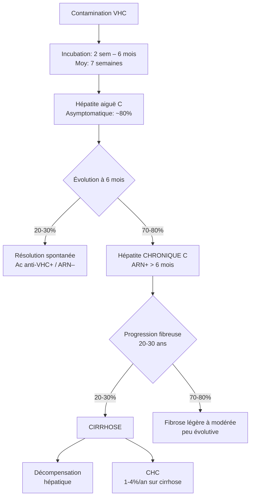
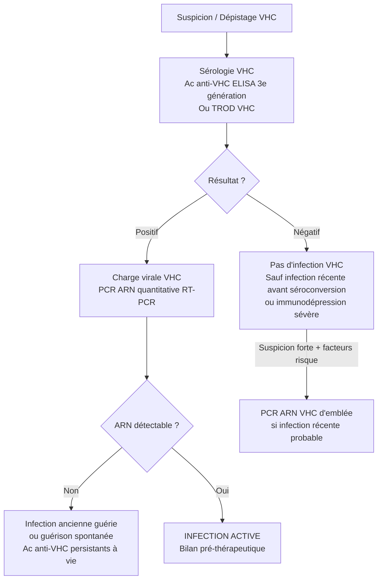
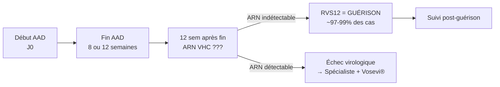

# Hépatite C — Virus de l'Hépatite C (VHC)

> [!info] Métadonnées
> **Module** : [[Hépato-Gastroentérologie]] · **Enseignant** : Pr. 
> **Date** : 2026-04-14 · **Statut** : 🟢 Complet
> **Sources** : OMS 2024 · HAS 2024 · AFEF 2020 · MSD Manuals 2024 · RecoMédicales 2024

---

## I. Introduction

> [!abstract] Objectifs pédagogiques
> 1. Connaître la virologie du VHC et ses mécanismes de persistance
> 2. Maîtriser la démarche diagnostique (sérologie → PCR → fibrose)
> 3. Savoir initier et surveiller un traitement par AAD pangénotypiques
> 4. Identifier et gérer les manifestations extra-hépatiques (cryoglobulinémie)
> 5. Connaître les indications de dépistage et les populations à risque

- **Définition** : Infection hépatotrope causée par le VHC (Flaviviridae), identifié en **1989** par clonage moléculaire (Houghton, Choo, Kuo — Prix Nobel 2020 avec Alter et Rice). Provoque une hépatite le plus souvent **silencieuse et chronique** dans ~75-80 % des cas, évoluant vers la cirrhose et le carcinome hépatocellulaire (CHC).

- **Intérêt de la question** :
  - **Fréquence** : 50 millions de personnes infectées dans le monde (OMS 2022) ; ~400 000 en France (séroprévalence Ac anti-VHC : 0,84 %)
  - **Gravité** : ~700 000 décès/an dans le monde liés aux complications ; 1ère cause de transplantation hépatique en Europe
  - **Enjeu thérapeutique majeur** : Maladie infectieuse chronique **guérissable** dans >97 % des cas en 8–12 semaines par les antiviraux à action directe (AAD) — révolution thérapeutique sans précédent depuis 2013
  - **Enjeu de santé publique** : Objectif OMS d'élimination d'ici **2030** (↓90 % nouvelles infections, ↓65 % mortalité)

---

## II. Rappels

### A. Virologique — Le VHC

- **Classification** : Famille *Flaviviridae*, genre *Hepacivirus*
- **Structure** : Virus enveloppé, ~60 nm de diamètre, capside icosaédrique
- **Génome** : ARN monocaténaire (+), linéaire, ~9 600 nucléotides
  - Code une **polyprotéine** unique clivée en : protéines structurales (Core, E1, E2) + protéines non structurales (NS2, **NS3/4A** protéase, NS4B, **NS5A**, **NS5B** polymérase ARN-dépendante)
  - NS3 (protéase), NS5A et NS5B sont les **cibles des AAD**

> [!tip] Mnémo — Protéines non structurales ciblées
> **"3-5A-5B"** → Protéase-NS5A-Polymérase = les 3 grandes cibles des AAD

- **Génotypes** : 7 génotypes principaux (1 à 7), nombreux sous-types
  - Génotype **1** : le plus fréquent (~70-80 % en Occident)
  - Génotype **3** : associé à stéatose et progression fibreuse plus rapide
  - **Impact clinique limité** avec les AAD pangénotypiques (guérison >97 % tous génotypes)
  - Génotypage encore utile en cas d'échec ou de situation particulière

- **Quasi-espèces** : Le VHC existe sous forme d'un nuage de variants génomiques (polymérase sans activité correctrice) → mécanisme d'échappement immunitaire → explique la chronicisation et l'absence de vaccin

### B. Hépatologique

- **Hépatocyte** = cellule cible principale du VHC (tropisme hépatique via récepteurs CD81, SR-BI, Claudin-1, Occludin)
- Le VHC n'est **pas directement cytopathogène** : les lésions hépatiques sont essentiellement immunologiques (réponse T CD8+)

### C. Immunologique

- Réponse immunitaire innée atténuée par le VHC (protéase NS3/4A clive MAVS et TRIF → bloquage des voies IFN)
- Réponse T spécifique : insuffisante → persistance virale
- Lymphotropisme B du VHC → stimulation polyclonale des lymphocytes B → production de cryoglobulines

---

## III. Épidémiologie

- **Mondiale** : 50 millions de personnes infectées (OMS 2022) ; ~1 million de nouvelles infections/an
- **France** :
  - Séroprévalence Ac anti-VHC : ~0,84 % (soit ~400 000 personnes exposées)
  - Prévalence infection active (ARN+) : ~0,42 % (~193 000 personnes avec infection chronique active)
  - Population surtout atteinte : **hommes de 40 à 59 ans** (génération ayant connu les drogues IV dans les années 80-90 avant les mesures de réduction des risques)
  - **Sous-diagnostic** : ~1 personne sur 2 non diagnostiquée

- **Sex-ratio** : Hommes > Femmes pour l'exposition, mais femmes plus à risque de cryoglobulinémie symptomatique

- **Tranche d'âge** : Pic chez 40-59 ans ; incidence en hausse chez les **HSH** (hommes ayant des rapports sexuels avec des hommes) et **UDI** (usagers de drogues injectables) jeunes

- **Facteurs de risque / Modes de transmission** (exclusivement sanguine) :
  - **UDI** (usagers de drogues IV ou sniffées) — risque majeur, 80 % des nouvelles contaminations
  - Antécédents transfusionnels avant **1992** (dépistage systématique instauré en France en 1992)
  - Tatouages, piercings, acupuncture dans des conditions non stériles
  - Soins médicaux invasifs dans des pays à ressources limitées
  - Transmission sexuelle : **faible** en couples hétérosexuels stables, **élevée** chez les **HSH** (surtout avec co-infection VIH, pratiques traumatisantes, chemsex)
  - Transmission materno-fœtale : risque ~5 % (2× si co-infection VIH)
  - Professionnelle : AES (accident d'exposition au sang) — risque ~3 %
  - **Pas de transmission** par voie orale, allaitement (sauf mamelons fissurés saignants), contact social

---

## IV. Étiopathogénie

### A. Histoire naturelle de l'infection

### B. Physiopathologie de la fibrose hépatique

> [!tip] Cascade physiopathologique
> `![[schema_physiopath_VHC_fibrose.excalidraw]]`

1. **Infection hépatocytaire** : VHC pénètre via CD81/SR-BI/Claudin-1/Occludin
2. **Réplication virale** → production de protéines virales
3. **Réponse immune T CD8+** → cytolyse hépatocytaire (↑ALAT)
4. **Inflammation chronique** → activation des **cellules étoilées hépatiques** (cellules de Ito)
5. **Myofibroblastes** → sécrétion de collagène → **fibrose progressive**
6. **Stéatose** (surtout génotype 3) → accélère la fibrose
7. **Cirrhose** → réorganisation nodulaire + hypertension portale
8. **CHC** : mutations accumulées, inflammation chronique, stress oxydatif

### C. Facteurs aggravants la progression fibreuse

| Facteur | Impact |
|---------|--------|
| Alcool (>50 g/j) | Accélérateur majeur |
| Co-infection VIH | Progression 2-3× plus rapide |
| Co-infection VHB | Risque de décompensation |
| Âge > 40 ans lors de la contamination | Fibrose plus rapide |
| Sexe masculin | Progression plus rapide |
| Génotype 3 | Stéatose + fibrose accélérée |
| Syndrome métabolique, obésité, diabète | Synergique |
| Immunodépression (transplantation) | Progression rapide |

---

## V. Étude clinique — TDD : *Hépatite chronique C découverte au dépistage*

### A. Circonstances de découverte

> [!warning] L'hépatite C est **silencieuse** dans >80 % des cas — le dépistage est crucial
> - **Dépistage systématique** chez les populations à risque (UDI, antécédent transfusionnel avant 1992, HSH)
> - **Dépistage universel** recommandé chez tout adulte ≥18 ans (au moins une fois dans la vie)
> - Découverte fortuite sur **bilan biologique** : ↑transaminases (ALAT)
> - Découverte lors d'un don de sang
> - Complication révélatrice : cirrhose, ascite, CHC

### B. Hépatite aiguë C (souvent asymptomatique)

- **Incubation** : 2 semaines à 6 mois (moyenne 7 semaines)
- **Asymptomatique** : ~80-90 % des cas
- Si symptomatique (10-20 %) :
  - Asthénie, anorexie, nausées
  - Ictère (rare, ~25 %)
  - Douleurs de l'hypochondre droit
  - Syndrome pseudo-grippal
  - **Hépatite fulminante** : **exceptionnelle** (surtout si co-infection VHB)

### C. Hépatite chronique C — Signes fonctionnels

- **Asthénie** : signe le plus fréquent et le plus invalidant, souvent disproportionnée au degré de fibrose
- Douleurs de l'hypochondre droit
- Arthralgies, myalgies (parfois liées à la cryoglobulinémie)
- Prurit (si cholestase associée ou cirrhose évoluée)
- Troubles cognitifs légers (« brain fog »)
- Très souvent : **totalement asymptomatique**

### D. Signes physiques

- **Hépatite chronique légère à modérée** : examen normal
- **Cirrhose compensée** : hépatomégalie, splénomégalie
- **Cirrhose décompensée / Insuffisance hépato-cellulaire** :
  - **Inspection** : ictère, angiomes stellaires (thorax supérieur), érythrose palmaire, ongles blancs, hippocratisme digital, circulation veineuse collatérale abdominale
  - **Palpation** : hépatomégalie (foie dur, à bord tranchant) ou foie non palpable si cirrhose rétractée, splénomégalie
  - **Percussion** : matité des flancs (ascite)
  - **Auscultation** : rare frottement périhépatique
- **Signes d'hypertension portale** : ascite, circulation collatérale, encéphalopathie porto-systémique

### E. Signes généraux

- Fièvre absente (sauf complication)
- Amaigrissement (stade évolué)
- Altération de l'état général (stade cirrhotique)

---

## VI. Manifestations extra-hépatiques (MEH)

> [!important] Les MEH sont liées au **lymphotropisme B** du VHC et à la stimulation immunitaire chronique — elles doivent être activement recherchées

### Tableau des MEH

| Manifestation | Fréquence | Mécanisme | Caractéristiques |
|---------------|-----------|-----------|-----------------|
| **Cryoglobulinémie mixte** (CM) | 36-55 % des patients VHC+ | Stimulation polyclonale lymphocytes B → complexes immuns | CM de type II (IgM monoclonale + IgG polyclonales) ou III |
| Vascularite cryoglobulinémique | 5-10 % | Dépôts de CM dans petits vaisseaux | Triade : purpura, arthralgies, asthénie |
| Glomérulonéphrite membranoproliférative | Rare | Dépôts de CM | Protéinurie, hématurie, insuffisance rénale |
| Neuropathie périphérique | Rare | Vascularite des vasa nervorum | Mononévrite multiple sensitive puis sensitivomotrice |
| **Lichen plan** | Association connue | Immunologique | Localisations cutanées et muqueuses |
| **Porphyrie cutanée tardive** | Rare | Atteinte hépatique + susceptibilité génétique | Fragilité cutanée, bulles photoexposées |
| **Lymphome B non hodgkinien** (LBNH) | RR× 2-3 | Stimulation clonale lymphocytes B | Lymphome splénique à lymphocytes villeux++ |
| Diabète de type 2 | Association | Insulinorésistance + atteinte hépatique | Indépendant de la fibrose |
| Syndrome sec (Sjögren-like) | Fréquent | Auto-immunité B | Xérostomie, xérophtalmie |
| Fatigue chronique | Très fréquente | Multifactorielle | Souvent réversible après guérison virologique |
| Manifestations cardio-vasculaires | Association | Inflammation chronique systémique | Athérosclérose accélérée |

> [!warning] Cryoglobulinémie — Point critique
> - La cryoglobulinémie mixte est la MEH **la plus fréquente** (36-55 %)
> - Triade clinique classique : **purpura des membres inférieurs** (non prurigineux, ne blanchit pas à la vitropression) + **arthralgies** + **asthénie**
> - Prélèvement IMPÉRATIF à 37°C (tube maintenu au chaud) sinon résultat faussé
> - Facteurs de risque de CM symptomatique : âge avancé, longue durée d'infection, type II, IgM kappa, taux élevés
> - **Traitement** : AAD en 1ère intention → résolution de la CM dans la majorité des cas

---

## VII. Examens complémentaires

### A. Biologie — Démarche diagnostique en 2 étapes

> [!warning] Points clés de la sérologie
> - Fenêtre sérologique : les Ac apparaissent en **2-12 semaines** après contamination
> - L'ARN VHC est détectable **1-3 semaines** après contamination (avant les Ac)
> - Les **Ac anti-VHC persistent à vie** même après guérison → ne pas confondre avec infection active
> - En cas d'immunodépression sévère : faire la PCR d'emblée (Ac peuvent être négatifs)

### B. Bilan biologique complet

| Examen | Résultat attendu / Interprétation |
|--------|----------------------------------|
| **ALAT (TGP)** | Élevées (fluctuantes, parfois normales) — reflet de la cytolyse |
| ASAT (TGO) | Élevées ; ratio ASAT/ALAT > 1 évoque cirrhose |
| GGT, PAL | Cholestase associée possible |
| Bilirubine totale | Élevée si cholestase ou insuffisance hépatocellulaire |
| **TP (taux de prothrombine)** | Abaissé si insuffisance hépatocellulaire |
| Albumine | Abaissée si cirrhose évoluée |
| **NFS-plaquettes** | Thrombopénie (hypersplénisme) évoque cirrhose |
| **Charge virale VHC (ARN)** | Quantification avant traitement (copies/mL ou UI/mL) |
| Génotypage VHC | Utile si échec AAD ou populations spéciales |
| **Cryoglobuline** | Prélèvement à 37°C ; recherche si signes évocateurs |
| Facteur rhumatoïde + complément (C3/C4) | Si CM : FR élevé + C4 bas |
| Glycémie, HbA1c | Dépistage diabète associé |
| **Ag HBs, Ac anti-HBc, Ac anti-HBs** | Co-infection VHB obligatoire à rechercher |
| **Sérologie VIH** | Co-infection VIH obligatoire à rechercher |
| **ECG** | Recommandé avant AAD (HAS 2024) — recherche trouble du rythme/conduction |

### C. Évaluation de la fibrose hépatique (non invasive en 1ère intention)

> [!warning] Examen clé — Évaluation de la fibrose
> L'évaluation de la fibrose conditionne le suivi post-thérapeutique et la surveillance du CHC

| Méthode | Seuil significatif | Interprétation |
|---------|-------------------|----------------|
| **Fibroscan® (élastométrie impulsionnelle)** | < 10 kPa : fibrose non sévère / ≥ 10 kPa : fibrose avancée/cirrhose | Méthode de référence non invasive |
| **Fibrotest®** | ≤ 0,58 : maladie hépatique sévère peu probable | Test biologique composite |
| **Fibromètre®** | ≤ 0,786 : maladie hépatique sévère peu probable | Test biologique composite |
| **Biopsie hépatique** | Stades F0→F4 (classification METAVIR) | Gold standard — réservée aux cas difficiles |

Classification METAVIR :
- **F0** : pas de fibrose
- **F1** : fibrose portale sans cloisons
- **F2** : fibrose portale avec rares cloisons
- **F3** : fibrose portale avec nombreuses cloisons
- **F4** : **CIRRHOSE**

### D. Imagerie

- **Échographie abdominale** : évaluation morphologie hépatique, recherche de cirrhose (aspect hétérogène, bords irréguliers, hypertension portale), **dépistage CHC** (échogénicité suspecte)
- **Scanner/IRM hépatique** : caractérisation des nodules hépatiques suspects de CHC
- **Endoscopie digestive haute** : si cirrhose — dépistage et surveillance des varices œsophagiennes

---

## VIII. Diagnostic

### A. Diagnostic positif

**Hépatite aiguë C** :
- Contexte d'exposition récente au VHC
- ↑ALAT
- **ARN VHC positif** (avant la séroconversion possible)
- Sérologie VHC initialement négative → se positive en 2-12 semaines

**Hépatite chronique C** :
- Persistance de l'ARN VHC **> 6 mois**
- Ac anti-VHC positifs + ARN VHC positif
- Bilan de fibrose hépatique

### B. Diagnostic différentiel

| Diagnostic | Arguments pour | Arguments contre |
|------------|----------------|-----------------|
| Hépatite B chronique | Ag HBs+, ADN VHB+ | Ac anti-VHC négatifs |
| Hépatite auto-immune | Femme jeune, Ac anti-muscle lisse, anti-LKM1 | Sérologie VHC négative |
| NASH/stéatohépatite | Syndrome métabolique, stéatose prédominante | ARN VHC négatif |
| Hépatite médicamenteuse | Prise médicamenteuse récente | ARN VHC négatif |
| Hépatite alcoolique | Alcoolisme chronique, ratio ASAT/ALAT >2, GGT très élevées | ARN VHC négatif |
| Hépatite E | Contexte épidémique, voyage, contact porcin | Sérologie VHE positive |

### C. Diagnostic étiologique

Recherche systématique du **mode de contamination** :
- Antécédents de drogues IV/sniffées
- Transfusions avant 1992
- Tatouages, piercings, acupuncture
- Comportements sexuels à risque (HSH)
- Actes médicaux invasifs en zone endémique
- AES professionnel

### D. Diagnostic de gravité — Complications

> [!danger] Signes de gravité à rechercher systématiquement
> - **Cirrhose** : TP < 60 %, albumine < 35 g/L, plaquettes < 100 000/mm³, Fibroscan ≥ 10 kPa
> - **Décompensation** : ascite, encéphalopathie, hémorragie digestive (varices)
> - **CHC** : nodule hépatique + ↑alpha-fœtoprotéine
> - **Cryoglobulinémie sévère** : atteinte rénale, neuropathie, vascularite extensive

**Score Child-Pugh** (si cirrhose) :

| Paramètre | 1 point | 2 points | 3 points |
|-----------|---------|----------|----------|
| Bilirubine (µmol/L) | <35 | 35-50 | >50 |
| Albumine (g/L) | >35 | 28-35 | <28 |
| TP (%) | >50 | 40-50 | <40 |
| Ascite | Absente | Modérée | Abondante |
| Encéphalopathie | Absente | Grade 1-2 | Grade 3-4 |

> Child A (5-6) : survie à 1 an ~100 % · Child B (7-9) : ~80 % · Child C (10-15) : ~45 %

---

## IX. Formes cliniques

- **Selon l'âge** :
  - **Enfant** : transmission materno-fœtale (5 %) ; généralement bénin, guérison spontanée plus fréquente ; diagnostic Ac après 15 mois, ARN à partir de 2-6 mois
  - **Sujet âgé** : progression plus rapide, comorbidités multipliées

- **Selon le terrain** :
  - **Co-infection VIH** : progression de la fibrose 2-3× accélérée ; indications thérapeutiques étendues ; AAD généralement efficaces mais interactions à surveiller
  - **Co-infection VHB** : risque de réactivation VHB sous AAD → traitement VHB associé si Ag HBs+ ; surveillance si Ac anti-HBc isolés
  - **Insuffisance rénale sévère** (DFGe < 30 mL/min) : adaptation des AAD nécessaire ; sofosbuvir contre-indiqué → utiliser Maviret® avec précaution
  - **Transplantation hépatique** : VHC récidive presque toujours sur le greffon ; AAD très efficaces (>95 % RVS)
  - **Grossesse** : pas d'AAD validés ; traitement différé après accouchement

- **Selon le génotype** :
  - Génotype 3 : stéatose plus fréquente, fibrose accélérée, réponse aux AAD légèrement moins bonne

- **Formes associées** :
  - Hépatite C avec cryoglobulinémie symptomatique
  - Hépatite C avec lymphome B (splénique à lymphocytes villeux)

---

## X. Traitement

### A. Buts

1. **Éradication virale** : Réponse Virologique Soutenue (RVS) = ARN indétectable 12 semaines après fin du traitement
2. **Prévenir** la progression vers la cirrhose, le CHC et les décompensations
3. **Réduire/éliminer** les manifestations extra-hépatiques
4. **Interrompre** la transmission

> [!note] La RVS = guérison virologique dans >99 % des cas (récidive exceptionnelle)

### B. Indications — Qui traiter ?

**Tous les patients avec infection chronique active** (ARN VHC détectable), sans contre-indication.

**Prise en charge simplifiée possible** (médecin généraliste) si :
- Pas de co-infection VIH ou VHB active
- DFGe ≥ 30 mL/min
- Pas de cirrhose décompensée (Child B/C)
- Pas de comorbidité hépatique mal contrôlée (alcool, obésité sévère)

**Prise en charge spécialisée** (hépatologue) si :
- Cirrhose (Child B/C)
- Co-infection VIH ou VHB
- Insuffisance rénale sévère
- Interactions médicamenteuses complexes
- Échec d'un traitement antérieur

### C. Moyens — Les Antiviraux à Action Directe (AAD)

#### Classes des AAD

| Classe | Cible | Exemples |
|--------|-------|----------|
| **Inhibiteurs de protéase NS3/4A** | NS3/4A sérine-protéase | Glécaprévir (GLE), Voxilaprévir (VOX) |
| **Inhibiteurs de NS5A** | Protéine de réplication NS5A | Pibrentasvir (PIB), Velpastavir (VEL) |
| **Inhibiteurs nucléotidiques de NS5B** | Polymérase ARN-dépendante | Sofosbuvir (SOF) |

#### Schémas pangénotypiques recommandés (HAS/AFEF 2024)

> [!warning] Les 2 schémas de référence — À MÉMORISER

**1. Epclusa®** = Sofosbuvir (400 mg) + Velpatasvir (100 mg)
- **1 comprimé/jour pendant 12 semaines**
- Pangénotypique (génotypes 1-6)
- Prise indépendante des repas
- Contre-indication : DFGe < 30 mL/min (sofosbuvir)

**2. Maviret®** = Glécaprévir (100 mg) + Pibrentasvir (40 mg)
- **3 comprimés/jour en 1 prise lors d'un repas pendant 8 semaines**
- Pangénotypique
- **À privilégier si insuffisance rénale** (pas de sofosbuvir)
- Contre-indication : inhibiteur de protéase → cirrhose Child B/C (attention hépatotoxicité)

| Molécule | Génotypes | Durée | Spécificité |
|----------|-----------|-------|-------------|
| **Epclusa®** (SOF+VEL) | Pangénotypique | **12 semaines** | DFGe ≥ 30 |
| **Maviret®** (GLE+PIB) | Pangénotypique | **8 semaines** | Pas de CI rénale ; attention cirrhose |
| Vosevi® (SOF+VEL+VOX) | Pangénotypique | 12 semaines | Réservé aux échecs d'AAD |

#### Bilan pré-thérapeutique

- ARN VHC quantitatif
- Bilan hépatique complet (ALAT, ASAT, GGT, PAL, bilirubine, TP, albumine)
- NFS-plaquettes
- Créatinine, DFGe
- Ag HBs, Ac anti-HBc, Ac anti-HBs (risque réactivation VHB)
- Sérologie VIH
- **ECG** (HAS 2024 — recherche trouble du rythme)
- Évaluation de la fibrose (Fibroscan®/Fibrotest®)
- Bilan des interactions médicamenteuses (++important)

#### Effets indésirables des AAD

- **Très bien tolérés** (révolution par rapport à l'interféron)
- Principaux EI : asthénie, céphalées, nausées d'intensité modérée (~10 %)
- **Interactions médicamenteuses** : nombreuses et importantes à vérifier systématiquement (antiépileptiques, anticoagulants, immunosuppresseurs, antirétroviraux, rifampicine…)
  - Consulter **Liverpool HEP Drug Interactions** (www.hep-druginteractions.org)

#### Mesures associées (hépatoprotection à vie)

- **Arrêt complet de l'alcool**
- Contrôle du syndrome métabolique (régime, activité physique)
- Éviter médicaments hépatotoxiques et automédication
- Vaccination contre **VHB** (si non immunisé) et **VHA**

### D. Surveillance du traitement et après guérison

**Suivi post-guérison** selon le statut hépatique :

| Situation | Suivi |
|-----------|-------|
| Pas de fibrose significative, pas de facteur de risque | Pas de surveillance particulière |
| Fibrose significative (Fibroscan ≥ 10 kPa) ou comorbidité | Fibroscan annuel, échographie semestrielle |
| **Cirrhose** | Échographie + AFP tous les **6 mois** (dépistage CHC à vie) + EDA/bilan varices |
| Conduites à risque persistantes (UDI, HSH) | PCR VHC 1-2×/an (risque réinfection) |

> [!note] Les **Ac anti-VHC persistent à vie** après guérison — ne pas les utiliser pour confirmer une réinfection → utiliser la PCR ARN

---

## XI. Évolution et pronostic

- **Avec traitement (AAD)** :
  - RVS > 97 % (guérison virologique)
  - Régression de la fibrose possible même à un stade avancé
  - Régression de la cirrhose dans un tiers des cas
  - Réduction significative du risque de CHC (mais non nul si cirrhose préexistante)
  - Résolution des manifestations extra-hépatiques (cryoglobulinémie, fatigue) dans la majorité des cas
  - Amélioration de la qualité de vie

- **Sans traitement** :
  - ~20-30 % des patients développent une cirrhose en 20-30 ans
  - Sur cirrhose : CHC ~1-4 %/an ; décompensation ~5-10 %/an
  - Mortalité liée aux complications hépatiques et extra-hépatiques

- **Facteurs pronostiques péjoratifs** :
  - Alcool, co-infection VIH, âge avancé lors de la contamination, sexe masculin, génotype 3, syndrome métabolique

---

## XII. Dépistage et Prévention

### Populations à dépister

> [!warning] Dépistage systématique recommandé
> - **Tout adulte ≥ 18 ans** : au moins une fois dans la vie (stratégie universelle)
> - UDI (actifs ou anciens, même une seule fois)
> - Antécédent de transfusion ou greffe avant 1992
> - HSH (tous les 3-6 mois si VIH+)
> - Patients VIH+ ou VHB+
> - Détenus et ex-détenus
> - Personnes nées en zone de forte endémie
> - Enfants nés de mères VHC+
> - Personnel de santé après AES
> - Partenaires sexuels de patients VHC+

### Prévention primaire

- Réduction des risques chez les UDI : matériel stérile à usage unique, programmes d'échange de seringues, SCMR (salles de consommation à moindre risque)
- Précautions universelles en milieu de soins
- Préservatifs chez les HSH et partenaires multiples
- Sécurité des actes de tatouage/piercing/acupuncture
- **Aucun vaccin disponible** contre le VHC

---

## XIII. Formes spéciales importantes

### Hépatite C aiguë — Traitement

- Traitement recommandé **dès le diagnostic** d'hépatite aiguë C (sans attendre résolution spontanée)
- Mêmes AAD qu'en chronique
- RVS pratiquement identique (~97 %)

### VHC et grossesse

- Pas d'AAD validés pendant la grossesse → traitement différé post-partum
- Allaitement : pas de transmission prouvée (sauf mamelons fissurés saignants)
- Dépistage enfant après 15 mois (Ac) ou 2-6 mois (ARN)

### VHC et transplantation d'organe

- VHC récidive sur le greffon mais AAD très efficaces (RVS >95 %)
- Transplantation d'organes VHC+ à receveurs VHC+ de plus en plus pratiquée

---

## Capture rapide

> [!tip] Zone brouillon — pendant le cours
> - 
> - 
> - 

---

## Zone de révision active

> [!question] QCM / Questions de synthèse
>
> **Q1** : Un patient de 52 ans, usager de drogues dans les années 90, présente des Ac anti-VHC positifs mais une PCR ARN VHC négative. Quelle est votre interprétation ?
> **R1** : Infection ancienne guérie spontanément (ou traitée). Les Ac anti-VHC persistent à vie. Pas d'infection active. Pas de traitement nécessaire. Surveiller si conduites à risque reprises.
>
> **Q2** : Quelle est la durée de traitement par Maviret® en première ligne chez un patient non cirrhotique ?
> **R2** : **8 semaines** (3 cp/j lors d'un repas).
>
> **Q3** : Quand évaluer la réponse virologique soutenue (RVS) ?
> **R3** : **12 à 24 semaines après la fin du traitement** (ARN VHC indétectable = guérison).
>
> **Q4** : Quelle précaution spécifique pour le prélèvement de cryoglobuline ?
> **R4** : Le tube doit être maintenu à **37°C** immédiatement après prélèvement, sinon les cryoglobulines précipitent et le résultat sera faussé.
>
> **Q5** : Pourquoi réaliser un ECG avant de débuter les AAD ?
> **R5** : Recommandation HAS 2024 — recherche d'un trouble du rythme ou de la conduction qui pourrait être aggravé par certains AAD (notamment Epclusa® avec certains antiarythmiques).
>
> **Q6** : Quel risque lors du démarrage des AAD chez un patient Ac anti-HBc+ isolé ?
> **R6** : Risque de **réactivation du VHB** → surveiller les transaminases et l'ADN VHB ; prophylaxie antivirale VHB à discuter si ADN VHB détectable.

> [!example] Cas clinique rapide
> Homme de 45 ans, ATCD de toxicomanie IV dans les années 1995-2000. Découverte fortuite d'ALAT à 2N lors d'un bilan de routine. Asthénie depuis 2 ans. Pas d'ictère. Examen clinique normal.
>
> **Quelle démarche ?**
> 1. Sérologie VHC + VHB + VIH en urgence relative
> 2. Si Ac anti-VHC+ → PCR ARN VHC quantitative
> 3. Si ARN VHC+ → Fibroscan® + Fibrotest® + bilan hépatique complet + ECG
> 4. Si fibrose non sévère, pas de CI → Maviret® 8 semaines ou Epclusa® 12 semaines
> 5. Contrôle ARN VHC 12-24 sem après fin traitement
> 6. Si RVS → guérison ; suivi selon fibrose résiduelle

> [!note] Moyens mnémotechniques
>
> **Protéines ciblées par les AAD** : "**3-5A-5B**" = NS3 (protéase) + NS5A + NS5B (polymérase)
>
> **Triade de la cryoglobulinémie** : "**PAV**" = Purpura + Arthralgies + asthénie (Vascularite)
>
> **Maviret® vs Epclusa®** :
> - **M**aviret = **M**oins long (8 sem) + **M**arche mieux en cas de problème **r**énal
> - **E**pclusa = **E**xtérieur des repas possible + **E**xclu si DFGe < 30
>
> **Populations à dépister** (mnémo "**TUDES**") :
> - **T**ransfusés avant 1992
> - **U**DI (usagers de drogues injectables)
> - **D**étenus
> - **E**ndémie (zone de forte prévalence)
> - **S**exe à risque (HSH)

---

> [!warning] Points tombables à l'examen
> - Les **Ac anti-VHC persistent à vie** après guérison → toujours confirmer l'infection active par la PCR ARN VHC
> - **RVS = guérison** si ARN indétectable **12 sem après fin du traitement** (pas pendant)
> - Prélèvement cryoglobuline **obligatoirement à 37°C**
> - **ECG avant AAD** (HAS 2024)
> - Rechercher systématiquement **co-infection VHB** avant AAD (risque réactivation)
> - Maviret® = **8 semaines** / Epclusa® = **12 semaines** (non cirrhotique naïf)
> - **Aucun vaccin** contre le VHC (contrairement à VHA et VHB)
> - Le VHC n'est **pas directement cytopathogène** : lésions = immunopathologiques (lymphocytes T CD8+)
> - En cas d'immunodépression sévère : faire directement la **PCR ARN** (Ac peuvent être négatifs)
> - Surveillance CHC à vie sur cirrhose VHC même après guérison virologique : **échographie + AFP tous les 6 mois**
> - **Dépistage universel** recommandé : au moins une fois chez tout adulte ≥ 18 ans

---

## Liens

- **Cours précédent** : [[Topo — Hépatite B (VHB)]]
- **Cours suivant** : [[Topo — Cirrhose et ses complications]]
- **Maladies** : [[Maladie — Cirrhose hépatique]] · [[Maladie — Carcinome hépatocellulaire]] · [[Maladie — Cryoglobulinémie mixte]]
- **Médicaments** : [[Med — Sofosbuvir]] · [[Med — Velpastavir]] · [[Med — Glécaprévir]] · [[Med — Pibrentasvir]]
- **Référentiel** : [[Collège d'Hépato-Gastroentérologie]] · [[HAS 2024 — Hépatite C prise en charge simplifiée]]
- **Outil interactions** : [Liverpool HEP Drug Interactions](https://www.hep-druginteractions.org)

---

> [!success] Suivi de révision
> | Date | Score (/5) | Notes |
> |------|------------|-------|
> | 2026-04-14 |        |       |

---

*Sources : OMS 2024 · HAS 2024 · AFEF 2020 · RecoMédicales 2024 · MSD Manuals 2024 · VIDAL 2024 · Académie Nationale de Médecine · ScienceDirect*
*Dernière révision : 2026-04-14*
