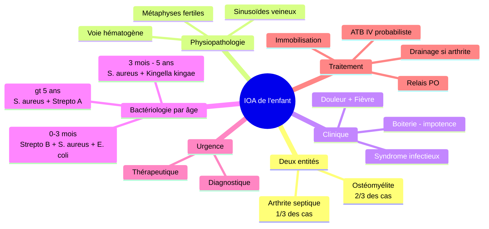
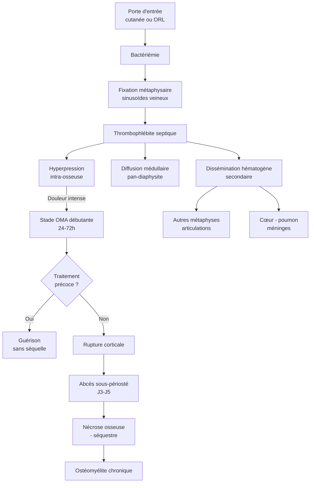
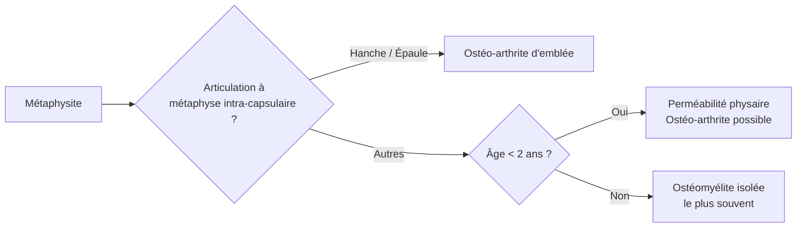
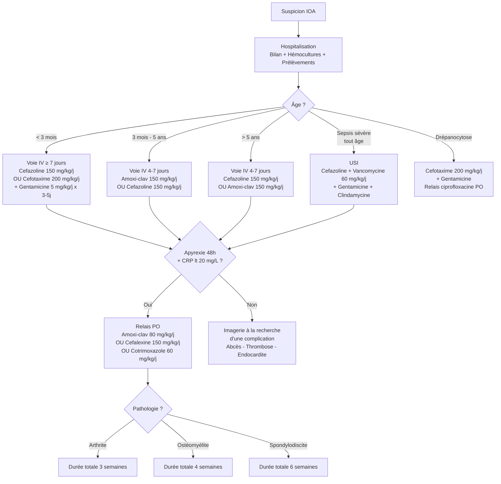
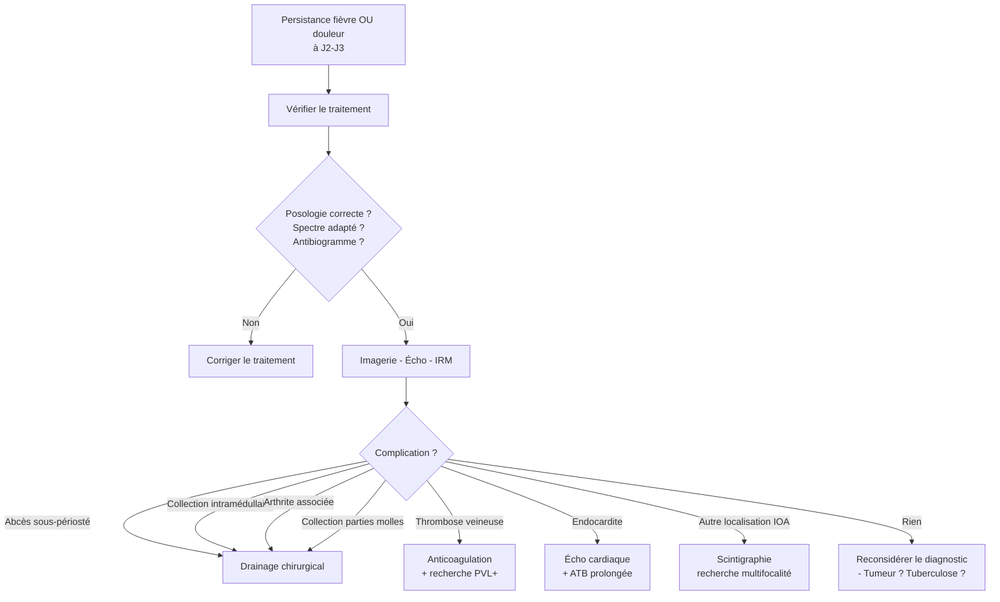
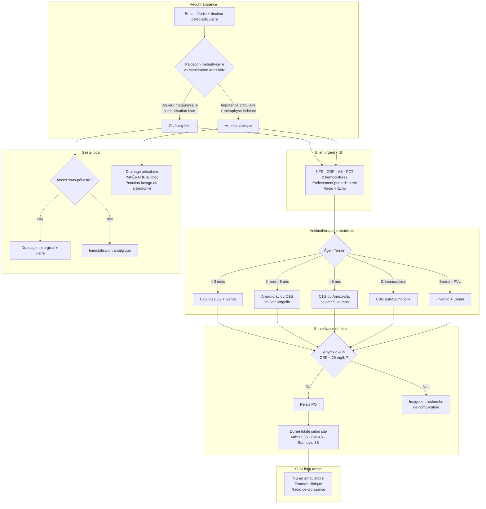

# Les infections ostéo-articulaires chez l'enfant

> **Sources** : PDF `COURS_infection_osteo_articulaire_Décembre_2025.pdf` (Pr. AGHOUTANE, FMPM) · Transcription du cours · Recommandations GPIP/SPILF, *Archives de Pédiatrie* (Lemoine 2016), *Paediatrie Schweiz* (2024), AFPA/JPP 2024
> **Plan FMPC** : Pathologie B (TDD + Formes cliniques) — le sujet recouvre deux entités (ostéomyélite, arthrite septique) partageant physiopathologie, bactériologie et traitement.
> **Langue** : français

---

## I. Introduction

Les **infections ostéo-articulaires (IOA) de l'enfant** regroupent deux entités anatomocliniques distinctes mais intimement liées par leur mécanisme et leur prise en charge :

- l'**ostéomyélite aiguë hématogène (OMA)** — infection métaphysaire par voie hématogène, représentant les **2/3** des IOA ;
- l'**arthrite septique (AS)** — infection synoviale, représentant **1/3** des IOA.

Elles partagent un même dénominateur physiopathologique (dissémination hématogène) et une **même exigence de prise en charge : urgence diagnostique ET thérapeutique**. Tout retard expose à deux ordres de complications :

- **à court terme** : sepsis sévère, atteintes viscérales (staphylococcie pleuropulmonaire, péricardite, thrombose veineuse, méningite), décès ;
- **à long terme** : séquelles orthopédiques invalidantes (chondrolyse, destruction épiphysaire, luxation, inégalité de longueur, raccourcissement, passage à la chronicité).

**Épidémiologie** : fréquence 7–20 / 100 000 enfants/an ; **sex-ratio 2 garçons pour 1 fille** ; majorité **< 5 ans** ; notion de traumatisme dans **30 %** des cas (piège diagnostique classique) ; terrains favorisants : malnutrition, diabète, **drépanocytose**, déficits immunitaires.

**Intérêt de la question** : fréquence, gravité potentielle (vitale et fonctionnelle), urgence thérapeutique (« antibiothérapie dans le quart d'heure »), nécessité d'une démarche probabiliste car le germe n'est isolé que dans **50 %** des cas, coopération multidisciplinaire (pédiatre, chirurgien pédiatre, bactériologiste, radiologue).

**Plan** : I. Introduction · II. Physiopathologie · III. Bactériologie · IV. Ostéomyélite aiguë hématogène (TDD + formes cliniques) · V. Arthrite septique · VI. Diagnostics différentiels · VII. Traitement · VIII. Évolution et complications · IX. Perles & High-Yield · X. Conclusion

### Vue d'ensemble

---

## II. Physiopathologie

### 1. Le fondement vasculaire : pourquoi la métaphyse ?

La métaphyse concentre **90 %** des OMA. Cette prédilection n'est pas anecdotique — elle découle de trois propriétés vasculaires métaphysaires que tout interne doit comprendre :

1. **Hypervascularisation** : la métaphyse reçoit une irrigation artérielle terminale riche.
2. **Boucles sinusoïdales veineuses** : le sang ralentit brutalement dans ces « lacs veineux » métaphysaires, permettant au germe circulant de **se fixer** à l'endothélium.
3. **Endothélium fenestré** : la barrière capillaire métaphysaire est perméable, facilitant le passage bactérien vers la matrice osseuse.

La règle clinique qui en découle : **« près du genou et loin du coude »** — les métaphyses les plus fertiles (donc les plus vascularisées) sont celles qui croissent le plus : **fémur distal, tibia proximal, humérus proximal**.

### 2. La cascade physiopathologique de l'OMA

> 💎 **Perle physiopathologique** — La douleur initiale de l'OMA est proportionnelle à l'**hyperpression intra-osseuse** (le pus est dans une logette inextensible). Dès que la corticale se rompt (abcès sous-périosté), la pression baisse : la douleur **diminue paradoxalement**. Cette « amélioration clinique trompeuse » est un **piège classique** — elle signe en fait l'aggravation anatomique.

### 3. Cas particulier : l'ostéo-arthrite « d'emblée »

Dans deux configurations, la métaphysite fait communiquer directement l'infection avec l'articulation adjacente, réalisant une **ostéo-arthrite d'emblée** — d'où la gravité particulière de ces localisations :

- **Articulations où la métaphyse est intra-capsulaire** : **hanche** (métaphyse fémorale supérieure dans la capsule) et **épaule** (métaphyse humérale supérieure). L'abcès sous-périosté rompt directement dans l'articulation.
- **Nourrisson < 18-24 mois** : la barrière physaire (cartilage de croissance) est encore **perméable** aux vaisseaux transphysaires — l'infection métaphysaire diffuse à l'épiphyse puis à l'articulation.

### 4. Physiopathologie de l'arthrite septique

**Localisation synoviale** (voie hématogène prédominante chez l'enfant) → prolifération bactérienne dans le liquide synovial → afflux leucocytaire massif → **libération d'enzymes protéolytiques** (collagénases, élastases) → **chondrolyse irréversible** à partir de **48–72 h** d'évolution.

> 🎯 **High-Yield** — L'arthrite septique détruit le cartilage **en 48 à 72 heures** : ce délai est la raison du caractère **urgentissime** du drainage articulaire. Contrairement à l'os, le cartilage **ne régénère pas**.

**Conséquences mécaniques** : épanchement sous pression → **luxation** (risque majeur à la hanche du nourrisson, d'où la culotte d'abduction préventive), compression vasculaire → nécrose de la tête fémorale.

---

## III. Bactériologie — clé de l'antibiothérapie probabiliste

Le germe n'étant isolé qu'une fois sur deux, l'antibiothérapie repose d'abord sur la **probabilité bactériologique selon l'âge** — point **hautement tombable**.

### Tableau de bactériologie probabiliste par âge

| Âge | Germes principaux | Particularités |
|---|---|---|
| **0 – 3 mois** | *Streptococcus agalactiae* (B), ***Staphylococcus aureus***, entérobactéries (*E. coli*) | Spectre néonatal large, couvrir les BGN |
| **3 mois – 5 ans** | ***S. aureus*** ++, ***Kingella kingae*** ++, *Streptococcus pyogenes* (A), pneumocoque | *H. influenzae* b quasi disparu (vaccination) |
| **> 5 ans** | ***S. aureus*** +++, *S. pyogenes* (A) | Staphylocoque très dominant |
| **Drépanocytose** | ***Salmonella*** spp., *H. influenzae*, *S. pneumoniae*, *S. aureus* | Couverture anti-salmonelle obligatoire |

> 📊 **Chiffre clé** — Taux d'isolement bactériologique selon les séries : Marrakech 2021 = **38 %** · France (Timsit 2004) = **29 %** · Suisse (Juchler 2018) = **63 %** (PCR Kingella). Retenir : **germe isolé dans environ 50 % des cas** — traitement probabiliste inévitable.

### Pourquoi *Kingella kingae* est si particulière

- **Cocco-bacille Gram négatif** aérobie, hôte de la flore oropharyngée des enfants de 6 mois à 4 ans.
- **Très difficile à isoler** sur milieu standard : nécessite l'inoculation des flacons d'hémoculture aérobies avec le liquide articulaire ou la **PCR 16S / PCR spécifique** — d'où la sous-estimation majeure de sa fréquence dans les centres sans biologie moléculaire.
- Sensibilité : **amoxicilline et céphalosporines** (CMI très basses) → couvert par l'amoxicilline-acide clavulanique probabiliste.
- **Résistances à connaître** : **vancomycine, oxacilline/cloxacilline, clindamycine** → ne pas choisir un traitement « anti-staphylococcique pur » chez un enfant de 6 mois – 4 ans !

> ⚠️ **Piège thérapeutique** — Chez un enfant de 3 mois à 4 ans, prescrire de la cloxacilline seule ou vancomycine + clindamycine seules expose à un **échec sur Kingella**. Toujours couvrir Kingella dans cette tranche d'âge (β-lactamine active : amoxicilline, C1G, C2G, C3G).

### Le cas particulier de *S. aureus* producteur de PVL (leucocidine de Panton-Valentine)

**Entité clinique à part entière** à reconnaître :

- **Tableau de gravité initiale** : choc septique, **atteinte multifocale**, abcès des parties molles / musculaires, **thromboses veineuses profondes** (rechercher systématiquement par écho-doppler), syndrome inflammatoire majeur.
- **Évolution lente** sous antibiotiques, **reprises chirurgicales fréquentes**.
- **Sensibilité** : en France souvent **méti-S** ; aux USA souvent **méti-R** (SARM-C).
- **Traitement** : antibiotique **anti-toxine** → **clindamycine** (inhibe la synthèse protéique donc la production de PVL). Si SARM : **vancomycine + clindamycine**.

> 🔴 **Signal d'alerte PVL+** — Tout tableau d'IOA avec **atteinte multifocale**, abcès des parties molles, thrombose veineuse ou choc septique : évoquer PVL+ et ajouter de la **clindamycine** à l'antibiothérapie.

---

## IV. Ostéomyélite aiguë hématogène (OMA)

### A. Type de description (TDD) : OMA débutante de l'extrémité inférieure du fémur chez l'enfant de 5–10 ans

#### 1. Tableau clinique

##### a. Circonstances de découverte

Enfant **jusque-là en pleine santé**, qui présente brutalement :

- une **douleur intense, atroce**, « véritable douleur de fracture », localisée au voisinage de l'articulation du genou ;
- un **syndrome infectieux brutal** : fièvre à 39–40 °C, frissons, altération de l'état général ;
- une **impotence fonctionnelle** (refus de marcher, pseudo-paralysie) ;
- éventuellement une **notion de traumatisme** (30 % des cas) — **piège classique** à ne pas retenir comme explication.

> 🔴 **Règle d'or** — Il n'y a pas de « traumatisme fébrile ». Toute douleur osseuse **+ fièvre** chez un enfant est une **OMA jusqu'à preuve du contraire**.

##### b. Examen physique — technique et signes

L'examen doit être **doux, progressif**, dans une salle chauffée, enfant en confiance avec un parent.

- **Inspection** : région initialement **normale** (pas de rougeur, pas de tuméfaction, pas de circulation collatérale) — la peau ne parle que tardivement ;
- **Palpation uni- ou bidigitale** métaphysaire : déclenche une **douleur métaphysaire circulaire, segmentaire et extra-articulaire**. Ce triplet sémiologique est **pathognomonique** ;
- **Mobilisation douce de l'articulation adjacente** : **possible et non douloureuse** — point qui distingue l'OMA de l'arthrite septique ;
- **Température** ≥ 39 °C ;
- **Recherche systématique** d'une porte d'entrée (cutanée, ORL, dentaire) — présente dans 30 % des cas ;
- **Recherche d'autres localisations** (palpation de toutes les métaphyses, auscultation pleuropulmonaire et cardiaque, examen neurologique/méningé).

> 💎 **Perle sémiologique** — Chez tout enfant fébrile, **palper les extrémités osseuses et mobiliser les articulations** doit faire partie de l'examen systématique, au même titre que gorge, tympans, poumons, nuque, BU. C'est le seul moyen de dépister une OMA débutante avant la constitution des complications.

#### 2. Examens paracliniques

##### a. Biologie

- **NFS** : hyperleucocytose à polynucléaires neutrophiles (sensibilité modeste — **36 %** seulement) ;
- **CRP** : élevée (> 20 mg/L) dans **80 %** des cas. Pic à 48 h, décroissance sous ATB efficace en 6 h, retour à la normale en 7–10 j → **marqueur idéal du suivi hospitalier** ;
- **VS** : élevée dans **91 %** des cas, mais cinétique lente (pic J3–J5, normalisation en 6 semaines) → **marqueur du suivi ambulatoire** après sortie ;
- **Procalcitonine** : > 0,5 ng/mL — utile pour le diagnostic différentiel avec les infections virales ;
- **Hémocultures ×2** avant antibiothérapie ;
- **Prélèvement de la porte d'entrée** si accessible.

> 🎯 **High-Yield — Sensibilité diagnostique** — Sensibilité maximale (**98 %**) obtenue quand **CRP + VS sont toutes deux élevées** (Pääkkönen 2010). Aucun marqueur biologique pris isolément n'exclut l'IOA.

##### b. Imagerie

- **Radiographie standard** : **normale au stade débutant** — c'est un élément clé à connaître. Les signes radiologiques (réaction périostée, ostéolyse, abcès) n'apparaissent qu'à partir de **J10–J14**. Une radio normale **n'élimine donc absolument pas** le diagnostic.
- **Échographie** : précoce, opérateur-dépendante — recherche un abcès sous-périosté, un épanchement articulaire.
- **IRM** : examen de référence pour le diagnostic précoce (œdème médullaire dès 24–48 h) — réservée aux localisations difficiles (bassin, rachis) ou en cas de doute.
- **Scintigraphie osseuse** au Tc-99m : hyperfixation précoce, utile en cas de localisations multiples suspectées ou de topographie profonde.

> ⚠️ **Piège radiologique** — « Radio normale ≠ pas d'OMA ». L'interne qui attend une image pour traiter **traite trop tard**.

#### 3. Règle fondamentale : « Traiter à coup sûr, c'est traiter trop tard »

Aphorisme de G. Laurence : **« L'antibiotique dans le ¼ d'heure, le plâtre dans les 2 heures »**. La bactériologie ne doit **jamais** retarder le traitement probabiliste. Les hémocultures et prélèvements sont faits **avant** la première dose d'ATB, mais le résultat est attendu **sous traitement**, pas avant.

### B. Formes cliniques de l'OMA

#### 1. Formes évolutives

##### a. Abcès sous-périosté

- **Chronologie** : apparaît à partir du **3ᵉ jour** d'une OMA non ou mal traitée.
- **Clinique** : apparition d'une **tuméfaction chaude, douloureuse** en regard de la métaphyse, impotence fonctionnelle absolue, syndrome infectieux persistant. La douleur intra-osseuse diminue paradoxalement (décompression).
- **Imagerie** : **échographie +++** (collection hypo-échogène en continuité avec la corticale), radio normale ou montrant une réaction périostée / une ostéolyse débutante.
- **Traitement** : **drainage chirurgical au bloc opératoire** + antibiothérapie + **immobilisation plâtrée** (~ 10 j).

##### b. Ostéomyélite chronique

- Aboutissement d'une OMA négligée ou mal traitée.
- **Clinique stéréotypée** : fistules cutanées productives, cicatrices rétractiles, séquestres osseux (os mort visible à travers la fistule), amyotrophie, raccourcissement, **fracture pathologique**.
- **Problème devenu thérapeutique** : excision du séquestre, antibiothérapie au long cours, reconstruction osseuse.
- **Dans le contexte marocain** : le **Jbar** (rebouteux traditionnel) est le principal pourvoyeur de cette forme — le traumatisme initial est mis sur le compte d'une entorse/fracture, l'enfant est bandé/massé, l'OMA évolue sans ATB.

> ⚠️ **Piège sociétal** — La notion de « traumatisme » chez un enfant fébrile doit toujours faire évoquer une OMA, pas faire éliminer le diagnostic. Particulièrement vrai devant un recours préalable au *Jbar*.

##### c. Ostéomyélite subaiguë — **Abcès de Brodie**

- Forme rare, liée à un **germe peu virulent** ou à un **bon statut immunitaire**.
- **Tableau peu bruyant** : boiterie, refus de marche, raideur rachidienne (si vertébral), peu ou pas de signes généraux.
- **Radiographie** : **image d'ostéolyse métaphysaire bien limitée, cernée d'un liseré de sclérose** — aspect très évocateur.
- **Diagnostics différentiels multiples** : tumeur osseuse bénigne (kyste osseux, ostéome ostéoïde), **tuberculose osseuse** (contexte marocain ++).
- **Diagnostic de certitude** : **biopsie** (liquide purulent stérile souvent).
- **Traitement** : drainage + ATB — évolution favorable.

#### 2. Formes topographiques

##### a. Spondylodiscite

- **Clinique** : douleur rachidienne brutale, intense, continue, insomniante, **rectitude vertébrale**, douleur provoquée à la percussion de l'épineuse, parfois boiterie. Fièvre élevée, AEG.
- **Imagerie** : radio standard tardive (pincement discal, érosions vertébrales), **IRM = examen de référence** (hypersignal T2 du disque et des plateaux vertébraux), scintigraphie osseuse sensible.
- **Traitement** : idem OMA sauf **durée PO = 6 semaines** (selon document source ; certaines recommandations récentes acceptent 4–6 semaines si évolution favorable).

> 📊 **Note** — La transcription du cours mentionne 8 semaines, le schéma thérapeutique du PDF mentionne 6 semaines. Les recommandations récentes (GPIP 2022, Paediatrica Suisse 2024) convergent vers **4–6 semaines** en cas d'évolution clinico-biologique favorable. Se référer à la durée en vigueur dans le service.

##### b. Bassin / sacrum

- Diagnostic **difficile** : présentation souvent trompeuse (boiterie, douleur abdominale, pseudo-sciatique).
- **Scintigraphie osseuse** et **IRM** essentielles.
- Biopsie guidée pour documentation bactériologique.

#### 3. Formes selon le terrain

##### a. Nouveau-né et nourrisson

- **Multifocalité fréquente** (50 % des cas).
- **Ostéo-arthrite d'emblée** (perméabilité physaire + localisations à métaphyse intra-capsulaire).
- **Sémiologie pauvre** : **pseudo-paralysie** du membre, position anormale permanente, limitation douloureuse à la mobilisation, pleurs à la mobilisation, refus de téter.
- **Gravité** : séquelles orthopédiques majeures (destruction épiphysaire, luxation, inégalité de longueur).

##### b. Drépanocytose

- **Salmonella** +++ (+ *Haemophilus*, pneumocoque).
- **Difficulté majeure** : distinguer infarctus osseux vaso-occlusif et ostéomyélite — la clinique est identique. En pratique, **traiter comme OMA** si doute, faire hémocultures, scintigraphie au Tc/Ga.
- **ATB de choix** : C3G (céfotaxime) + fluoroquinolone (ciprofloxacine orale en relais).

#### 4. Forme grave : la septicopyohémie à *S. aureus* (PVL+)

- **Tableau multifocal** : OMA + atteinte viscérale (staphylococcie pleuropulmonaire avec risque de pneumothorax suffocant, péricardite purulente, méningite, endocardite).
- **Hospitalisation en réanimation**.
- **ATB renforcée** : céfazoline ou céfalotine **+ vancomycine** (si SARM suspecté) **+ gentamicine** **+ clindamycine** (anti-toxine).
- **Recherche systématique** : échocardiographie, TDM/IRM thoracique, écho-doppler veineux des membres.

---

## V. Arthrite septique

### A. TDD : arthrite septique du genou ou de la hanche chez l'enfant > 2 ans

#### 1. Épidémiologie des localisations

| Articulation | Fréquence |
|---|---|
| Genou | 35 % |
| **Hanche** | 34 % — la plus grave (risque luxation/nécrose) |
| Cheville | 14 % |
| Coude | 6 % |
| Épaule | 5 % |
| Poignet | 5 % |

#### 2. Clinique

- **Début brutal** : fièvre élevée 39–40 °C, AEG.
- **Douleur articulaire** intense à la mobilisation — même très douce — passive et active.
- **Boiterie d'esquive** ou refus total de marche.
- **Articulation tuméfiée**, chaude ; épanchement palpable (choc rotulien au genou, attitude en flexion-abduction-rotation externe à la hanche pour ouvrir la capsule au maximum de volume).
- **Palpation métaphysaire indolore** — élément qui oriente vers l'arthrite plutôt que l'OMA.

> 🎯 **High-Yield sémiologique** — Le diagnostic différentiel OMA / AS repose sur :
> - **OMA** : douleur **métaphysaire** à la palpation, articulation **mobilisable**.
> - **AS** : articulation **impotente totale**, palpation métaphysaire **indolore**.

### B. Formes cliniques

#### 1. Arthrite du nouveau-né et du nourrisson

- **Localisation prédominante** : **hanche** — origine des séquelles les plus graves.
- **Contexte** : souvent nourrisson hospitalisé pour une autre pathologie (prématurité, sepsis néonatal) → **porte d'entrée iatrogène** (cathéter, ponctions). D'où l'importance du **lavage des mains** du personnel.
- **Quatre signes cliniques** doivent alerter :
  1. Limitation douloureuse de la mobilité articulaire
  2. Douleur à la palpation péri-articulaire
  3. **Aspect pseudo-paralytique** du membre
  4. **Position anormale permanente** du membre (flessum permanent)
- **Risque séquellaire majeur** : luxation de hanche, destruction du col fémoral, inégalité de longueur.

#### 2. Arthrite de la sacro-iliaque

- **Tableau trompeur** : douleur fessière profonde irradiant en sciatalgie ou boiterie, fièvre oscillante 39–40 °C, **mobilisation douce de la hanche homolatérale non douloureuse** (point clé).
- **Signes provocateurs** :
  - Pression directe sur la sacro-iliaque (décubitus ventral)
  - **Manœuvre d'écartement des ailes iliaques** (pression des EIAS vers l'extérieur)
  - **Signe de Gaenslen** : sujet en décubitus dorsal, flexion maximale de la hanche du côté sain, extension forcée de la hanche du côté suspect (jambe laissée tomber hors de la table) → douleur localisée à la sacro-iliaque.
- **Imagerie** : **scintigraphie osseuse** (hyperfixation) puis **IRM**. Ponction sous guidage radiologique pour documentation.

#### 3. Ostéo-arthrite

Voir section II.3 — association métaphysite + arthrite, pronostic fonctionnel plus sombre, localisations à métaphyse intra-capsulaire (hanche, épaule) ou nourrisson.

---

## VI. Diagnostics différentiels

À toujours considérer comme **diagnostics d'élimination** — l'arthrite septique doit être évoquée en premier.

| Diagnostic | Éléments distinctifs |
|---|---|
| **Synovite aiguë transitoire (rhume de hanche)** | Boiterie fébricule (< 38,5 °C), CRP basse, épanchement clair à l'écho, évolution spontanément favorable en 7–10 j. **Toujours éliminer une AS par ponction si doute.** |
| **Flessum extra-articulaire de la hanche** | Pas de fièvre, pas de syndrome inflammatoire |
| **Arthrite juvénile idiopathique** | Évolution prolongée (> 6 semaines pour 1 articulation), fièvre intermittente, multiples articulations |
| **Ostéomyélite** (si présentation articulaire trompeuse) | Palpation métaphysaire douloureuse, mobilisation articulaire conservée |
| **Tumeur osseuse** (ostéosarcome, Ewing) | Douleur osseuse chronique, sans fièvre initiale, masse palpable, radio évocatrice |
| **Hémarthrose** (hémophilie) | Contexte, TCA allongé |

> ⚠️ **Règle cardinale** — Devant une arthrite fébrile, **il n'est pas grave de commencer une antibiothérapie en urgence et de rectifier le diagnostic par la suite** ; il est gravissime de passer à côté d'une arthrite septique et de récupérer l'enfant au stade de séquelles.

---

## VII. Traitement

### A. Principes fondamentaux

1. **Urgence** : antibiothérapie parentérale probabiliste dans l'heure qui suit l'admission.
2. **Prélèvements avant ATB** : 2 hémocultures, prélèvement de porte d'entrée, ponction articulaire (pour l'AS) avant la première dose.
3. **Voie parentérale initiale**, **relais oral** si évolution favorable (apyrexie ≥ 48 h, CRP < 20 mg/L).
4. **Drainage chirurgical** obligatoire pour l'AS, pour l'abcès sous-périosté, pour les formes abcédées.
5. **Immobilisation** à visée antalgique et fonctionnelle.
6. **Adaptation à l'antibiogramme** dès que possible.
7. **Coopération pédiatre – chirurgien pédiatre – bactériologiste**.

### B. Algorithme d'antibiothérapie probabiliste

### C. Détail des protocoles antibiotiques

#### 1. Enfant < 3 mois (voie parentérale ≥ 7 j)

Spectre à couvrir : *S. aureus* + Strepto B + entérobactéries.

- **Céfazoline** (C1G, Kefzol®) 150 mg/kg/j en 4 injections (max 6 g) **ou**
- **Céfalotine** (C1G, Keflin®) 150 mg/kg/j, max 6 g **ou**
- **Céfotaxime** (C3G, Claforan®) 200 mg/kg/j en 4 injections (max 8 g) **ou**
- **Ceftriaxone** (C3G) 100 mg/kg/j en 2 injections (max 4 g)
- **\+ Gentamicine** 5 mg/kg/j pendant 3–5 j (association systématique néonat)

#### 2. Enfant > 3 mois (voie IV 4–7 j)

Spectre à couvrir : *S. aureus* + *Kingella kingae* + Strepto A.

- **Amoxicilline-acide clavulanique** 150 mg/kg/j (dose d'amoxicilline) en 4 injections, max 6 g **ou**
- **Céfazoline** 150 mg/kg/j en 4 injections, max 6 g **ou**
- **Céfalotine** 150 mg/kg/j, max 6 g
- **Gentamicine** uniquement si **syndrome septique sévère**.

#### 3. Sepsis sévère / atteinte multifocale / thrombose veineuse — quel que soit l'âge (voie veineuse profonde, réanimation)

- **Céfazoline ou céfalotine** 150 mg/kg/j **+**
- **Vancomycine** 60 mg/kg/j en 4 injections, max 3 g (couverture SARM) **+**
- **Gentamicine** 5 mg/kg/j (3–5 j), max 320 mg **+**
- **Clindamycine** (anti-toxine si PVL+) 30–40 mg/kg/j.

#### 4. Allergie aux bêta-lactamines

- **Cotrimoxazole** 40–60 mg/kg/j **ou**
- **Clindamycine** 30–40 mg/kg/j — **MAIS** inactive sur *Kingella kingae* → à éviter chez l'enfant de 6 mois – 4 ans.

#### 5. Relais oral (après apyrexie 48 h + CRP < 20 mg/L, IV minimum 4 j)

- **Amoxicilline-acide clavulanique** 80 mg/kg/j (max 3 g/j) **ou**
- **Céfalexine** (Orex®, cp et sirop) 150 mg/kg/j **ou**
- **Cotrimoxazole** 60 mg/kg/j en 2 doses (max triméthoprime 320 mg) **ou**
- **Acide fusidique** 60 mg/kg/j en 2 prises (surtout pour l'AS)

### D. Durées totales de traitement (IV + PO)

| Pathologie | Durée totale |
|---|---|
| **Arthrite septique** | **3 semaines** |
| **Ostéomyélite** | **4 semaines** |
| **Spondylodiscite** | **6 semaines** (parfois 8 selon école) |

> 🎯 **High-Yield — Durées** — Ces durées correspondent aux **protocoles courts modernes** (Peltola 2010) validés par les recommandations GPIP/SPILF. Les schémas longs (2–3 mois) des années 2000 sont **obsolètes** pour les formes non compliquées.

### E. Germes particuliers et adaptations

| Germe | Probabiliste / Documentation | PO |
|---|---|---|
| **MSSA** (SAMS) | Cloxacilline / Céfazoline | Céfalexine, cloxacilline, clindamycine |
| **SARM** communautaire | Vancomycine / Linézolide | Linézolide, rifampicine + cotrimoxazole, rifampicine + ac. fusidique |
| ***Kingella kingae*** | Amoxicilline 150 mg/kg/j | Amoxicilline 150 mg/kg/j |
| **Pneumocoque** | Amoxicilline 150–200 mg/kg/j ou céfotaxime | Amoxicilline 150 mg/kg/j |
| ***Salmonella*** (drépanocytose) | Ceftriaxone / cotrimoxazole | Céfixime / ciprofloxacine |
| **BGN BLSE** | Méropénème / imipénème | Ciprofloxacine / cotrimoxazole |
| **Tuberculose** | Rien en urgence — biopsie | Quadrithérapie 2 mois puis bithérapie 10 mois |
| **Brucellose** | Cotrimoxazole + rifampicine (< 8 ans) ; doxycycline + rifampicine (> 8 ans) 3 mois + gentamicine 7 j | |

### F. Gestes locaux

- **Arthrite septique** : **drainage obligatoire** au bloc opératoire
  - **Ponction-lavage** si liquide fluide (voie échoguidée idéale à la hanche) ;
  - **Arthrotomie** si pus épais ou grumeleux ;
  - **Arthroscopie** (genou, épaule).
- **Abcès sous-périosté** : drainage chirurgical + mise à plat.
- **Ostéomyélite chronique** : excision du séquestre, mise à plat des géodes, parfois greffe osseuse.

### G. Immobilisation

- **Antalgique** principalement : 2–3 j pour l'OMA simple, 10 j après arthrotomie, 1 mois en cas de fragilité osseuse (ostéite évolutive).
- **Hanche du nourrisson** : **culotte d'abduction** ou attelle — **prévention de la luxation** (risque majeur).

---

## VIII. Évolution, surveillance, complications

### A. Surveillance sous traitement

- **Biquotidienne** : température, douleur, état local, recherche de porte d'entrée secondaire.
- **Palpation de toutes les métaphyses** et examen général (auscultation pleuropulmonaire, cardiaque, recherche de raideur méningée).
- **CRP à J2 (48 h)** : doit diminuer sous ATB efficace. Si stagne ou augmente → reprise du bilan.
- **VS** : utile pour le suivi ambulatoire.

### B. Évolution défavorable à J2–J3 : démarche

### C. Complications

#### À court terme
- **Sepsis sévère / choc septique**
- **Staphylococcie pleuropulmonaire** (image de pneumopathie bulleuse, pneumothorax suffocant)
- **Péricardite purulente** (assourdissement des bruits du cœur, frottement)
- **Thrombose veineuse profonde** (orienter vers PVL+)
- **Méningite**
- **Endocardite**
- **Autres localisations ostéo-articulaires**
- **Décès**

#### À long terme — séquelles orthopédiques
- **Chondrolyse** (arthrite négligée)
- **Luxation** (hanche du nourrisson)
- **Nécrose épiphysaire** (tête fémorale, tête humérale)
- **Destruction physaire** → **inégalité de longueur**, **troubles axiaux**
- **Ostéomyélite chronique** (fistulisation, séquestres, fractures pathologiques)
- **Raideur articulaire / ankylose**
- **Amyotrophie, rétractions**

---

## IX. Perles cliniques & High-Yield consolidés

> 💎 **Perle 1** — « **Près du genou et loin du coude** » : les métaphyses les plus fertiles sont les plus fréquemment touchées. Topographie des OMA : fémur 28 %, tibia/fibula 27 %, pieds 13 %, humérus 10 %, bassin 8 %, radius/ulna 5 %, main 3 %.

> 💎 **Perle 2** — « **Traiter à coup sûr, c'est traiter trop tard** » (G. Laurence). La preuve bactériologique n'est obtenue que dans 50 % des cas ; l'antibiothérapie probabiliste **précède** toujours les résultats.

> 🎯 **High-Yield 1** — **Douleur métaphysaire circulaire, segmentaire et extra-articulaire + fièvre = ostéomyélite jusqu'à preuve du contraire.**

> 🎯 **High-Yield 2** — **Douleur articulaire + fièvre = arthrite septique jusqu'à preuve du contraire.**

> 🎯 **High-Yield 3** — **Radiographie normale ≠ OMA éliminée** : les signes radio apparaissent à J10–J14. IRM pour diagnostic précoce.

> 🎯 **High-Yield 4** — **Bactériologie par âge** : 0–3 mois (SGB + *S. aureus* + entérobactéries) · 3 mois – 5 ans (*S. aureus* + *Kingella*) · > 5 ans (*S. aureus* + Strepto A) · Drépanocytose (*Salmonella*).

> 🎯 **High-Yield 5** — **Durées totales** : Arthrite **3 S** · Ostéomyélite **4 S** · Spondylodiscite **6 S**.

> ⚠️ **Piège 1** — La **notion de traumatisme** dans 30 % des cas est un piège diagnostique : **« il n'y a pas de traumatisme fébrile »**.

> ⚠️ **Piège 2** — La **douleur qui diminue paradoxalement à J3** n'est pas une amélioration mais une **rupture corticale avec abcès sous-périosté**.

> ⚠️ **Piège 3** — Chez l'enfant de 3 mois à 4 ans : **ne jamais prescrire cloxacilline ou vancomycine + clindamycine seules** → inefficace sur *Kingella kingae*.

> 🔴 **Urgence 1** — Tout enfant fébrile avec douleur ostéo-articulaire : hospitalisation + bilan + **antibiothérapie probabiliste parentérale dans l'heure**.

> 🔴 **Urgence 2** — Arthrite septique → **drainage chirurgical dans les 6 heures** (le cartilage est détruit en 48–72 h).

> 🔴 **Urgence 3** — Tableau PVL+ (multifocal, thrombose, abcès multiples) : hospitalisation USI, **ajouter clindamycine**, rechercher thromboses et atteintes viscérales.

> 📊 **Chiffres clés** — Incidence 7–20/100 000/an · Sex-ratio 2G/1F · Âge moyen 6 ans · Hémoculture + dans 50 % · CRP > 20 mg/L dans 80 % · VS + dans 91 % · Sensibilité CRP+VS combinées 98 %.

> 🧪 **Gold standard microbiologique** — **Hémocultures + prélèvement articulaire / osseux avec mise en culture standard + flacon d'hémoculture (pour Kingella) + PCR 16S**. La PCR spécifique *K. kingae* a fait passer le taux d'isolement de 18 % à 63 % dans certaines séries.

> ✅ **Première intention > 3 mois** — Amoxicilline-acide clavulanique 150 mg/kg/j IV, ou céfazoline 150 mg/kg/j IV. Pas de gentamicine sauf sepsis.

---

## X. Conclusion

Les IOA de l'enfant sont des **urgences diagnostiques et thérapeutiques**. Le diagnostic est **clinique** (palpation métaphysaire systématique chez tout enfant fébrile), la confirmation bactériologique est différée (50 % d'isolement seulement) et ne doit **jamais** retarder le traitement probabiliste. La prise en charge repose sur une **triade thérapeutique** :

1. **Antibiothérapie probabiliste précoce**, adaptée à l'âge et au terrain ;
2. **Drainage chirurgical** (obligatoire pour l'arthrite, les collections) ;
3. **Immobilisation** antalgique et fonctionnelle, avec prévention de la luxation chez le nourrisson.

Le pronostic vital (à court terme) et fonctionnel (à long terme) dépend directement de la précocité du diagnostic. Le **médecin généraliste** qui voit l'enfant en premier a une responsabilité capitale : faire le diagnostic et **démarrer l'antibiothérapie avant le transfert**.

### Synthèse intégrative

---

## Glossaire des abréviations

- **AEG** : altération de l'état général
- **AS** : arthrite septique
- **ATB** : antibiothérapie
- **BLSE** : β-lactamase à spectre étendu
- **BGN** : bacille Gram négatif
- **C1G / C2G / C3G** : céphalosporine de 1re / 2e / 3e génération
- **CRP** : C-Reactive Protein
- **EIAS** : épine iliaque antéro-supérieure
- **GPIP** : Groupe de Pathologie Infectieuse Pédiatrique
- **IOA** : infection ostéo-articulaire
- **IV / PO** : intraveineux / per os
- **NFS** : numération formule sanguine
- **OMA** : ostéomyélite aiguë hématogène
- **PCT** : procalcitonine
- **PVL** : leucocidine de Panton-Valentine
- **SAMS / MSSA** : *S. aureus* méti-sensible
- **SARM / MRSA** : *S. aureus* méti-résistant
- **SGB** : streptocoque du groupe B (*S. agalactiae*)
- **SPILF** : Société de Pathologie Infectieuse de Langue Française
- **TDD** : type de description
- **VS** : vitesse de sédimentation

---

## Références

### Sources principales fournies
- Pr. E. **AGHOUTANE** — *Les infections ostéo-articulaires chez l'enfant*, Faculté de Médecine et de Pharmacie de Marrakech, cours de décembre 2025 (PDF + transcription).
- **Lemoine A et al.** — *Archives de Pédiatrie* 2016 ; 23(11):1124-1134 — bactériologie par tranche d'âge.
- **Pääkkönen M et al.** — *Clin Orthop Relat Res* 2010 ; 468:861-866 — sensibilité CRP/VS en pédiatrie.
- **Indian Academy of Pediatrics** — *Indian Pediatr* 2024 ; 61(3):209-218 — consensus diagnostique et thérapeutique.

### Recommandations professionnelles (ressources à consulter pour mise à jour)
- **SPILF / GPIP** (Société de Pathologie Infectieuse de Langue Française + Groupe de Pathologie Infectieuse Pédiatrique) — recommandations françaises IOA pédiatriques.
- **SSI / Paediatrica Suisse** — *Prise en charge des infections ostéo-articulaires* (guideline 4041, ssi.guidelines.ch).
- **AFPA / JPP 2024** — *Antibiothérapie des infections ostéo-articulaires* (pages 174-181).
- **infectiologie.com** — séminaire DESC 2021 (M. Lorrot) : IOA chez l'enfant.
- **Collège de Chirurgie Pédiatrique** : documents Fitoussi, Sales de Gauzy, Ilharreborde, Lorrot & Doit, Dugué.
- **Vidal** — *Infections ostéo-articulaires bactériennes* (fiche de prise en charge 1903).
- **COFER** (Collège Français des Enseignants en Rhumatologie) — item 1-11-0.
- **Pedia-univ** — Boiteries et infections ostéoarticulaires (référentiel DFASM).

### Séries locales citées dans le cours
- Série Marrakech 2021 (notre série)
- Moutaouakkil et al. (Fès 2021)
- National study SOMIPEV (Maroc 2017)
- Timsit et al. (France 2004)
- Moumile et al. (France 2005)
- Chometon et al. (France 2007)
- Juchler et al. (Suisse 2018)

---

### Note de synthèse critique

> 💭 **Réflexion** — Une discordance existe entre les sources sur la durée du traitement de la spondylodiscite (6 S dans le PDF vs 8 S dans la transcription). Les recommandations internationales convergent vers **4–6 semaines** en cas d'évolution clinico-biologique favorable chez l'enfant immunocompétent avec un germe sensible, sauf spécificités (tuberculose, brucellose). Le passage du « traitement long » (3 mois) au « traitement court » est l'une des évolutions majeures des 10 dernières années en infectiologie ostéo-articulaire pédiatrique — ne pas rester sur des schémas obsolètes.
>
> La seconde évolution majeure est la généralisation de la **PCR Kingella kingae** dans les centres équipés, qui a fait passer le taux d'isolement bactériologique de ~30 % à plus de 60 %. Pour un centre sans PCR disponible, on continuera à traiter probabilistiquement avec couverture systématique de Kingella chez l'enfant de 6 mois à 4 ans.
