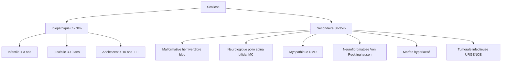

# Déformation Rachidienne — Scoliose

> [!info] Métadonnées
> **Module** : [[Maladies de l'enfant]] · **Spécialité** : [[Chirurgie Pédiatrique]]
> **Enseignant** : Pr. El Fezzazi · **Date** : 2026-04-14
> **Statut** : 🔴 Brouillon → 🟡 Révisé → 🟢 Maîtrisé

---

## I. Introduction — Cas clinique d'accroche

> [!example] Vignette clinique
> *Adolescente de 13 ans, amenée par ses parents qui ont remarqué que son dos est "de travers". Pas de douleur. À l'examen, asymétrie des épaules et test d'Adams (flexion antérieure) positif avec gibosité dorsale droite.*
> *Que suspectez-vous ? Quelle est votre démarche ?*

- **Objectif pédagogique** : Reconnaître une scoliose, la différencier d'une attitude scoliotique, en déterminer l'étiologie et le pronostic évolutif, puis proposer un traitement adapté.
- Réponse → Scoliose idiopathique de l'adolescente → Radio du rachis entier debout → Angle de Cobb → Corset si évolutive.

---

## II. Rappels

### A. Anatomique — Courbures rachidiennes normales (plan sagittal)

- **Lordose cervicale** (concavité postérieure)
- **Cyphose dorsale** physiologique (concavité antérieure, normale < 40°)
- **Lordose lombaire** (concavité postérieure)
- **Plan frontal** : le rachis normal est **rectiligne** (pas d'inclinaison latérale)

---

## III. Définitions

> [!important] Définitions
> **Scoliose** : Déviation latérale du rachis > **10°** (angle de Cobb) dans le plan frontal, **associée à une rotation vertébrale** autour de l'axe rachidien. Déformation en **3 dimensions**.
>
> **Attitude scoliotique** : Inclinaison latérale du rachis **SANS rotation vertébrale**, réductible en décubitus et à la flexion antérieure. Secondaire à une inégalité de longueur ou attitude vicieuse articulaire. **Non pathologique**.
>
> **Cyphose pathologique** : Aggravation anormale de la cyphose physiologique dorsale (> 40°) ou inversion d'une lordose lombaire.

---

## IV. Épidémiologie

| Paramètre | Donnée |
|-----------|--------|
| Prévalence scoliose idiopathique | 2–3 % de la population |
| Sex-ratio | Filles >> Garçons (évolutivité ×10 chez la fille) |
| Âge de début | 10–14 ans (scoliose idiopathique de l'adolescent) |
| Scoliose idiopathique | **65–70 %** de toutes les scolioses |

---

## V. Physiopathologie

- Déformation en 3D : inclinaison latérale + rotation vertébrale autour de l'axe + modification des courbures sagittales
- La **rotation vertébrale** entraîne le déplacement des processus épineux vers la concavité et des côtes vers la convexité → **gibosité (bosse) costale**
- L'évolutivité est étroitement liée à la **croissance résiduelle** (score de Risser)

---

## VI. Clinique

### A. Diagnostic — Différencier scoliose vs attitude scoliotique

**Étape 1 : Inspection statique**
- Asymétrie des épaules, des omoplates
- Déséquilibre du bassin (fossettes sacrées inégales)
- Gibbosité visible en inclinaison

**Étape 2 : Test d'Adams** (flexion antérieure du tronc, genoux tendus)
- **Scoliose** : Gibosité visible (rotation vertébrale entraîne les côtes en saillie)
- **Attitude scoliotique** : La déformation disparaît, rachis rectiligne

**Étape 3 : Vérification de l'équilibre**
- Fil à plomb du C7 : doit tomber dans le pli interfessier
- Mesure de l'inégalité de longueur des membres inférieurs

### B. Signes d'alarme (drapeaux rouges) ⚠️

> [!danger] Drapeaux rouges → Bilan urgent (scinti + IRM)
> - **Scoliose douloureuse** → cause tumorale ou infectieuse à éliminer
> - **Anomalie neurologique** associée
> - **Pied creux** (associé à une syringomyélie)
> - **Convexité gauche** (inhabituelle → cause organique probable)
> - **Aggravation rapide** malgré traitement orthopédique
> - **Scoliose avant 10 ans** (mauvais pronostic)

---

## VII. Paraclinique

### A. Radiographie du rachis entier (debout, face + profil) — Examen de référence

- Face debout : mesure de l'**angle de Cobb** (angle entre les plateaux des vertèbres limites)
- Profil : évaluation des courbures sagittales
- **Vertèbre sommet** (la moins inclinée) → détermine le siège :

| Vertèbre sommet | Type de scoliose |
|-----------------|-----------------|
| T2 – T12 | Thoracique |
| T12 – L1 | Thoraco-lombaire |
| L1 – L4 | Lombaire |

- **Test de bending** (radiographies en inclinaison forcée) : évalue la réductibilité → valeur pronostique

### B. Score de Risser (maturation squelettique)

| Risser | Signification | Évolutivité |
|--------|--------------|-------------|
| 0 | Crête iliaque non ossifiée | **Forte évolutivité** |
| 1–2 | Ossification du 1/3 ou 2/3 externe | Évolutivité modérée |
| 3–4 | Ossification quasi-complète | Évolutivité faible |
| 5 | Fusion crête-aile iliaque | **Croissance terminée** |

> [!tip] Règle pratique
> Risser 0–1 + sexe féminin + Cobb > 20° = **forte évolutivité** → traitement corset immédiat.

### C. IRM rachidienne

- Obligatoire si : scoliose douloureuse, anomalie neurologique, pied creux, convexité gauche
- Recherche : syringomyélie, malformation de Chiari, tumeur intra-rachidienne

---

## VIII. Étiologies

### A. Classification

> [!important] Neurofibromatose de Von Recklinghausen
> Retenue devant : **> 6 taches café-au-lait** de diamètre > 1 cm.

### B. Scolioses idiopathiques (la plus fréquente)

- Aucune cause identifiable
- Prédominance féminine
- Scoliose thoracique droite = forme la plus fréquente
- Évolution pendant la croissance, se stabilise à maturité squelettique

---

## IX. Traitement

### A. Surveillance (Cobb < 20° + Risser avancé)

- Consultation tous les 6 mois
- Radio de contrôle
- Si progression > 5° entre deux consultations → indication au corset

### B. Traitement orthopédique — Corset

**Indications** : Cobb 20–40° + croissance en cours (Risser 0–3)

| Type de corset | Indication |
|----------------|-----------|
| **Boston / Cheneau** | Courbures dorso-lombaires (< 10 ans) |
| **Milwaukee** | Enfants < 10 ans (dégage la cage thoracique) |
| **Gauchois** | Hémiplégie / tétraplégie |

- Porté 20–23h/24
- Contrôle radiologique sous corset → vérification de la correction

### C. Traitement chirurgical — Arthrodèse vertébrale

**Indications** :
- Cobb **> 40°**
- Échec du traitement orthopédique
- Scoliose évolutive malgré maturité squelettique

**Technique** :
- Arthrodèse vertébrale (fusion des vertèbres)
- Matériel d'ostéosynthèse (tiges + vis pédiculaires)
- Objectif : **corriger et stabiliser définitivement**

---

## X. Cyphose — Diagnostic et causes

> [!note] Déformation sagittale
> **Cyphose pathologique** = exagération de la cyphose dorsale ou inversion lordose

| Type | Étiologie | Caractéristiques |
|------|-----------|-----------------|
| **Postural** | Adolescent "avachi" | Réductible, non évolutif, rassurant |
| **Scheuermann** | Cunéiformisation vertébrale > 5° sur ≥ 3 vertèbres | Rigide, douloureux, adolescent |
| **Pottique** | Tuberculose vertébrale | Gibbosité angulaire, douleur |
| **Malformative** | Malformations vertébrales | Radio : vertèbres en bloc ou hémivertèbres |
| **Marfan / Mucopolysaccharidose** | Hyperlaxité, enzyme | Contexte syndromique |

---

## XI. Conclusion

> [!success] Points-clés à retenir
> 1. **Scoliose ≠ attitude scoliotique** → différencier par le test d'Adams (gibosité = scoliose)
> 2. Scoliose = déviation latérale **> 10° + rotation vertébrale** = déformation 3D
> 3. Scoliose idiopathique = **65–70 %** des cas, prédominance féminine, adolescente
> 4. **Scoliose douloureuse** → urgent : scinti + IRM → éliminer tumeur ou infection
> 5. Score de Risser → guide le pronostic évolutif
> 6. Corset si Cobb 20–40° en croissance. Chirurgie si Cobb > 40°
> 7. Dépistage systématique à l'examen pédiatrique de tout enfant

---

## Zone de révision active

> [!question] QCM / Questions de synthèse
> **Q1** : Quelle est la différence clinique clé entre scoliose et attitude scoliotique ?
> **R1** : Test d'Adams → gibosité visible = SCOLIOSE (rotation vertébrale). Disparition en flexion = attitude scoliotique (pas de rotation).
>
> **Q2** : À partir de quel angle de Cobb indique-t-on un corset ?
> **R2** : Cobb > 20° chez un enfant en croissance (Risser 0–3).
>
> **Q3** : Quels signes imposent une IRM rachidienne en urgence dans une scoliose ?
> **R3** : Scoliose douloureuse, anomalie neurologique, pied creux, convexité gauche, aggravation rapide.
>
> **Q4** : Qu'est-ce que le signe de Risser et à quoi sert-il ?
> **R4** : Degré d'ossification de la crête iliaque → évalue la maturité squelettique → guide le pronostic évolutif de la scoliose.

> [!example] Cas clinique rapide
> Garçon de 8 ans, scoliose thoracique douloureuse à convexité gauche, découverte lors d'une consultation ORL.
> **Quel bilan ?** → Scintigraphie osseuse + IRM rachidienne (éliminer cause tumorale ou infectieuse).

> [!note] Mnémotechnique
> **SCOLIOSE = S**pirale 3D (inclinaison + rotation + gibosité)
> **Drapeaux rouges = PANDA** : **P**ied creux, **A**nomalie neuro, **N**on indolore (douloureuse), **D**roite absente (convexité gauche), **A**vant 10 ans

---

## Liens

- **Cours associés** : [[Les Boiteries de l'enfant]], [[Maladie luxante de la hanche]]
- **Maladies** : [[Neurofibromatose de Von Recklinghausen]], [[Maladie de Marfan]], [[Spondylodiscite tuberculeuse]]
- **Référentiel** : [[Collège de Chirurgie Pédiatrique]]

---

> [!success] Suivi de révision
> | Date | Score (/5) | Méthode | Notes |
> |------|------------|---------|-------|
> | 2026-04-14 | | | |

---

*Dernière révision : 2026-04-14*
