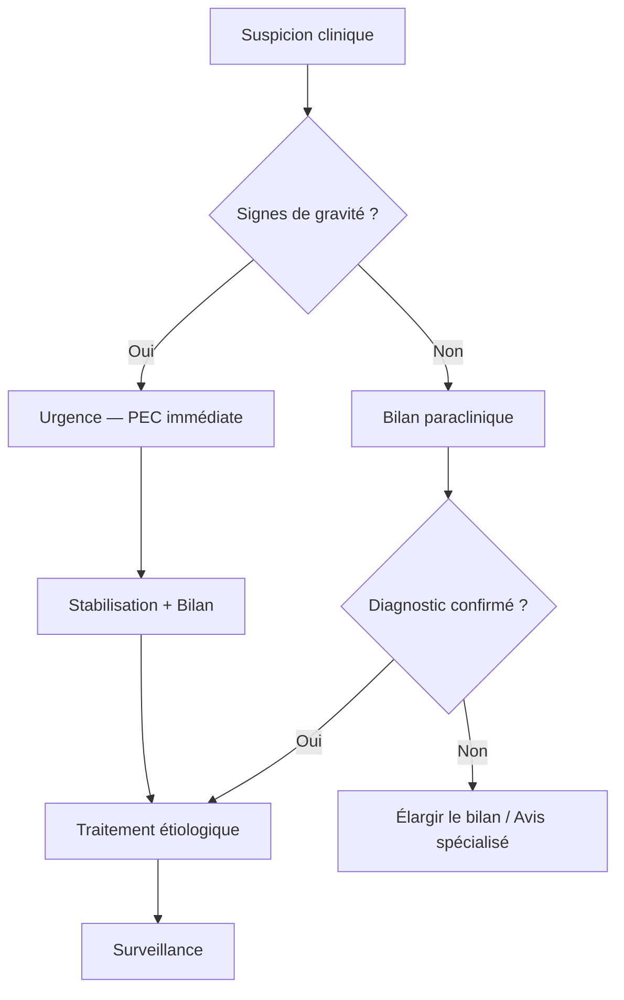

# {{title}}

> [!info] Métadonnées
> **Module** : [[]] · **Spécialité** : [[]]
> **Enseignant** : Pr.  · **Date** : {{date}}
> **Durée** : ~15 min · **Diapos** : ~30
> **Statut** : 🔴 Brouillon → 🟡 Révisé → 🟢 Maîtrisé

---

## I. Introduction — Cas clinique d'accroche

> [!example] Vignette clinique
> *Patient de __ ans, __(sexe), consulte pour __. Antécédents : __.*
> *Que suspectez-vous ? Quelle est votre démarche ?*

- **Objectif pédagogique** : poser le problème, capter l'attention
- Réponse → voir [XVI. Cas clinique — Réponse](#XVI.%20Cas%20clinique%20—%20Réponse)

---

## II. Rappels

### A. Anatomique

- 

### B. Physiologique

- 

### C. Historique *(situer l'état actuel des connaissances)*

- 

---

## III. Définition

> [!important] Définition
> *Formuler en 1-2 phrases claires.*
> 

- **Type** : *(médicale / chirurgicale / mixte)*
- **Urgence** : *(absolue / relative / non urgente)*
- **Classification OMS / internationale** : 

---

## IV. Épidémiologie

| Paramètre | Donnée |
|-----------|--------|
| Prévalence |       |
| Incidence  |       |
| Sex-ratio  |       |
| Âge moyen  |       |
| Mortalité  |       |
| Tendance   |       |

- **Facteurs de risque** :
  - 
  - 

> [!tip] Support visuel
> Insérer graphique / courbe épidémiologique.
> `![[graph_epidemio_{{title}}.png]]`

---

## V. Physiopathologie

> [!tip] Schéma physiopathologique
> `![[schema_physiopath_{{title}}.excalidraw]]`

**Cascade physiopathologique :**

1. **Événement initial** : 
2. **Mécanisme** : 
3. **Conséquence tissulaire** : 
4. **Traduction clinique** : 

---

## VI. Clinique — Signes cliniques / Sémiologie

### A. Circonstances de découverte

- 

### B. Signes fonctionnels *(interrogatoire)*

- 

### C. Signes physiques *(examen clinique)*

| Temps | Résultat |
|-------|----------|
| Inspection   |   |
| Palpation    |   |
| Percussion   |   |
| Auscultation |   |

### D. Signes généraux

- **Constantes** : PA = , FC = , T° = , FR = , SpO2 = 

---

## VII. Paraclinique

### A. Biologie

| Examen | Résultat attendu | Intérêt |
|--------|-------------------|---------|
|        |                   |         |

### B. Imagerie

| Examen | Signe caractéristique | Sensibilité / Spécificité |
|--------|----------------------|---------------------------|
|        |                      |                           |

### C. Examens spécialisés

- 

> [!warning] Examen clé
> 

---

## VIII. Diagnostic positif

> [!abstract] Synthèse diagnostique
> *Le diagnostic est __(clinique / clinico-biologique / clinico-radiologique / histologique)__.*

- **Critères cliniques** : 
- **Critères paracliniques** : 
- **Critères diagnostiques formels** *(si applicable)* :
  - 

---

## IX. Diagnostic de gravité — Urgences — Complications

> [!danger] Signes de gravité
> - 
> - 

| Complication | Mécanisme | Délai | Conduite à tenir |
|-------------|-----------|-------|------------------|
|             |           |       |                  |

- **Urgence absolue** : 
- **Urgence relative** : 

---

## X. Diagnostic différentiel

| Diagnostic | Arguments pour | Arguments contre | Examen discriminant |
|------------|---------------|------------------|---------------------|
| [[]]       |               |                  |                     |
| [[]]       |               |                  |                     |
| [[]]       |               |                  |                     |

---

## XI. Étiologie

| Catégorie | Étiologie | Fréquence | Mécanisme |
|-----------|-----------|-----------|-----------|
| Infectieuse   |       |           |           |
| Auto-immune   |       |           |           |
| Métabolique   |       |           |           |
| Génétique     |       |           |           |
| Iatrogène     |       |           |           |
| Idiopathique  |       |           |           |

---

## XII. Prise en charge

### A. Buts du traitement

1. 
2. 
3. 

### B. Traitement symptomatique

| Classe | DCI | Posologie | Voie | Durée |
|--------|-----|-----------|------|-------|
| [[]]   |     |           |      |       |

### C. Traitement étiologique

| Étiologie | Traitement | Remarques |
|-----------|------------|-----------|
|           |            |           |

### D. Traitement chirurgical

- **Indication** : 
- **Technique** : 
- **Résultats** : 

### E. Mesures associées

- 

---

## XIII. Complications iatrogènes — Effets indésirables

| Traitement | Effet indésirable | Fréquence | Surveillance | CAT |
|-----------|-------------------|-----------|--------------|-----|
| [[]]      |                   |           |              |     |

---

## XIV. Pronostic

- **Sous traitement** : 
- **Sans traitement** : 
- **Facteurs de bon pronostic** :
  - 
- **Facteurs de mauvais pronostic** :
  - 
- **Survie à 5 ans** *(si applicable)* : 

---

## XV. Logigramme — Conduite à tenir

> [!tip] Arbre décisionnel
> `![[logigramme_CAT_{{title}}.excalidraw]]`

---

## XVI. Cas clinique — Réponse

> [!success] Réponse au cas d'introduction
> **Diagnostic** : 
> **Arguments** :
> - 
> **PEC** :
> - 

---

## XVII. Conclusion

> [!abstract] Points essentiels
> 1. **Définition** : 
> 2. **Diagnostic** : 
> 3. **Urgence à éliminer** : 
> 4. **Traitement** : 
> 5. **Pronostic** : 

---

## XVIII. Références

| Type | Auteur / Source | Titre | Année | Lien |
|------|----------------|-------|-------|------|
| Référentiel |  |  |  |  |
| Article     |  |  |  |  |
| Livre       |  |  |  |  |

---

## XIX. Pour aller plus loin *(Further Read)*

- 
- 

---

## Capture rapide

> [!tip] Zone brouillon — pendant le cours
> Vitesse avant perfection. Mots-clés, schémas, idées-clés.

- 
- 
- 

---

## Zone de révision active

> [!question] QCM / Questions de synthèse
> **Q1** : 
> **R1** : 
>
> **Q2** : 
> **R2** : 
>
> **Q3** : 
> **R3** : 

> [!note] Moyens mnémotechniques
> 

---

## Liens

- **MOC** : [[]]
- **Cours précédent** : [[]]
- **Cours suivant** : [[]]
- **Maladies** : [[]]
- **Médicaments** : [[]]
- **Concepts** : [[]]

---

> [!warning] Points tombables à l'examen
> - 
> - 
> - 

---

> [!success] Suivi de révision
> | Date | Score (/5) | Méthode | Notes |
> |------|------------|---------|-------|
> | {{date}} |        |         |       |

---

*Dernière révision : {{date}}*