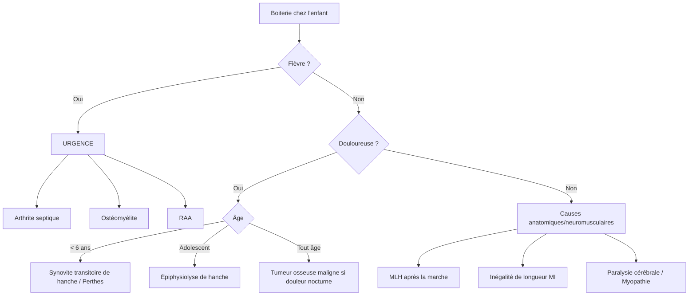

# Les Boiteries de l'Enfant

> [!info] Métadonnées
> **Module** : [[Maladies de l'enfant]] · **Spécialité** : [[Chirurgie Pédiatrique]]
> **Enseignant** : Pr. El Fezzazi · **Date** : 2026-04-14
> **Statut** : 🔴 Brouillon → 🟡 Révisé → 🟢 Maîtrisé

---

## I. Introduction — Cas clinique d'accroche

> [!example] Vignette clinique
> *Garçon de 8 ans, boiterie droite depuis 3 jours, fièvre à 39°C, refus de mise en charge. Pas de traumatisme.*
> *Que suspectez-vous ? Quelle est votre démarche ?*

- **Objectif pédagogique** : Établir une démarche diagnostique devant une boiterie chez l'enfant, distinguer les urgences des pathologies non urgentes, et adapter la prise en charge selon l'âge et le contexte.
- Réponse → Boiterie fébrile = arthrite septique ou ostéomyélite jusqu'à preuve du contraire → Hospitalisation + ATB urgence.

> [!danger] Règles fondamentales
> - **Boiterie + Fièvre** → Arthrite septique ou Ostéomyélite → **URGENCE**
> - **Boiterie douloureuse non fébrile** → Éliminer tumeur osseuse maligne → **radio + bilan**
> - **Boiterie de l'adolescent** → Penser à l'épiphysiolyse de hanche
> - **Examen du rachis systématique** devant toute boiterie douloureuse de l'enfant

---

## II. Définition et classification

> [!important] Définition
> **Boiterie** : Asymétrie de la démarche entraînant un déhanchement ou une claudication, d'origine orthopédique, neurologique, ou musculaire.

**Classification par symptomatologie :**

| Type | Étiologies principales |
|------|----------------------|
| **Boiterie fébrile** | Arthrite septique, Ostéomyélite, Rhumatisme articulaire aigu |
| **Boiterie douloureuse non fébrile** | Tumeur osseuse maligne, Synovite transitoire de hanche, Perthes-Legg-Calvé, Épiphysiolyse |
| **Boiterie indolore** | MLH (maladie luxante), Inégalité de longueur MI, Causes neuromusculaires |

---

## III. Démarche diagnostique

### Étape 1 : Fièvre présente ou absente ?

---

## IV. Étiologies — Description détaillée

### A. Boiteries fébriles — URGENCES

#### 1. Arthrite septique et Ostéomyélite

→ Voir note [[Infections ostéo-articulaires de l'enfant]]

**Points clés** :
- Arthrite septique : hanche et genou les plus fréquentes
- Ostéomyélite : douleur métaphysaire + fièvre
- Traitement : ATB probabiliste + drainage chirurgical

#### 2. Rhumatisme Articulaire Aigu (RAA)

- Après angine streptococcique (≥ 2 semaines)
- Polyarthrite fébrile migrante et fugace
- Traitement : Pénicilline V + AINS + surveillance cardiaque (valvulite)

---

### B. Boiteries douloureuses non fébriles

#### 1. Synovite aiguë transitoire de hanche (= rhume de hanche)

> [!tip] La plus fréquente des boiteries douloureuses non fébriles de l'enfant

- **Âge** : 4–8 ans, garçon ++
- **Clinique** : boiterie + limitation de l'abduction et de la rotation interne de hanche, **apyrexie ou fébricule < 38°C**
- **Diagnostic d'élimination** (éliminer arthrite septique en priorité)
- **Traitement** : repos + AINS → guérison spontanée en 1–2 semaines
- Récidive possible (15–20 %)
- Complication rare : **maladie de Perthes** (nécrose aseptique de tête fémorale) → surveillance

#### 2. Maladie de Legg-Calvé-Perthes (ostéochondrose de hanche)

- **Âge** : 4–8 ans, garçon 4:1
- **Mécanisme** : nécrose ischémique aseptique de la tête fémorale, d'origine inconnue
- **Clinique** : boiterie douloureuse insidieuse, limitation de l'abduction et de la rotation interne
- **Imagerie** :
  - Radio : condensation puis aplatissement de la tête fémorale (stades I–IV)
  - IRM : précoce, montre l'œdème osseux et la nécrose
- **Traitement** : mise en décharge, contention orthopédique, parfois chirurgie de recentrage
- **Pronostic** : dépend de l'âge au diagnostic (plus jeune = meilleur pronostic)

#### 3. Épiphysiolyse fémorale supérieure (EFS)

> [!warning] Urgence orthopédique chez l'adolescent

- **Âge** : 10–15 ans, surpoids ++, garçon ++
- **Mécanisme** : glissement de l'épiphyse fémorale supérieure en arrière et en dedans par rapport à la métaphyse (zone de fragilité hormonale au moment de la puberté)
- **Clinique** :
  - Boiterie douloureuse, douleur projetée à la cuisse ou au genou
  - Limitation de la rotation interne + abduction de hanche
  - Signe de Drehmann : lors de la flexion de hanche, rotation externe automatique
- **Imagerie** : Radio de hanche face + profil de Lauenstein
  - Signe de la ligne de Klein (épiphyse en dehors de la ligne prolongeant le bord supérieur du col)
- **Traitement** : **Vissage épiphysaire en urgence** (risque de nécrose si mobilisation avant vissage)
- **Bilatéralité** : 30–40 % → traitement prophylactique du côté controlatéral

#### 4. Tumeurs osseuses malignes

> [!danger] Boiterie douloureuse nocturne = tumeur jusqu'à preuve du contraire

- **Sarcome d'Ewing** et **Ostéosarcome** : pathologies décrites dans la note [[Tumeurs osseuses malignes de l'enfant]]
- **Signes d'alarme** : douleur nocturne, AEG, masse palpable, fièvre inexpliquée
- **CAT** : Radio + IRM + biopsie

---

### C. Boiteries indolores

#### 1. Maladie luxante de la hanche (MLH) après la marche

→ Diagnostic tardif (voir note [[Maladie luxante de la hanche]])
- Boiterie de Trendelenburg (chute de hanche du côté sain)
- Limitation de l'abduction, signe de Galeazzi, ascension du grand trochanter
- Chirurgie nécessaire après acquisition de la marche

#### 2. Inégalité de longueur des membres inférieurs (ILMI)

- **Étiologies** :
  - Malformative : hypoplasie fémorale ou tibiale
  - Traumatique : fracture mal consolidée avec chevauchement
  - Infectieuse : ostéo-arthrite → destruction du cartilage de croissance → épiphysiodèse
  - Tumorale : tumeur ostéolytique du cartilage de croissance
  - Malformations vasculaires : peuvent accélérer la croissance

- **Diagnostic** : mesure comparative des membres + radiographie

#### 3. Causes neuromusculaires

| Pathologie | Démarche caractéristique |
|-----------|------------------------|
| Paralysie cérébrale (IMC) | Démarche en ciseaux, spasticité |
| Myopathie de Duchenne | Signe de Gowers (se relève en s'appuyant sur ses propres jambes), chute du bassin |
| Neuropathie périphérique (Charcot-Marie-Tooth) | Steppage, pied creux |

---

## V. Diagnostic différentiel — Tableau récapitulatif

| Étiologie | Âge | Fièvre | Douleur | Imagerie |
|-----------|-----|--------|---------|----------|
| Arthrite septique | < 5 ans | +++ | +++ | Écho : épanchement |
| Ostéomyélite | Tout âge | +++ | Métaphysaire | IRM |
| Synovite transitoire | 4–8 ans | 0 ou légère | + | Écho : épanchement modéré |
| Perthes | 4–8 ans | Non | + | Radio : tête aplatie |
| Épiphysiolyse | Ado | Non | + (cuisse/genou) | Radio : glissement épiphyse |
| Tumeur maligne | Tout âge | Parfois | Nocturne | Radio + IRM |
| MLH tardive | > 12 mois | Non | Non | Radio : hanche luxée |

---

## VI. Conclusion

> [!success] Points-clés à retenir
> 1. **Boiterie fébrile = urgence = arthrite septique ou OMH** jusqu'à preuve du contraire
> 2. **Boiterie douloureuse non fébrile** → éliminer tumeur (douleur nocturne !)
> 3. **Boiterie de l'adolescent** → penser épiphysiolyse → vissage en urgence
> 4. **Boiterie indolore** → MLH tardive, ILMI, causes neuro-musculaires
> 5. **Examen du rachis systématique** dans toute boiterie douloureuse
> 6. La synovite transitoire est un diagnostic **d'élimination** → éliminer arthrite septique d'abord

---

## Zone de révision active

> [!question] QCM / Questions de synthèse
> **Q1** : Que signifie le signe de Drehmann dans l'épiphysiolyse ?
> **R1** : Lors de la flexion de hanche, rotation externe automatique irréductible → pathognomonique de l'EFS.
>
> **Q2** : Quelle est la complication principale de la synovite transitoire de hanche ?
> **R2** : Maladie de Perthes (nécrose aseptique de la tête fémorale) → surveillance indispensable.
>
> **Q3** : Quel est le risque si on mobilise une épiphysiolyse avant vissage ?
> **R3** : Nécrose ischémique de la tête fémorale (compression des vaisseaux épiphysaires).

> [!example] Cas clinique rapide
> Adolescent de 13 ans, obèse, boiterie gauche depuis 2 semaines, douleur projetée au genou.
> **Diagnostic ?** → Épiphysiolyse fémorale supérieure gauche (douleur projetée au genou = signe d'appel classique).
> **CAT urgente ?** → Mise en décharge immédiate + Radio hanche face + profil Lauenstein + Vissage épiphysaire en urgence.

> [!note] Mnémotechnique — Causes de boiterie par âge
> **0–2 ans** : MLH
> **2–8 ans** : Synovite transitoire → Perthes → OMH/Arthrite
> **Ado** : Épiphysiolyse (surtout si obèse)
> **Tout âge** : Tumeur osseuse si douleur nocturne

---

## Liens

- **Cours associés** : [[Infections ostéo-articulaires de l'enfant]], [[Maladie luxante de la hanche]], [[Tumeurs osseuses malignes de l'enfant]], [[Déformation rachidienne — Scoliose]]
- **Référentiel** : [[Collège de Chirurgie Pédiatrique]]

---

> [!success] Suivi de révision
> | Date | Score (/5) | Méthode | Notes |
> |------|------------|---------|-------|
> | 2026-04-14 | | | |

---

*Dernière révision : 2026-04-14*
