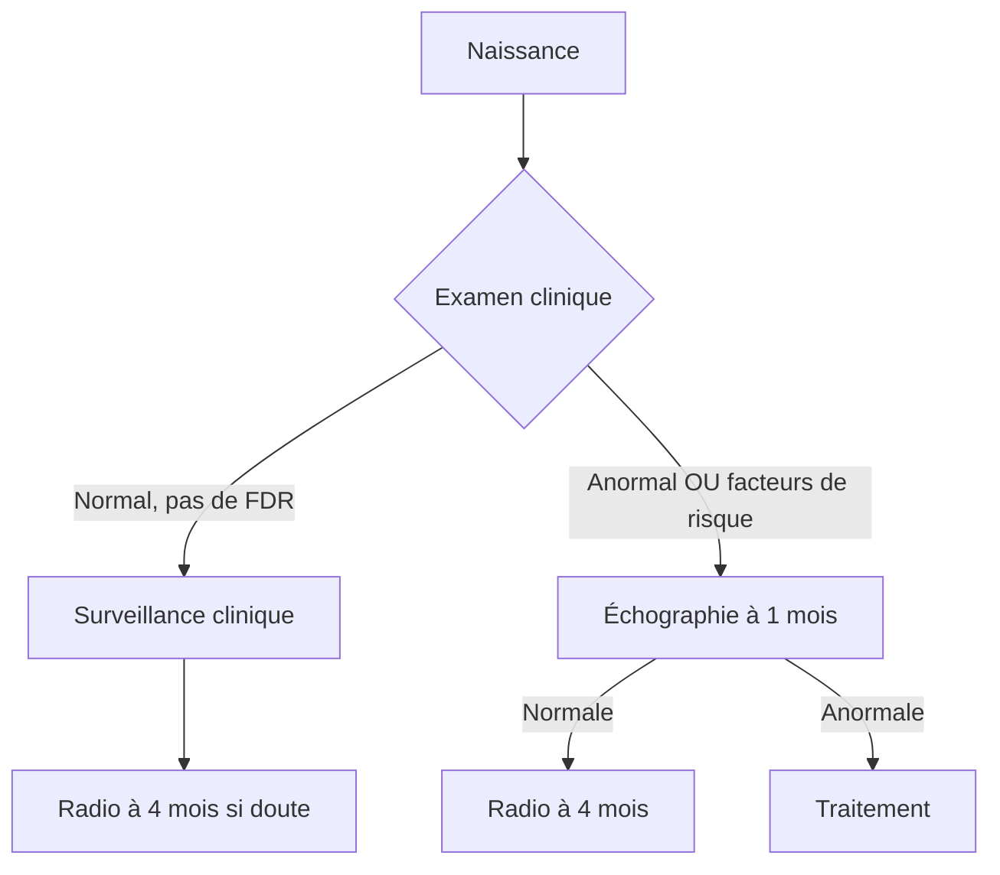

# Maladie Luxante de la Hanche (MLH)

> [!info] Métadonnées
> **Module** : [[Maladies de l'enfant]] · **Spécialité** : [[Chirurgie Pédiatrique]]
> **Enseignant** : Pr. El Fezzazi · **Date** : 2026-04-14
> **Statut** : 🔴 Brouillon → 🟡 Révisé → 🟢 Maîtrisé

---

## I. Introduction — Cas clinique d'accroche

> [!example] Vignette clinique
> *Nouveau-né de J3, examiné en maternité. À l'examen, la manœuvre d'Ortolani montre un ressaut de réduction de la hanche droite. La hanche gauche est normale.*
> *Que suspectez-vous ? Que faites-vous ?*

- **Objectif pédagogique** : Dépister la MLH à la naissance, identifier les facteurs de risque, connaître les manœuvres cliniques et conduire la prise en charge.
- Réponse → Hanche luxée réductible droite → Harnais de Pavlik ou culotte d'abduction, échographie de hanche.

---

## II. Rappels

### A. Anatomique

- La hanche est une articulation sphéroïde (tête fémorale + cotyle)
- Chez le nouveau-né : la tête fémorale est cartilagineuse, le cotyle est peu profond → instabilité physiologique
- La stabilité dépend du tonus musculaire, de la capsule et des ligaments

### B. Historique

- Ancienne dénomination (1932) : « Luxation congénitale de la hanche » (définition statique)
- Dénomination actuelle : **Maladie luxante de la hanche** (définition dynamique) → la hanche peut être en place à un instant T mais se luxer lors d'une manœuvre

---

## III. Définition

> [!important] Définition
> **Maladie luxante de la hanche (MLH)** : Instabilité articulaire de la hanche liée à une anomalie du développement, pouvant aboutir à une luxation permanente irréductible si non dépistée et traitée précocement.

**Classification clinique** (3 situations à l'examen du nouveau-né) :

| Situation | Définition |
|-----------|-----------|
| **Hanche luxable** | Tête en place au repos, mais luxée par une manœuvre (Barlow) |
| **Hanche luxée réductible** | Tête hors du cotyle, mais réductible par manœuvre (Ortolani) |
| **Hanche luxée irréductible** | Tête hors du cotyle, irréductible quelle que soit la manœuvre |

---

## IV. Épidémiologie

| Paramètre | Donnée |
|-----------|--------|
| Prévalence | 1–3/1000 naissances (formes vraies) |
| Sex-ratio | Filles >> Garçons (6:1) |
| Côté | Gauche > Droit > Bilatéral |
| Hérédité | 1er facteur de risque |

---

## V. Étiologie — Facteurs de risque

> [!important] Caractère multifactoriel

| Facteur | Mécanisme |
|---------|-----------|
| **Hérédité** | Prédisposition génétique (interroger la famille) |
| **Hyperlaxité ligamentaire** | Laxité capsulo-ligamentaire → instabilité |
| **Présentation en siège** | Position intra-utérine en flexion-adduction → luxation |
| **Primiparité** | Muscles abdominaux toniques → compression fœtale |
| **Oligoamnios** | Compression fœtale |
| **Sexe féminin** | Sensibilité aux œstrogènes maternels → hyperlaxité |
| **Malformations associées** | Torticolis musculaire, métatarsus adductus (pied varus) |

> [!tip] Astuce
> L'hyperlaxité peut être évaluée chez le nouveau-né en testant le poignet, les doigts, le coude, le genou, la cheville.

---

## VI. Clinique — Dépistage néonatal

### A. Manœuvres cliniques (examen en abduction)

**Manœuvre d'Ortolani** (ressaut de réduction) :
- Hanche en flexion à 90° + abduction progressive
- Si luxée réductible → ressaut perçu lors de la réduction de la tête dans le cotyle
- Signe : **ressaut de réduction** = « clunk » perçu

**Manœuvre de Barlow** (ressaut de luxation) :
- Hanche en adduction + pression postérieure sur le grand trochanter
- Si hanche luxable → ressaut de luxation de la tête hors du cotyle

**Limitation de l'abduction** :
- Normale : 70–80° en abduction bilatérale
- Limitation asymétrique ou < 60° → suspect

**Signe de Galeazzi** :
- Enfant en décubitus dorsal, hanches fléchies à 90°
- Si inégalité de hauteur des genoux → raccourcissement du fémur (hanche luxée haute)

### B. Signes chez l'enfant marchant (si diagnostic tardif)

- Boiterie (démarche de canard ou de Trendelenburg)
- Limitation de l'abduction
- Signe de Galeazzi positif
- Ascension du grand trochanter au-dessus de la ligne Ombilico-EIAS
- Inégalité de longueur des membres inférieurs
- Hyperlordose lombaire compensatrice

---

## VII. Paraclinique

### A. Échographie de hanche (< 4 mois) — Examen de référence

> [!warning] Examen clé
> L'échographie est l'**examen de première intention** chez le nouveau-né et le nourrisson < 4 mois (la tête fémorale est cartilagineuse et non visible sur la radio).

- Mesure de l'angle alpha (fond du cotyle) : **normal > 60°**
- Mesure du taux de couverture de la tête fémorale
- Évaluation de la stabilité dynamique (manœuvre de stress sous échographie)

### B. Radiographie du bassin (> 4 mois)

- Tête fémorale ossifiée → visible à la radio après 4 mois
- Recherche : ligne de Shenton (interrompue si luxation), indice acétabulaire

---

## VIII. Stratégie de dépistage

---

## IX. Traitement

### A. Buts

- Réduire la tête dans le cotyle
- Maintenir la réduction
- Permettre le développement normal de la hanche

### B. Selon l'âge et le type de hanche

#### Nouveau-né / Nourrisson < 6 mois — Traitement orthopédique

| Type de hanche | Traitement |
|----------------|-----------|
| Luxable | Surveillance clinique rapprochée (souvent résolution spontanée) |
| Luxée réductible | **Harnais de Pavlik** (maintien en flexion-abduction) — traitement de choix |
| Luxée irréductible | **Hospitalisation** → Traction progressive 3 semaines → puis plâtre pelvi-pédieux |

**Harnais de Pavlik** :
- Maintient la hanche en flexion ~100° + abduction
- Porté 23h/24
- Contrôle écho sous harnais à 1–2 semaines
- Durée : jusqu'à stabilisation (3–6 mois)

> [!danger] Complication du harnais de Pavlik
> Si trop serré ou porté trop longtemps → **Nécrose de la tête fémorale** (complication la plus redoutable)

#### Nourrisson 6–18 mois — Traction puis réduction

- Traction progressive ambulatoire (2–3 semaines) → réduction progressive "à ciel fermé"
- Puis plâtre pelvi-pédieux

#### Grand enfant après la marche — Chirurgie

- Réduction chirurgicale "à ciel ouvert"
- Ostéotomie de réorientation (fémorale et/ou acétabulaire)
- Résultats **moins bons** (d'où l'intérêt absolu du dépistage précoce)
- Complications fréquentes : nécrose de tête fémorale, arthrose précoce

---

## X. Évolution et pronostic

- **Dépistage précoce + traitement néonatal** : pronostic excellent, traitement ambulatoire, pas de séquelles
- **Diagnostic tardif** (après la marche) : chirurgie nécessaire, complications plus fréquentes, résultats moins satisfaisants
- **Complication principale** : Nécrose de la tête fémorale (iatrogène : harnais trop serré, ou liée à la pathologie)

---

## XI. Conclusion

> [!success] Points-clés à retenir
> 1. **Dépistage systématique à la naissance** = clé du pronostic
> 2. Manœuvres : Ortolani (réduction), Barlow (luxation)
> 3. Facteurs de risque : hérédité, siège, hyperlaxité, sexe féminin
> 4. Examen de référence chez le nourrisson : **échographie de hanche**
> 5. Traitement de choix < 6 mois : **harnais de Pavlik**
> 6. Plus le diagnostic est tardif, plus le traitement est lourd et les séquelles sont importantes
> 7. Complication redoutable du traitement : **nécrose de la tête fémorale**

---

## Zone de révision active

> [!question] QCM / Questions de synthèse
> **Q1** : Quelles sont les 3 situations cliniques possibles lors de l'examen néonatal d'une MLH ?
> **R1** : Hanche luxable (en place, luxée par Barlow), Hanche luxée réductible (ressaut Ortolani+), Hanche luxée irréductible.
>
> **Q2** : Quel est l'examen de référence pour le dépistage de la MLH avant 4 mois ?
> **R2** : Échographie de hanche (la tête fémorale est cartilagineuse → non visible à la radio).
>
> **Q3** : Quelle est la complication la plus redoutable du harnais de Pavlik ?
> **R3** : Nécrose ischémique de la tête fémorale si harnais trop serré.
>
> **Q4** : Quel facteur de risque est le plus important dans la MLH ?
> **R4** : Hérédité (antécédent familial de MLH).

> [!example] Cas clinique rapide
> Fillette de 15 mois, boiterie unilatérale indolore depuis l'acquisition de la marche. Limitation de l'abduction de la hanche droite. Signe de Galeazzi positif.
> **Diagnostic ?** → Maladie luxante de la hanche droite, diagnostic tardif.
> **CAT ?** → Radio du bassin face → si confirmé : chirurgie de réduction + ostéotomies.

> [!note] Mnémotechnique
> **O**rtolani = **O**n Réduit (ressaut de réduction)
> **B**arlow = **B**rush out (ressaut de luxation)
> **P**avlik = **P**etit traitement (nourrisson < 6 mois)

---

## Liens

- **Cours associés** : [[Les Boiteries de l'enfant]], [[Déformation rachidienne]]
- **Maladies** : [[Arthrite de hanche]], [[Nécrose de tête fémorale]]
- **Référentiel** : [[Collège de Chirurgie Pédiatrique]]

---

> [!success] Suivi de révision
> | Date | Score (/5) | Méthode | Notes |
> |------|------------|---------|-------|
> | 2026-04-14 | | | |

---

*Dernière révision : 2026-04-14*
