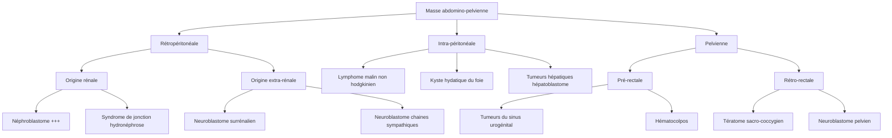

# Les Masses Abdomino-Pelviennes de l'Enfant

> [!info] Métadonnées
> **Module** : [[Maladies de l'enfant]] · **Spécialité** : [[Chirurgie Pédiatrique]]
> **Enseignant** : Pr. Kamili · **Date** : 2026-04-14
> **Statut** : 🔴 Brouillon → 🟡 Révisé → 🟢 Maîtrisé

---

## I. Introduction — Cas clinique d'accroche

> [!example] Vignette clinique
> *Enfant de 3 ans amené pour augmentation progressive du volume de l'abdomen depuis 2 semaines. La mère rapporte avoir remarqué une bosse en donnant le bain. L'examen retrouve une masse abdominale ferme, indolore, latéralisée à droite.*
> *Que suspectez-vous ? Quelle est votre démarche ?*

- **Objectif pédagogique** : Devant toute masse abdominale chez l'enfant, établir une démarche diagnostique rigoureuse et éliminer une cause maligne.
- **Règle d'or** : Toute masse abdomino-pelvienne chez l'enfant doit être considérée maligne jusqu'à preuve du contraire.

---

## II. Rappels

### A. Anatomique

- La cavité abdominale de l'enfant est proportionnellement plus grande / taille corporelle
- Les organes rétropéritonéaux (reins, surrénales, chaînes sympathiques) sont accessibles à la palpation
- Le foie et la rate se palpent physiologiquement jusqu'à 2–3 ans

---

## III. Définition

> [!important] Définition
> Toute tuméfaction détectée cliniquement ou à l'imagerie dans la région abdominale ou pelvienne chez l'enfant, pouvant être d'origine maligne ou bénigne, et nécessitant une évaluation oncologique systématique.

---

## IV. Épidémiologie

| Paramètre | Donnée |
|-----------|--------|
| Fréquence | 2ème cause de cancer pédiatrique après les leucémies |
| Âge | Variable selon l'étiologie (0–15 ans) |
| Découverte | Souvent fortuite lors examen de routine |
| Spécificité | Aucun signe spécifique — la palpation systématique est indispensable |

> [!important] Principe fondamental
> **La palpation abdominale doit être systématique lors de l'examen de tout enfant, quel que soit le motif de consultation.**

---

## V. Démarche diagnostique

### A. Interrogatoire — Signes d'orientation

**Signes directs :**
- Masse découverte par les parents (bain, habillage)
- Augmentation du périmètre abdominal
- Douleur abdominale

**Signes d'appel indirects :**
- **Hématurie** → Penser au **Néphroblastome** (tumeur de Wilms)
- **HTA** → Néphroblastome (compression vasculaire) ou neuroblastome (sécrétant)
- **Signes neurologiques** : syndrome oculo-cérébello-myoclonique de Kinsbourne (ataxie + myoclonies + mouvements oculaires en saccade) → Neuroblastome dans 50 % des cas
- **Signes ostéo-articulaires** : polyarthrite, tuméfactions osseuses → Neuroblastome métastatique
- **Syndrome de Hutchinson** : zygomose + enorbitite + exophtalmie → Infiltration orbitaire d'un neuroblastome
- **Signes généraux** : pâleur, fatigue, fièvre → Infiltration médullaire (neuroblastome, lymphome, rhabdomyosarcome)
- **Nodules sous-cutanés** chez nourrisson < 1 an → **Syndrome de Pepper** (neuroblastome avec métastases nodulaires hépatiques)

### B. Malformations associées / Prédispositions génétiques

| Syndrome | Caractéristiques | Tumeur associée |
|----------|------------------|-----------------|
| **WAGR** | Wilms, Aniridie, anomalies Génitales, Retard mental | Gène WT1 → Néphroblastome |
| **Drash (Denys-Drash)** | Pseudohermaphrodisme + glomérulopathie | Gène WT1 → Néphroblastome |
| **Beckwith-Wiedemann** | Viscéromégalie, macroglossie, hypoglycémie, hémi-hypertrophie | Néphroblastome, hépatoblastome |
| **Perlman** | Hépatomégalie, macrosomie | Néphroblastome |
| **Von Recklinghausen (NF1)** | Neurofibromatose | Tumeurs mésenchymateuses, vasculaires |

---

## VI. Paraclinique

### A. Imagerie

**1. Radiographie ASP (face + profil)** — Orientation initiale
- Situe l'opacité par rapport aux organes
- **Calcifications** → valeur d'orientation :

| Type de calcification | Étiologie évoquée |
|----------------------|-------------------|
| Poudreuse, fine | **Neuroblastome** |
| En coquille d'œuf | **Néphroblastome** |
| En motte | Hématome surrénalien |
| Absciforme | Kyste hydatique |
| Organoïde | Tératome mature |

- Atteinte lithique osseuse (côtes, bassin) + élargissement des trous de conjugaison → **Neuroblastome**
- Radiographie pulmonaire : métastases enchimateuses (lâcher de ballons) → Néphroblastome / tumeur mésenchymateuse

**2. Échographie abdomino-pelvienne** — Examen de **1ère intention**
- Anodin, facilement réalisable
- Précise : siège (rétropéritonéal / intra-péritonéal / pelvien), contenu (solide/liquidien/mixte), origine (rénale / extra-rénale), rapport avec la veine cave inférieure et la veine rénale

**3. TDM abdomino-pelvienne** — Bilan d'extension loco-régional
- Précise les rapports avec le voisinage
- Dépiste mieux les adénopathies loco-régionales
- **Signe de l'éperon** → caractéristique du **Néphroblastome** (languette de parenchyme rénal séparant la tumeur de la surrénale)

**4. Autres examens d'imagerie**
- IRM abdomino-pelvienne : indiquée si doute ou tumeur pelvienne
- **Scintigraphie à la MIBG** (méta-iodo-benzylguanidine) → Diagnostic et bilan d'extension du **neuroblastome**
- Scintigraphie osseuse au Technétium-99 → Métastases osseuses

### B. Biologie

| Marqueur | Valeur | Tumeur |
|---------|--------|--------|
| Catécholamines urinaires (VMA + AHV) | ↑ dans 95 % | **Neuroblastome** |
| Alpha-fœtoprotéine (AFP) plasmatique | ↑ | Hépatoblastome, tumeurs germinales |
| Beta-HCG | ↑ | Tumeurs germinales sacro-coccygiennes |

### C. Anatomopathologie

- Prélèvement histologique nécessaire pour toute tumeur solide sans marqueur spécifique
- **Exception : le Néphroblastome** — dans 95 % des cas, l'imagerie suffit pour débuter le traitement (pas de biopsie pré-opératoire de principe)
- Modalités de prélèvement :
  - Pièce d'exérèse (si chirurgie première possible sans mutilation)
  - Ponction-biopsie trans-cutanée écho/scanner-guidée
  - Biopsie de métastase accessible (ganglion, nodule)

---

## VII. Étiologies — Classification anatomique

### A. Le Néphroblastome (Tumeur de Wilms) — Tumeur rénale la plus fréquente de l'enfant

> [!important] Caractéristiques clés
> - Tumeur du **blastème rénal**, entre **1 et 5 ans**
> - Augmentation rapide du volume → risque de **rupture spontanée**
> - Gène impliqué : **WT1** (11p13)

**Présentation clinique :**
- Masse abdominale (découverte par les parents)
- Hématurie macroscopique
- HTA (compression artère rénale)
- AEG
- Abdomen aigu (rupture tumorale) — urgence

**Imagerie :**
- Échographie + TDM : masse **intra-rénale**, solide, parfois kystique, **signe de l'éperon** (languette de tissu rénal normal séparant la tumeur de la surrénale)
- Rechercher : perméabilité veine rénale et veine cave inférieure (extension veineuse = critère de classification)

**Traitement (protocole SIOPE/GPOH) :**
- Chimiothérapie néo-adjuvante (4–6 semaines) → Réduction tumorale
- Néphrectomie chirurgicale
- Chimiothérapie adjuvante ± radiothérapie selon le stade

### B. Le Neuroblastome — Tumeur extra-rénale la plus fréquente

> [!important] Caractéristiques clés
> - Issu des **cellules de la crête neurale**
> - Se développe : surrénale, chaînes sympathiques périvasculaires ou paravertébrales
> - Très métastatique (os, moelle, foie, peau)

**Présentation clinique :**
- Masse abdominale + signes d'appel neurologiques, osseux, généraux
- Syndrome de Kinsbourne, Hutchinson, Pepper

**Biologie :** Catécholamines urinaires (VMA + AHV) élevées dans **95 %** des cas

**Imagerie :** Calcifications poudreuses. MIBG = examen de référence pour bilan d'extension.

### C. Tératome sacro-coccygien

- Forme exopelvienne (visible à la naissance) ou endopelvienne (symptômes compressifs)
- Marqueurs : AFP ↑, β-HCG ↑
- Traitement : exérèse chirurgicale complète avec le coccyx

### D. Lymphome malin non hodgkinien abdominal

- Masse intra-péritonéale chez l'enfant > 5 ans
- Liquide d'ascite ou épanchement pleural possible
- Traitement : chimiothérapie

---

## VIII. Traitement — Principes généraux

> [!warning] Règle oncologique
> **Toute tumeur doit être considérée maligne et opérée comme telle**, dans des conditions carcinologiques strictes.

### Approche multidisciplinaire

- Réunion de concertation pluridisciplinaire (RCP) systématique
- Oncologues pédiatres + chirurgiens + radiologues + anatomopathologistes
- Protocoles nationaux / internationaux (SIOPE, GPOH)

---

## IX. Évolution et pronostic

| Tumeur | Pronostic |
|--------|-----------|
| Néphroblastome localisé | Excellent : survie > 90 % à 5 ans |
| Neuroblastome localisé < 1 an | Souvent bon (régression spontanée possible) |
| Neuroblastome métastatique > 1 an | Réservé (stade IV) |
| Tératome mature | Excellent après exérèse |
| LMNH | Selon stade, souvent bon avec chimio |

---

## X. Conclusion

> [!success] Points-clés
> 1. **Palpation abdominale systématique** chez tout enfant, quel que soit le motif de consultation
> 2. Pas de signe clinique spécifique → la découverte est souvent **fortuite**
> 3. Masses **rétropéritonéales** : dominées par **Néphroblastome** + **Neuroblastome**
> 4. Masses **intra-péritonéales** : lymphome, kyste hydatique, tumeurs hépatiques
> 5. Masses **pelviennes pré-rectales** : tumeur sinus urogénital, hématocolpos
> 6. Masses **pelviennes rétro-rectales** : tératome sacro-coccygien, neuroblastome pelvien
> 7. Exception biopsie : **Néphroblastome** (95 % → traitement sur imagerie seule)

---

## Zone de révision active

> [!question] QCM / Questions de synthèse
> **Q1** : Quel est le signe TDM pathognomonique du Néphroblastome ?
> **R1** : Le signe de l'éperon (languette de tissu rénal séparant la tumeur de la surrénale).
>
> **Q2** : Quels marqueurs biologiques confirment un neuroblastome dans 95 % des cas ?
> **R2** : Catécholamines urinaires : acide homovanilique (AHV) + acide vanylmandélique (AVM).
>
> **Q3** : Qu'est-ce que le syndrome WAGR ?
> **R3** : Wilms + Aniridie + anomalies Génitales + Retard mental → prédisposition au Néphroblastome (mutation WT1).
>
> **Q4** : Quels types de calcifications oriente vers un neuroblastome à l'ASP ?
> **R4** : Calcifications poudreuses, fines.

> [!example] Cas clinique rapide
> Nourrisson de 8 mois, nodules sous-cutanés multiples, hépatomégalie massive, état général conservé.
> **Syndrome ?** → Syndrome de Pepper (neuroblastome avec métastases hépatiques nodulaires).

> [!note] Mnémotechnique — Calcifications ASP
> **N**euro = **N**uage poudreuse | **N**éphrob = co**Q**uille d'œuf | **H**ématome surr. = **M**otte | **H**ydatique = **A**bsciforme | **T**ératome = **O**rganoïde

---

## Liens

- **Cours précédent** : [[Pathologie du canal péritonéo-vaginal (CPV)]]
- **Maladies** : [[Néphroblastome]], [[Neuroblastome]], [[Tératome sacro-coccygien]]
- **Référentiel** : [[Collège de Chirurgie Pédiatrique]]

---

> [!success] Suivi de révision
> | Date | Score (/5) | Méthode | Notes |
> |------|------------|---------|-------|
> | 2026-04-14 | | | |

---

*Dernière révision : 2026-04-14*
